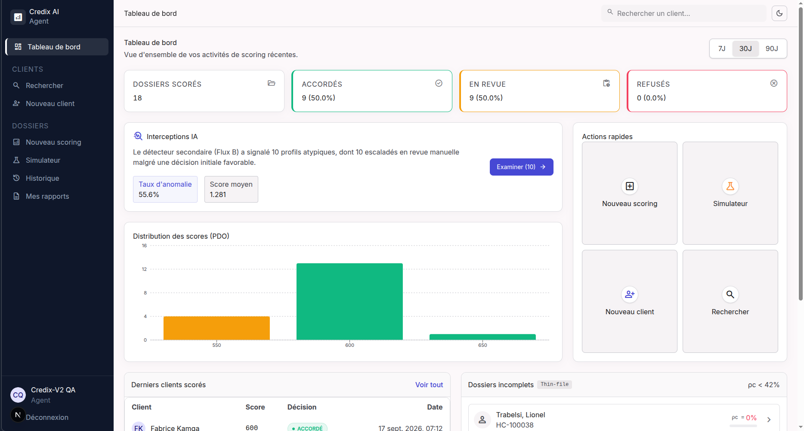
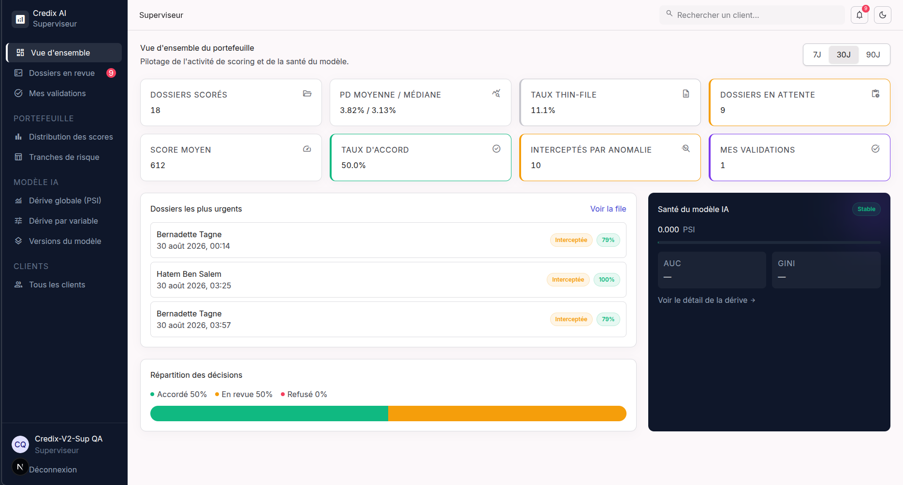
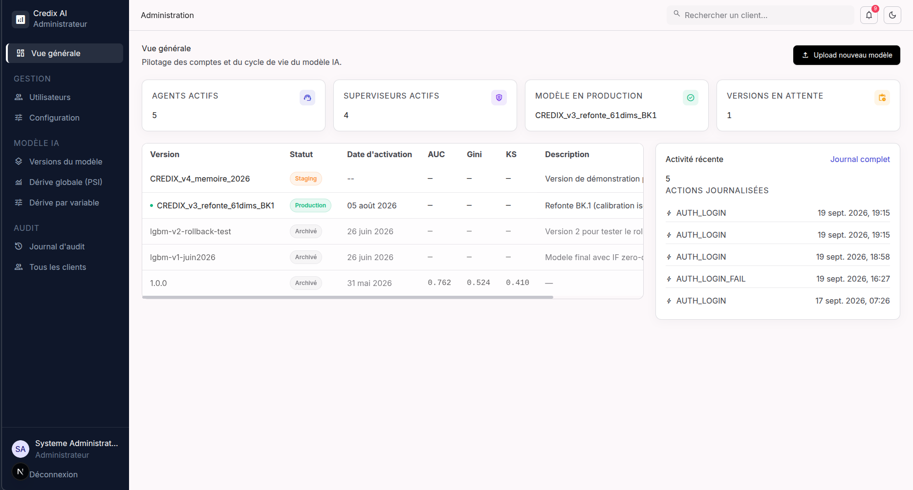

# CREDIX : système intelligent de scoring du risque de crédit

**Guide complet : comprendre, récupérer, lancer, tester et modifier le projet.**

Projet de fin d'études (ENSPY, Université de Yaoundé I). Dépôt GitHub : <https://github.com/HendrixPenka2/credix>

<!-- toc -->

## Sommaire

1. [Présentation du projet](#1-présentation-du-projet)
2. [Architecture : comment le projet est organisé](#2-architecture--comment-le-projet-est-organisé)
3. [Ce qu'il faut installer avant de commencer](#3-ce-quil-faut-installer-avant-de-commencer)
4. [Récupérer le projet depuis GitHub](#4-récupérer-le-projet-depuis-github)
5. [Lancer le backend](#5-lancer-le-backend)
6. [Lancer le frontend](#6-lancer-le-frontend)
7. [Tester l'application de bout en bout](#7-tester-lapplication-de-bout-en-bout)
8. [Arrêter, relancer, tout effacer](#8-arrêter-relancer-tout-effacer)
9. [Modifier le projet et le remettre à jour avec Git](#9-modifier-le-projet-et-le-remettre-à-jour-avec-git)
10. [Dépannage](#10-dépannage)
11. [Annexes : glossaire, récapitulatif des commandes, pour aller plus loin](#11-annexes)

<!-- /toc -->

## Comment lire ce guide

- **Si vous voulez seulement lancer le projet**, allez directement aux sections 3 à 7, dans l'ordre. Chaque étape suppose que la précédente a réussi.
- Les blocs gris sont des **commandes à copier-coller** dans un terminal, ou des **résultats** que vous devez voir à l'écran. Le texte « Résultat attendu » précède toujours ce que vous devez obtenir.
- Pour chaque commande, le guide dit **ce qu'elle fait**, **ce qu'il faut voir**, et **quoi faire si ce n'est pas le cas**.
- Ce guide est écrit et testé pour **Linux**. Windows (avec WSL 2 et Docker Desktop) et macOS peuvent fonctionner, mais n'ont pas été testés.
- Un **terminal** est la fenêtre où l'on tape des commandes (sur Ubuntu : touches `Ctrl` + `Alt` + `T`). Les commandes de base sont rappelées dans les annexes.

---

## 1. Présentation du projet

### 1.1 Qu'est-ce que CREDIX ?

Quand une banque ou une microfinance accorde un crédit, elle doit estimer le risque que le client ne rembourse pas : c'est le **risque de défaut**. **CREDIX** est une application web qui aide l'agent de crédit à prendre cette décision. Elle :

- calcule la **probabilité de défaut** du client avec un modèle d'apprentissage automatique, puis la convertit en un **score de 300 à 850** ;
- **explique** chaque score avec des phrases simples (quels facteurs ont pesé, dans quel sens) ;
- mesure la **quantité d'information disponible** sur le client (l'indice de couverture ρc) ;
- repère les **profils atypiques**, c'est-à-dire ceux qui ne ressemblent pas aux clients sur lesquels le modèle a appris ;
- décide seule des dossiers clairs, et **envoie à un superviseur humain** les dossiers douteux ;
- garde une **trace complète** de chaque action (journal d'audit) et surveille la **dérive** du modèle dans le temps.

### 1.2 Dans quel contexte a-t-il été réalisé ?

- CREDIX est le projet du **mémoire de fin d'études** de SINGHE PENKA Hendrix Donavan, pour le Diplôme d'Ingénieur de Conception en Génie Informatique (École Nationale Supérieure Polytechnique de Yaoundé, Université de Yaoundé I), année académique 2025-2026. Le mémoire s'intitule *Conception et développement d'un système intelligent de scoring du risque de défaut pour l'aide à la décision de crédit*. Il a été supervisé par le Pr Bernabé Batchakui (ENSPY) et Mme Abjean (IT Nearshore).
- Le travail a été conduit au sein d'une société de services numériques qui conçoit des solutions pour des institutions financières, **sans accès aux données d'un établissement réel**. Le système a donc été construit et évalué sur un corpus public, **Home Credit Default Risk** (compétition Kaggle) : 307 511 demandes de crédit, dont 24 825 défauts (8,07 %).
- Le cadre réglementaire (Comité de Bâle, règles sur les décisions automatisées) impose qu'une décision de crédit soit **justifiable, traçable et reprenable par un humain**. Tout le système est conçu pour cela.

### 1.3 Ce que le mémoire a établi (résultats principaux)

| Constat | Valeur |
|---|---|
| Capacité du modèle à séparer bons et mauvais payeurs (AUC, jeu de test de 46 128 demandes) | 0,751 |
| Probabilité moyenne annoncée avant calibration, après calibration, et taux de défaut réellement observé | 43,5 % puis 9,3 %, pour 10,1 % observé |
| Dossiers accordés automatiquement, et taux de défaut sur cette part | 67,3 % des dossiers, avec 5,1 % de défaut (la moitié de celui du portefeuille) |

### 1.4 Les trois acteurs de l'application

Trois profils se connectent, chacun avec ses propres écrans. Ce ne sont pas des droits différents sur les mêmes pages : ce sont trois espaces de travail distincts.

| Acteur | Son rôle | Ce qu'il fait dans l'application |
|---|---|---|
| **Agent** (agent de crédit en agence) | Instruit les demandes | Recherche ou crée un client, lance un **scoring**, fait des **simulations** « et si… », consulte l'historique d'un client, télécharge le rapport PDF d'une décision |
| **Superviseur** (superviseur risque) | Tranche les cas douteux, surveille le portefeuille | Traite la **file des dossiers en revue manuelle** (accorde ou refuse avec une justification obligatoire), suit la répartition des scores, la santé du modèle (dérive) et ses versions |
| **Administrateur** | Gère la plateforme | Crée les **comptes** (agents, superviseurs), règle les **seuils de décision**, **charge et promeut** les versions du modèle, consulte le **journal d'audit** |

**Page principale de l'espace Agent**



*Figure 1. Espace Agent : tableau de bord.*

**Page principale de l'espace Superviseur**



*Figure 2. Espace Superviseur : vue d'ensemble.*

**Page principale de l'espace Administrateur**



*Figure 3. Espace Administrateur : vue générale.*

La liste détaillée de tous les écrans se trouve dans [`credix-v2/FONCTIONNALITES.md`](credix-v2/FONCTIONNALITES.md).

### 1.5 Comment le système décide (les règles en clair)

Le système travaille en **deux flux** qui se contrôlent l'un l'autre :

- **Flux A (le score).** Un modèle (LightGBM) estime la probabilité de défaut (PD). Elle est corrigée par calibration, puis convertie en score : `Score = 515,06 - 28,85 x ln(PD / (1 - PD))`.
- **Flux B (le contrôle).** Un second modèle (un autoencodeur) mesure si le profil du client est **atypique**. Il ne juge pas le risque : il repère les dossiers sur lesquels le système ne devrait pas se prononcer seul.

| Règle | Seuil | Conséquence |
|---|---|---|
| PD inférieure à 10 % (score au moins égal à 578,5) | Décision initiale **ACCORDÉ** | Accord automatique |
| PD supérieure à 30 % (score inférieur à 539,5) | Décision initiale **REFUSÉ** | Refus automatique |
| PD entre les deux | Décision **REVUE MANUELLE** | Un superviseur tranche |
| Profil atypique sur un dossier accordé | Seuil : percentile 95 (réglable par l'administrateur) | Le dossier passe en **revue manuelle**. Un dossier refusé, lui, reste refusé. |
| Couverture ρc inférieure à 0,42 | Information limitée | Bandeau « confiance limitée » et recommandation de documents à demander au client |
| Couverture ρc inférieure à 0,25 | Information très insuffisante | **Revue manuelle forcée**, et le détecteur d'anomalies est désactivé |

Le **ρc n'est calculé qu'au moment du scoring** : avant, un client affiche une couverture de 0, c'est normal.

### 1.6 Les outils utilisés

| Domaine | Outils |
|---|---|
| **Backend** (le « cerveau ») | Python 3.12, FastAPI 0.111, Uvicorn, Pydantic 2 |
| **Modèle et calculs** | LightGBM 4.3, scikit-learn 1.6, optbinning 0.21 (transformation WoE), SHAP 0.45 (explications), TensorFlow CPU (autoencodeur), pandas, NumPy |
| **Base de données** | MongoDB 7 (avec GridFS pour les fichiers du modèle) |
| **Sécurité** | Jetons JWT, mots de passe hachés avec bcrypt |
| **Rapports PDF** | WeasyPrint, dans un petit service séparé |
| **Suivi des modèles** | MLflow 2.12 (démarré avec le reste ; l'interface n'en dépend pas) |
| **Frontend** (l'interface web) | Next.js 15, React 19, TypeScript, Tailwind CSS 4, Radix UI, Recharts, react-hook-form et zod, axios |
| **Lancement** | Docker et Docker Compose |
| **Conception** | Maquettes Google Stitch ; schémas draw.io et PlantUML (dossier `docs/diagrammes/`) |
| **Assistance à la conception et au développement** | Claude (claude.ai en conversation, puis Claude Code dans VS Code). Le détail de la méthode fait l'objet de guides séparés, dans `docs/guides/`. |

---

## 2. Architecture : comment le projet est organisé

### 2.1 Les cinq couches

Le système est organisé en **cinq couches**, chacune avec une seule responsabilité. Une couche ne dépend jamais d'une couche au-dessus d'elle.

```text
        Navigateur web (l'utilisateur)
                    |
                    v
 [1] PRESENTATION         dossier credix-v2/                   port 3001
     affiche les écrans, recueille les saisies
                    |     requêtes HTTP avec un jeton JWT
                    v
 [2] INTERFACE            scoring-backend/app/routers/         port 8080
     APPLICATIVE          expose les opérations, vérifie l'identité et les droits
                    |
                    v
 [3] SERVICES DE          scoring-backend/app/services/
     DECISION             score, couverture rho_c, anomalie, règle finale, SHAP, PSI
              |                          |
              v                          v
 [4] MODELES              [5] PERSISTANCE
     scoring-backend/         MongoDB (port 27017)
     artefacts/               clients, demandes, décisions,
     (lecture seule)          journal d'audit, versions du modèle

 En plus :  service PDF (port 8001)   fabrique le compte rendu d'une décision
            MLflow (port 5000)        suivi des modèles
```

### 2.2 Les services qui tournent, et leurs ports

| Service | Rôle | Adresse sur votre ordinateur |
|---|---|---|
| Frontend (Next.js) | L'interface web | <http://localhost:3001> |
| API (FastAPI), service `api` | Le backend | <http://localhost:8080> (documentation interactive : <http://localhost:8080/docs>) |
| MongoDB, service `mongodb` | La base de données | `localhost:27017` |
| Service PDF, service `pdf-worker` | Fabrique les rapports PDF | <http://localhost:8001> |
| MLflow, service `mlflow` | Suivi des modèles | <http://localhost:5000> |

Le backend et ses trois services annexes tournent dans des **conteneurs Docker**. Le frontend tourne directement sur votre machine, avec Node.js.

### 2.3 L'arborescence des dossiers

```text
credix/                          dossier créé par « git clone »
|-- README.md                    ce document
|-- scoring-backend/             LE BACKEND
|   |-- app/                     le code de l'API
|   |   |-- main.py              démarrage, chargement du modèle, route /health
|   |   |-- routers/             les routes : auth, scoring, clients, decisions,
|   |   |                        dashboard, monitoring, admin, upload_model
|   |   |-- services/            la logique de décision : pipeline (WoE et LightGBM),
|   |   |                        calibration, score PDO, couverture rho_c, SHAP, PSI,
|   |   |                        percentiles, client du service PDF
|   |   |-- schemas/             la forme des données échangées
|   |   |-- core/                configuration (config.py) et sécurité (JWT, droits)
|   |   `-- db/                  accès à MongoDB et à GridFS
|   |-- artefacts/               les 16 fichiers du modèle entraîné (3,5 Mo),
|   |                            dont 14 chargés par l'API au démarrage
|   |-- demo_data/               phrases d'explication et clients de démonstration
|   |-- scripts/                 scripts de premier lancement (voir section 5)
|   |-- adapters/, configs/      lecture des données Home Credit (rechargement complet)
|   |-- pdf-worker/              le petit service qui fabrique les PDF
|   |-- mock/, tests/            fichiers factices et tests
|   |-- contexte claude code/    notes de travail avec Claude Code
|   |-- docker-compose.yml       la description des 4 conteneurs
|   |-- Dockerfile.api           la recette de fabrication de l'image de l'API
|   |-- requirements.txt         les bibliothèques Python
|   |-- .env.example             le modèle du fichier de configuration
|   `-- README.md                documentation technique détaillée du backend
|-- credix-v2/                   LE FRONTEND
|   |-- app/                     les pages (un dossier par écran)
|   |-- components/              les briques visuelles réutilisables
|   |-- contexts/, hooks/, lib/  connexion, appels à l'API, types
|   |-- package.json             les bibliothèques JavaScript et les commandes npm
|   |-- .env.example             le modèle du fichier de configuration
|   `-- FONCTIONNALITES.md       la liste détaillée des écrans
|-- docs/                        schémas (diagrammes/), captures (captures_memoire/),
|                                images (images/), guides (guides/), PDF (pdf/),
|                                fichiers LaTeX (tex/), outils de fabrication (build/)
`-- stitch_credix_design_system/ cahier des charges du frontend et système de design
```

---

## 3. Ce qu'il faut installer avant de commencer

### 3.1 Ordinateur nécessaire

| Ressource | Minimum conseillé |
|---|---|
| Système | Linux 64 bits (testé sur Ubuntu) |
| Espace disque libre | 10 Go (les images Docker pèsent environ 6 Go) |
| Mémoire vive (RAM) | 8 Go recommandés |
| Ports libres | 3001, 8080, 8001, 5000, 27017 |
| Connexion Internet | Oui, pour le premier lancement (téléchargement des images et des bibliothèques) |

### 3.2 Les outils

| Outil | À quoi il sert | Version utilisée pour les tests |
|---|---|---|
| **Git** | Récupérer et versionner le projet | 2.43 |
| **Docker** et **Docker Compose** | Lancer le backend, la base de données et les services annexes sans les installer un par un | Docker 29.5, Compose 5.1 |
| **Node.js** et **npm** | Lancer et compiler le frontend | Node 22.22, npm 11.14 (Node 18.18 minimum) |
| **curl** | Vérifier depuis le terminal que les services répondent | 8.16 |
| **OpenSSL** | Fabriquer une clé secrète aléatoire | 3.5 |

### 3.3 Vérifier ce qui est déjà installé

Ouvrez un terminal et tapez ces commandes, une par une :

```bash
git --version
docker --version
docker compose version
node --version
npm --version
curl --version
openssl version
```

**Ce que fait chaque commande :** elle affiche le numéro de version de l'outil.

**Résultat attendu (les numéros peuvent différer légèrement) :**

```text
git version 2.43.0
Docker version 29.5.3, build d1c06ef
Docker Compose version v5.1.4
v22.22.0
11.14.1
curl 8.16.0 (Linux) libcurl/8.16.0 ...
OpenSSL 3.5.5 27 Jan 2026 ...
```

**Si une commande répond « command not found » :** l'outil n'est pas installé, passez à la section 3.4 pour cet outil.

### 3.4 Installer ce qui manque (Ubuntu ou Debian)

> Les commandes de cette section viennent de la documentation officielle de chaque outil. Elles n'ont **pas été rejouées** pour ce guide, car la machine de test avait déjà tout installé. En cas de doute, suivez la documentation officielle indiquée.

**Git, curl et OpenSSL :**

```bash
sudo apt-get update
sudo apt-get install -y git curl openssl
```

**Docker et Docker Compose** (documentation officielle : <https://docs.docker.com/engine/install/ubuntu/>) :

```bash
sudo apt-get update
sudo apt-get install -y ca-certificates curl
sudo install -m 0755 -d /etc/apt/keyrings
sudo curl -fsSL https://download.docker.com/linux/ubuntu/gpg -o /etc/apt/keyrings/docker.asc
sudo chmod a+r /etc/apt/keyrings/docker.asc
echo "deb [arch=$(dpkg --print-architecture) signed-by=/etc/apt/keyrings/docker.asc] https://download.docker.com/linux/ubuntu $(. /etc/os-release && echo "${UBUNTU_CODENAME:-$VERSION_CODENAME}") stable" | sudo tee /etc/apt/sources.list.d/docker.list > /dev/null
sudo apt-get update
sudo apt-get install -y docker-ce docker-ce-cli containerd.io docker-buildx-plugin docker-compose-plugin
```

Ensuite, **autorisez votre utilisateur à utiliser Docker sans `sudo`** (sinon vous aurez l'erreur « permission denied ») :

```bash
sudo usermod -aG docker $USER
```

**Fermez votre session Linux puis rouvrez-la** (ou redémarrez), puis testez :

```bash
docker run --rm hello-world
```

**Résultat attendu :** un message qui contient `Hello from Docker!`.

**Node.js et npm** (avec l'outil nvm, documentation : <https://github.com/nvm-sh/nvm>) :

```bash
curl -o- https://raw.githubusercontent.com/nvm-sh/nvm/v0.40.3/install.sh | bash
```

Fermez puis rouvrez le terminal, et tapez :

```bash
nvm install 22
node --version
```

**Résultat attendu :** `v22.` suivi de deux numéros.

---

## 4. Récupérer le projet depuis GitHub

### 4.1 Le lien du dépôt

- Page du projet : <https://github.com/HendrixPenka2/credix>
- Adresse à utiliser pour copier le projet (HTTPS) : `https://github.com/HendrixPenka2/credix.git`

Le dépôt est **privé** : seules les personnes invitées peuvent le voir et le copier. Avant de faire `git clone`, il faut donc :

1. **avoir un compte GitHub** (gratuit) ;
2. **être invité par l'auteur** comme collaborateur (l'auteur ouvre le dépôt sur GitHub, puis *Settings*, *Collaborators*, *Add people*) ; vous recevez un e-mail d'invitation, à **accepter** ;
3. **créer un jeton d'accès personnel**, car Git n'accepte plus le mot de passe du compte : sur GitHub, menu de votre photo de profil, *Settings*, *Developer settings*, *Personal access tokens*, *Tokens (classic)*, *Generate new token*, puis *Generate new token (classic)* ; donnez-lui un nom, cochez la permission **`repo`**, cliquez sur *Generate token*, puis **copiez le jeton affiché** (il n'est montré qu'une seule fois). Documentation : <https://docs.github.com/fr/authentication>.

> Ces trois étapes exigent un compte GitHub et n'ont pas pu être rejouées pour ce guide.

### 4.2 Copier le projet sur votre ordinateur

```bash
cd ~
git clone https://github.com/HendrixPenka2/credix.git
cd credix
ls
```

**Ce que fait chaque commande :**

| Commande | Effet |
|---|---|
| `cd ~` | Va dans votre dossier personnel |
| `git clone <adresse>` | **Copie tout le projet** (le code et son historique) dans un nouveau dossier `credix` |
| `cd credix` | Entre dans ce dossier |
| `ls` | Liste son contenu |

**Pendant le `git clone`, Git vous demande de vous identifier** (le dépôt est privé) :

```text
Username for 'https://github.com':
Password for 'https://votre_nom@github.com':
```

Tapez votre **nom d'utilisateur GitHub**, puis, à la ligne « Password », **collez le jeton** créé en 4.1 (rien ne s'affiche pendant la saisie, c'est normal), puis appuyez sur `Entrée`. Pour ne pas le retaper à chaque fois, vous pouvez taper une fois `git config --global credential.helper store` avant le clone (attention : le jeton est alors enregistré en clair dans votre dossier personnel).

**Si vous obtenez `Repository not found` ou `Authentication failed` :** l'invitation n'a pas été acceptée, ou vous avez saisi le mot de passe du compte au lieu du jeton.

**Résultat attendu de `ls` :**

```text
credix-v2  docs  README.md  scoring-backend  stitch_credix_design_system
```


### 4.3 Vérifier la copie

```bash
git status
git log --oneline -3
ls scoring-backend/artefacts | wc -l
```

**Ce que fait chaque commande :** `git status` indique la branche et si des fichiers ont changé ; `git log --oneline -3` affiche les 3 dernières modifications enregistrées ; la dernière commande **compte les fichiers du modèle**.

**Résultat attendu :** `git status` indique « Sur la branche main » et « la copie de travail est propre » ; la dernière commande affiche **`16`**.

**Si vous obtenez un autre nombre que 16 :** la copie est incomplète. Supprimez le dossier `credix` (`cd ~ && rm -rf credix`) et recommencez le `git clone`.

---

## 5. Lancer le backend

Toutes les commandes de cette section se tapent **dans le dossier `scoring-backend`**. Placez-vous-y :

```bash
cd ~/credix/scoring-backend
pwd
```

**Résultat attendu de `pwd` (affiche le dossier courant) :** `/home/votre_nom/credix/scoring-backend`.

### 5.1 Configurer : créer le fichier `.env`

Le fichier `.env` contient les réglages du backend, dont un **secret** qui ne doit jamais être publié. Le dépôt ne contient qu'un modèle, `.env.example`.

```bash
cp .env.example .env
sed -i "s|^JWT_SECRET=.*|JWT_SECRET=$(openssl rand -hex 32)|" .env
grep -E "^(USE_MOCK_ARTEFACTS|MONGO_URI|ALLOWED_ORIGINS|JWT_SECRET)=" .env
```

**Ce que fait chaque commande :**

| Commande | Effet |
|---|---|
| `cp .env.example .env` | Copie le modèle vers le vrai fichier de configuration |
| `sed -i "s\|...\|...\|" .env` | Remplace la ligne `JWT_SECRET=` par **une clé secrète aléatoire de 64 caractères**, fabriquée par `openssl rand -hex 32`. Cette clé sert à signer les jetons de connexion. |
| `grep -E ... .env` | Affiche les 4 réglages les plus importants pour que vous les contrôliez |

**Résultat attendu (la valeur de `JWT_SECRET` sera différente chez vous, mais elle doit faire 64 caractères) :**

```text
USE_MOCK_ARTEFACTS=false
MONGO_URI=mongodb://mongodb:27017
JWT_SECRET=3f9c1e...(64 caractères au total)
ALLOWED_ORIGINS=http://localhost:3000,http://localhost:3001,http://localhost:5173
```

**Ce que signifient ces réglages :**

- `USE_MOCK_ARTEFACTS=false` : on utilise le **vrai modèle** (le dossier `artefacts/`) et non des fichiers factices.
- `MONGO_URI=mongodb://mongodb:27017` : l'adresse de la base de données **à l'intérieur de Docker** ; ne la changez pas.
- `ALLOWED_ORIGINS` : les adresses autorisées à appeler l'API. **`http://localhost:3001` doit y figurer**, sinon le navigateur bloquera le frontend.
- Les autres lignes du fichier (`GOOGLE_API_KEY`, `HOME_CREDIT_DATA_DIR`…) sont **facultatives** et ne servent pas pour tester ; le fichier `.env.example` les explique une par une.

**Si `JWT_SECRET` contient encore `CHANGE_MOI` :** la deuxième commande a échoué ; vérifiez qu'OpenSSL est installé (`openssl version`) et relancez-la.

### 5.2 Démarrer les conteneurs

```bash
docker compose up -d --build
```

**Ce que fait cette commande :**

- `docker compose` lit le fichier `docker-compose.yml`, qui décrit **4 conteneurs** : l'API, MongoDB, MLflow et le service PDF ;
- `up` les **démarre** ;
- `-d` les lance **en arrière-plan** (vous récupérez la main dans le terminal) ;
- `--build` **fabrique d'abord les images** qui en ont besoin (l'API et le service PDF).

**Ce qu'il faut savoir :** au **premier lancement**, Docker télécharge des images (MongoDB, MLflow) et **fabrique celles de l'API et du service PDF** : il installe des paquets système puis des bibliothèques Python, dont TensorFlow (250 Mo à lui seul). Il y a **environ 700 Mo à télécharger**, donc la durée dépend surtout de votre connexion. Lors de notre test, avec une connexion lente (de 75 à 300 Ko/s), cela a duré **environ 50 minutes** (dont 45 pour l'installation des bibliothèques Python de l'API) ; avec une bonne connexion, comptez nettement moins. Prévoyez aussi **de la place sur le disque** : la construction a besoin d'environ 4 Go de marge temporaire à la toute fin (voir la section 3.1). Les lancements suivants sont rapides : environ **une minute** (les images sont déjà fabriquées).

**Comment savoir que c'est terminé ?**

- La commande affiche beaucoup de lignes (`#15 [api ...] Downloading ...`) et **ne vous rend pas la main** tant qu'elle travaille : l'invite du terminal (le `$`) ne réapparaît pas.
- Pendant le téléchargement d'un gros fichier comme TensorFlow, **rien ne s'affiche pendant plusieurs minutes** : ce n'est pas un blocage. Pour le vérifier, ouvrez un **autre terminal** et tapez `docker ps` : tant que vos conteneurs `scoring-...` n'apparaissent pas dans la liste, la construction est en cours.
- C'est **terminé** quand l'invite du terminal **réapparaît**, après les lignes `Container ... Started` ci-dessous. Passez alors à la section 5.3.

**Résultat attendu à la fin :** des lignes de ce type (le mot « error » ne doit pas apparaître) :

```text
 Container scoring-mongodb Started
 Container scoring-mlflow Started
 Container scoring-pdf Started
 Container scoring-api Started
```

### 5.3 Vérifier que le backend tourne

Le démarrage de l'API prend **une à deux minutes** (elle charge le modèle en mémoire). Faites les vérifications dans cet ordre.

#### Vérification 1 : l'état des conteneurs

```bash
docker compose ps
```

**Ce que fait la commande :** elle liste les conteneurs du projet et leur état.

**Résultat attendu :**

```text
NAME              IMAGE                           COMMAND                  SERVICE      CREATED         STATUS                   PORTS
scoring-api       scoring-backend-api             "uvicorn app.main:ap…"   api          2 minutes ago   Up 2 minutes (healthy)   0.0.0.0:8080->8000/tcp, [::]:8080->8000/tcp
scoring-mlflow    ghcr.io/mlflow/mlflow:v2.12.1   "mlflow server --hos…"   mlflow       2 minutes ago   Up 2 minutes             0.0.0.0:5000->5000/tcp, [::]:5000->5000/tcp
scoring-mongodb   mongo:7.0                       "docker-entrypoint.s…"   mongodb      2 minutes ago   Up 2 minutes (healthy)   0.0.0.0:27017->27017/tcp, [::]:27017->27017/tcp
scoring-pdf       scoring-backend-pdf-worker      "uvicorn main:app --…"   pdf-worker   2 minutes ago   Up 2 minutes             0.0.0.0:8001->8001/tcp, [::]:8001->8001/tcp
```

**Comment lire ce tableau :** les **4 conteneurs** doivent être `Up`. `scoring-api` et `scoring-mongodb` doivent afficher **`(healthy)`**. Juste après le démarrage, `scoring-api` peut afficher `(health: starting)` : **attendez**, puis retapez la commande. Pour la suivre en direct, tapez `watch -n 5 docker compose ps` et quittez avec `Ctrl` + `C`.

**Si un conteneur est `Exited` ou `unhealthy` :** voyez la vérification 2 pour lire l'erreur, puis la section 10.

#### Vérification 2 : les messages (logs) de l'API

```bash
docker compose logs -f --tail 60 api
```

**Ce que fait la commande :** `logs` affiche les messages écrits par le service `api` ; `--tail 60` limite aux 60 dernières lignes ; `-f` **suit les messages en direct**. Pour arrêter de suivre, tapez `Ctrl` + `C` : cela **n'arrête pas** l'application.

**Résultat attendu au tout premier lancement** (l'ordre de quelques lignes peut varier légèrement) :

```text
INFO:     Started server process [1]
INFO:     Waiting for application startup.
2026-09-19 17:32:02.014168: I tensorflow/core/platform/cpu_feature_guard.cc:210] This TensorFlow binary is optimized to use available CPU instructions in performance-critical operations.
To enable the following instructions: AVX2 FMA, in other operations, rebuild TensorFlow with the appropriate compiler flags.
INFO:     Application startup complete.
INFO:     Uvicorn running on http://0.0.0.0:8000 (Press CTRL+C to quit)
==================================================
  Scoring Backend — Démarrage
==================================================
[DB] Connecté à MongoDB : scoring_db
[Lifespan] Aucun modèle GridFS en PRODUCTION — fallback seed
[Artefacts] Mode seed — ./artefacts
[Artefacts] ✓ woe_transformers.pkl
[Artefacts] ✓ nap_features.pkl
[Artefacts] ✓ lgbm_final.pkl
[Artefacts] ✓ iv_scores_final.csv
[Artefacts] ✓ feature_stats.json
[Artefacts] ✓ isotonic_calibrator.pkl
[Artefacts] ✓ decision_config.json
[Artefacts] ✓ autoencoder.keras
[Artefacts] ✓ ae_metadata.json
[Artefacts] ✓ isolation_forest.pkl
[Artefacts] ✓ if_metadata.json
[Artefacts] ✓ scaler_if.pkl
[Artefacts] ✓ encoder_hybrid.pkl
[Artefacts] ✓ colonnes_ordonnees_61.json
[Artefacts] Seed chargé — 27 features NAP
[Metadata] 0 documents feature_metadata chargés
[Seuils] Premier démarrage — seuils PDO initialisés depuis decision_config.json : accorde=578.5, refuse=539.5
[OK] Backend prêt
```

**Comment lire ces messages :**

- `Aucun modèle GridFS en PRODUCTION — fallback seed` : normal au premier lancement. Comme aucune version du modèle n'a été chargée depuis l'interface, l'API prend **le modèle fourni dans le dossier `artefacts/`**.
- Les lignes `✓` confirment que **chaque fichier du modèle** est chargé.
- `[Metadata] 0 documents ... chargés` : normal pour l'instant, les phrases d'explication seront chargées à l'étape 5.4.
- `[Seuils] Premier démarrage ...` : les **seuils de décision** sont initialisés (accordé à partir de 578,5, refusé en dessous de 539,5).
- Le message `I tensorflow/... This TensorFlow binary is optimized ...` est une **simple information** de TensorFlow : ce n'est pas une erreur.
- `[OK] Backend prêt` : **c'est la ligne à attendre**. Elle signifie que le backend est opérationnel. (Les lignes `INFO:` s'affichent parfois **avant** les autres : c'est normal.)
- Une ligne contenant `[WARNING]` signale un fichier facultatif du modèle absent ; une ligne `Traceback` ou `FileNotFoundError` signale une erreur (voir section 10).

Après quelques minutes, vous verrez aussi, toutes les 30 secondes, des lignes `GET /health HTTP/1.1" 200 OK` : ce sont les **contrôles de santé** automatiques de Docker. Elles sont bon signe.

#### Vérification 3 : l'état de santé de l'API

```bash
curl -s http://localhost:8080/health
```

**Ce que fait la commande :** `curl` interroge l'adresse `/health` de l'API, que l'API utilise pour dire dans quel état elle est ; `-s` supprime la barre de progression.

**Résultat attendu (une seule ligne, avant l'étape 5.4) :**

```json
{"statut":"ok","model_run_id":"seed-initial","features_chargees":27,"metadata_chargees":0,"calibration_isotonique_active":true,"decision_config_charge":true,"seuils_pdo_defaut":{"accorde":578.5,"refuse":539.5},"isolation_forest_charge":true,"autoencoder_charge":true,"encodage_hybride_61dims_charge":true,"flux_b_actif":true,"flux_b_percentile":95,"mock_mode":false}
```

**Comment le lire :**

| Champ | Valeur attendue | Ce que cela veut dire |
|---|---|---|
| `statut` | `"ok"` | L'API répond |
| `model_run_id` | `"seed-initial"` | Le modèle vient du dossier `artefacts/` |
| `features_chargees` | `27` | Les 27 variables du modèle sont chargées |
| `metadata_chargees` | `0` (puis **27** après l'étape 5.4) | Nombre de phrases d'explication chargées |
| `calibration_isotonique_active` | `true` | Les probabilités sont calibrées |
| `decision_config_charge` | `true` | Les seuils de décision sont chargés |
| `isolation_forest_charge`, `autoencoder_charge`, `encodage_hybride_61dims_charge` | `true` | Les composants du détecteur d'anomalies sont chargés |
| `flux_b_actif` | `true` | Le détecteur d'anomalies (Flux B) est actif |
| `mock_mode` | `false` | C'est le **vrai modèle**, pas des fichiers factices |

**Si `curl` répond « Connection refused » :** l'API n'a pas fini de démarrer. Attendez 30 secondes et recommencez. Si cela persiste : `docker compose logs api` (voir section 10).

#### Vérification 4 : les autres services

```bash
curl -s http://localhost:8001/health
curl -sI http://localhost:5000 | head -1
curl -s -o /dev/null -w "documentation de l'API : HTTP %{http_code}\n" http://localhost:8080/docs
```

**Résultat attendu :**

```text
{"status":"ok"}
HTTP/1.1 200 OK
documentation de l'API : HTTP 200
```

Ces trois lignes confirment que le **service PDF**, **MLflow** et la **documentation interactive de l'API** répondent. Vous pouvez aussi ouvrir <http://localhost:8080/docs> dans un navigateur : c'est la liste de toutes les routes de l'API, que l'on peut essayer directement.

### 5.4 Premier lancement : créer l'administrateur et charger les données

À ce stade, la base de données est **vide** : il n'y a ni compte, ni client. Un script prépare tout en une commande. Il fait quatre choses :

1. **crée le compte administrateur** (le tout premier compte, sans lequel on ne peut pas se connecter) ;
2. **charge les 27 phrases d'explication** des variables du modèle (elles ont été écrites une fois avec l'IA Gemini, puis enregistrées dans `demo_data/feature_metadata.json` : **vous n'avez besoin d'aucune clé API**) ;
3. **charge 150 clients de démonstration** (`demo_data/clients_demo.json`, extraits du jeu Home Credit, noms fictifs : **vous n'avez besoin d'aucun fichier Kaggle**) ;
4. **enregistre le modèle fourni** comme version en production.

**Choisissez d'abord le mot de passe de l'administrateur** (8 caractères minimum ; utilisez de préférence des lettres et des chiffres, sans guillemets ni espaces) :

```bash
export ADMIN_PASSWORD='MonMotDePasse2026'
```

**Ce que fait cette commande :** `export` mémorise le mot de passe **uniquement pour la fenêtre de terminal courante**. Il n'est écrit dans aucun fichier. **Choisissez le vôtre et notez-le** : vous en aurez besoin pour vous connecter.

Lancez ensuite le script :

```bash
docker compose exec -T -e ADMIN_PASSWORD="$ADMIN_PASSWORD" api python scripts/init_demo.py
```

**Ce que fait cette commande :** `exec` exécute une commande **dans le conteneur `api` qui tourne déjà** ; `-T` indique qu'il n'y a pas de terminal interactif ; `-e ADMIN_PASSWORD=...` transmet le mot de passe au script ; `python scripts/init_demo.py` lance le script de premier lancement.

**Résultat attendu :**

```text

=== 1/4 Compte administrateur ===
[OK] Admin cree: username='admin' / role=ADMIN
     user_id: 21d0207e-d341-4ff7-a86a-125499fde6be

=== 2/4 Phrases d'explication ===
[OK] Phrases d'explication : 27 ajoutees, 0 remplacees, 0 deja presentes (base 'scoring_db' : 27 au total).
     Redemarre l'API pour qu'elle les recharge : docker compose restart api

=== 3/4 Clients de demonstration ===
[OK] Clients de demonstration : 150 ajoutes, 0 deja presents (base 'scoring_db' : 150 clients au total).

=== 4/4 Enregistrement du modele ===
[OK] Modele enregistre: run_id=lgbm-run-v1 version=1.0.0 statut=PRODUCTION

[OK] Initialisation terminee.
     Derniere etape : docker compose restart api   (pour que l'API recharge les phrases d'explication)
```

(Le `user_id` sera différent chez vous.)

**Bon à savoir :** ce script peut être **relancé sans danger** : il n'ajoute rien en double et ne modifie jamais un compte, une phrase ou un client déjà présent.

**Si vous voyez `[ERREUR] Mot de passe ADMIN manquant`** : la variable `ADMIN_PASSWORD` n'est pas définie dans ce terminal (refaites la commande `export`). **Si vous voyez `trop court`** : choisissez un mot de passe d'au moins 8 caractères.

Maintenant, **redémarrez l'API** pour qu'elle recharge les phrases d'explication :

```bash
docker compose restart api
docker compose up -d --wait --wait-timeout 240 api
```

**Ce que font ces commandes :** la première redémarre le conteneur de l'API ; la seconde **attend** (au plus 240 secondes) que l'API soit de nouveau `healthy` avant de vous rendre la main.

**Pourquoi ce redémarrage est nécessaire :** l'API charge les phrases d'explication **une seule fois, au démarrage**. Sans redémarrage, elle continuerait à en voir 0.

Vérifiez :

```bash
curl -s http://localhost:8080/health
```

**Résultat attendu :** la même ligne qu'en 5.3, mais avec **`"metadata_chargees":27`**.

### 5.5 Vérifier que l'administrateur peut se connecter

```bash
curl -s -X POST http://localhost:8080/api/auth/login \
  -H "Content-Type: application/json" \
  -d "{\"username\":\"admin\",\"password\":\"$ADMIN_PASSWORD\"}"
```

**Ce que fait la commande :** elle envoie à l'API un identifiant et un mot de passe, exactement comme le fera la page de connexion.

**Résultat attendu** (une seule ligne ; le `token` est une longue suite de caractères, ici raccourcie) :

```json
{"token":"eyJhbGciOiJIUzI1NiIsInR5...","role":"ADMIN","user_id":"3628800d-5f36-4d9b-94bd-b8012a95660f","nom":"Administrateur","prenom":"Systeme","expires_at":"2026-09-20T01:34:23.430433+00:00"}
```

Le jeton est valable **8 heures** (`expires_at`).

**Avec un mauvais mot de passe**, la réponse est (code 401) :

```json
{"detail":"Identifiants incorrects"}
```

### 5.6 Récapitulatif : le backend est prêt si…

| Contrôle | Commande | Résultat |
|---|---|---|
| Conteneurs | `docker compose ps` | 4 conteneurs `Up`, dont `scoring-api` et `scoring-mongodb` `(healthy)` |
| Messages de l'API | `docker compose logs --tail 60 api` | La ligne `[OK] Backend prêt` |
| Santé de l'API | `curl -s http://localhost:8080/health` | `"statut":"ok"`, `"features_chargees":27`, `"metadata_chargees":27`, `"mock_mode":false` |
| Service PDF | `curl -s http://localhost:8001/health` | `{"status":"ok"}` |
| Connexion | commande de la section 5.5 | Un `token` et `"role":"ADMIN"` |

---

## 6. Lancer le frontend

Le frontend est l'interface web. Il tourne avec Node.js et parle au backend, qui doit donc **déjà tourner** (section 5 terminée).

Ouvrez un **nouveau terminal** (ou gardez celui-ci : le frontend occupera la fenêtre tant qu'il tourne) et placez-vous dans le dossier du frontend :

```bash
cd ~/credix/credix-v2
pwd
```

**Résultat attendu de `pwd` :** `/home/votre_nom/credix/credix-v2`.

### 6.1 Configurer

```bash
cp .env.example .env.local
cat .env.local
```

**Ce que fait chaque commande :** la première crée le fichier de configuration du frontend ; la seconde l'affiche.

**Résultat attendu :** une ligne `NEXT_PUBLIC_API_URL=http://localhost:8080`. C'est l'adresse du backend que le navigateur va appeler. **Si votre backend est ailleurs, changez cette adresse maintenant :** elle est **intégrée au moment de la compilation** (section 6.3).

### 6.2 Installer les bibliothèques

```bash
npm ci
```

**Ce que fait la commande :** elle télécharge et installe, dans un dossier `node_modules/`, **exactement les bibliothèques listées dans `package-lock.json`** (les mêmes versions que celles utilisées par l'auteur). Comptez de 30 secondes à quelques minutes selon la connexion.

**Résultat attendu (le nombre de paquets et la durée peuvent varier un peu) :**

```text
added 477 packages in 28s

154 packages are looking for funding
  run `npm fund` for details
```

Sur la machine de test, l'installation a pris **28 secondes** et le dossier `node_modules/` occupe environ **520 Mo**. Des lignes `npm warn` éventuelles sont **sans gravité**.

**Si vous obtenez `EBADENGINE` ou une erreur de version :** votre Node.js est trop ancien. Vérifiez `node --version` (il faut 18.18 au minimum, 22 conseillé) et reprenez la section 3.4.

### 6.3 Compiler et démarrer (mode « production »)

```bash
npm run build
npm run start
```

**Ce que fait chaque commande :**

| Commande | Effet |
|---|---|
| `npm run build` | **Compile** l'application : elle vérifie le code TypeScript, transforme chaque page en fichiers optimisés et les range dans le dossier `.next/`. Comptez de 30 secondes à deux minutes. |
| `npm run start` | **Démarre le serveur web** sur le port 3001 avec la version compilée |

**Résultat attendu de `npm run build`** (une quarantaine de secondes sur la machine de test) :

```text
   ▲ Next.js 15.5.23
   - Environments: .env.local

   Creating an optimized production build ...
 ✓ Compiled successfully in 9.0s
   Skipping linting
   Checking validity of types ...
   Collecting page data ...
 ✓ Generating static pages (29/29)
   Finalizing page optimization ...
   Collecting build traces ...

Route (app)                                 Size  First Load JS
┌ ○ /                                      128 B         102 kB
├ ○ /admin                               2.35 kB         161 kB
├ ○ /admin/audit                         4.08 kB         168 kB
...(une ligne par page, 28 au total)...
└ ○ /superviseur/tranches                3.31 kB         136 kB
+ First Load JS shared by all             102 kB
```

La commande **se termine sans message d'erreur** et crée un dossier `.next/`. Si elle affiche `Failed to compile.` suivi de `Type error`, le code contient une erreur de type : voir la section 10.2.

**Résultat attendu de `npm run start` :**

```text
> credix-v2@0.1.0 start
> next start -p 3001

   ▲ Next.js 15.5.23
   - Local:        http://localhost:3001
   - Network:      http://192.168.1.20:3001

 ✓ Starting...
 ✓ Ready in 857ms
```

(l'adresse « Network » sera celle de votre machine). **Laissez ce terminal ouvert** : si vous le fermez, le frontend s'arrête. Si vous voyez `EADDRINUSE: address already in use :::3001`, le port 3001 est déjà pris (voir la section 10.2).

**Variante pour développer (mode « développement ») :** `npm run dev` démarre le frontend sur le même port, **sans compilation préalable**, et recharge la page automatiquement à chaque modification du code. C'est le mode à utiliser si vous modifiez le frontend (section 9).

### 6.4 Vérifier que le frontend tourne

Dans un **autre terminal** :

```bash
curl -s -o /dev/null -w "page de connexion : HTTP %{http_code}\n" http://localhost:3001/login
```

**Résultat attendu :** `page de connexion : HTTP 200`.

Puis ouvrez <http://localhost:3001> dans un navigateur. **Résultat attendu :** la page de connexion **« Credix AI »**, avec le titre « Bienvenue », les champs « Identifiant ou Email » et « Mot de passe », et un bouton **« Se connecter »**.

**Si la page ne s'affiche pas :** vérifiez que le terminal de `npm run start` est toujours ouvert et sans erreur, puis voyez la section 10.

---

## 7. Tester l'application de bout en bout

Ce parcours vérifie que **les trois espaces fonctionnent et communiquent**. Il dure une quinzaine de minutes. Utilisez de préférence des noms d'exemple.

### 7.1 Se connecter en administrateur

1. Ouvrez <http://localhost:3001>.
2. **Identifiant :** `admin`. **Mot de passe :** celui que vous avez choisi à l'étape 5.4.
3. Cliquez sur **« Se connecter »**.

**Résultat attendu :** vous arrivez sur la **Vue générale** de l'espace Administrateur, avec 4 indicateurs et le tableau des versions du modèle.

**Si vous voyez « Identifiants incorrects » (message rouge sous le mot de passe) :** vérifiez le mot de passe. **Si le navigateur affiche une erreur réseau ou de type CORS :** l'adresse `http://localhost:3001` n'est pas dans `ALLOWED_ORIGINS` (section 10).

### 7.2 Créer un compte Agent et un compte Superviseur

1. Dans le menu de gauche, cliquez sur **« Utilisateurs »**, puis sur le bouton **« Nouveau compte »**.
2. Section **« Identité & agence »** : renseignez **Prénom**, **Nom**, **Email**, **Agence** (par exemple `Awa`, `Test`, `awa.test@example.com`, `Agence Centrale`).
3. Section **« Compte & accès »** : choisissez le rôle **Agent**, puis un **Identifiant** (par exemple `agent.test`), un **Mot de passe** (8 caractères minimum) et sa **confirmation**.
4. Cliquez sur **« Créer le compte »**.

**Résultat attendu :** un écran de confirmation avec l'identifiant créé.

Recommencez avec le rôle **Superviseur** (identifiant `superviseur.test` par exemple). **Notez les deux mots de passe.**

Puis ouvrez de nouveau **« Utilisateurs »**. **Résultat attendu :** la page indique **« 3 comptes enregistrés »** et liste les trois comptes par leur **nom et leur e-mail** (« Systeme Administrateur », « Awa Agent », « Samir Superviseur »), avec leur rôle (Admin, Agent, Superviseur) et le statut « Actif ». La liste n'affiche pas les identifiants de connexion.

> Un compte n'est **jamais supprimé** dans l'application : il peut seulement être désactivé puis réactivé.

### 7.3 Se déconnecter, puis se connecter en agent

1. En bas du menu de gauche, cliquez sur **« Déconnexion »**.
2. Connectez-vous avec `agent.test` et son mot de passe.

**Résultat attendu :** vous arrivez sur le **Tableau de bord** de l'espace Agent (les statistiques sont à zéro : personne n'a encore été scoré).

### 7.4 Scorer un client (espace Agent)

1. Menu **« Nouveau scoring »**.
2. **Étape 1, choisir le client :** tapez `HC-100001` dans la recherche et sélectionnez-le.
3. **Étape 2, saisir la demande** (le formulaire est fourni par le backend) :

   | Champ | Valeur d'exemple |
   |---|---|
   | Type de contrat | `Cash loans` |
   | Annuité mensuelle (FCFA) | `36000` |
   | Montant du crédit demandé (FCFA) | `1000000` |
   | Valeur du bien financé (FCFA), facultatif | `800000` |

4. Cliquez sur **« Continuer »** : le calcul démarre (quelques secondes).

**Résultat attendu (étape 3), pour `HC-100001` avec ces valeurs :** un écran de résultat avec la jauge **« Score PDO global »** (**603**, sur une échelle de 300 à 850), la décision **`ACCORDÉ`**, une **couverture de données de 100 %**, les **5 facteurs qui ont le plus pesé** (« Facteurs d'influence ») expliqués en phrases, un bloc **« Analyse de profil (Flux B) — Aucune anomalie »** quand le profil est normal, un bloc **« Positionnement »** (le percentile du client), et trois boutons : **« Télécharger le rapport PDF »**, « Lancer une simulation » et « Recommencer ». Le rapport PDF est fabriqué par le service PDF de la section 5 ; sur la machine de test, le fichier pèse environ 21 Ko.

**Pour voir tous les cas de décision**, scorez les clients ci-dessous **avec les mêmes valeurs d'exemple** (résultats vérifiés sur une installation neuve). Avec d'autres montants, le score et la décision changent.

| Ce que l'on veut voir | Client | Score | Décision | Couverture ρc |
|---|---|---|---|---|
| Un accord net | `HC-101368` | 660 | `ACCORDÉ` | 100 % |
| Un accord (parcours ci-dessus) | `HC-100001` | 603 | `ACCORDÉ` | 100 % |
| Une revue à cause du **score** (zone entre 539,5 et 578,5) | `HC-100241` | 571 | `EN REVUE` | 77 % |
| Un **refus** (probabilité de défaut de 32 %) | `HC-101327` | 536 | `REFUSÉ` | 89 % |
| Une revue à cause d'une **anomalie** (Flux B), alors que le score seul accorderait | `HC-100169` | 589 | `EN REVUE` | 91 % |

Pour `HC-100169`, l'écran contient un bloc **« Détection d'anomalie (Flux B) — Revue forcée »**, qui explique que le profil a été jugé statistiquement atypique par le détecteur secondaire (l'autoencodeur) et que la décision a été forcée en revue manuelle, quel que soit le score initial.

**Voir une couverture faible.** Aucun des 150 clients de démonstration n'a une couverture inférieure à 42 %. Pour voir ce cas, **créez un nouveau client**, dont on ne connaît que les informations déclarées :

1. Menu **« Nouveau client »**, puis remplissez le formulaire, par exemple : Prénom `Awa`, Nom `Ndiaye`, Date de naissance `1996-02-18`, Genre `Femme`, Situation familiale `Célibataire`, Enfants à charge `0`, Téléphone `+237 677 12 34 56`, Agence `Agence Centrale`, Type de poste `Sales staff`, Type de revenu `Salarié`, Niveau d'éducation `Secondaire`, Ancienneté emploi (mois) `18`, Ancienneté domicile (mois) `24`.
2. Cliquez sur **« Créer le dossier »** : la fiche du client s'ouvre, avec les onglets « Vue d'ensemble », « Nouveau scoring », « Simulation », « Historique », « Explicabilité » et « Progression ».
3. Ouvrez l'onglet **« Nouveau scoring »**. Comme ce client est nouveau, le formulaire compte **11 champs** (et non 4). Saisissez : Annuité mensuelle `35000`, Montant du crédit demandé `650000`, Valeur du bien financé `700000`, Type de contrat `Cash loans`, Profession du demandeur `Sales staff`, Ancienneté dans l'emploi actuel (mois) `18`, Niveau d'éducation `Secondary / secondary special`, Genre `F`, Date de naissance `1996-02-18`, Type de revenu `Working`, Ancienneté à l'adresse actuelle (mois) `24`, puis cliquez sur **« Continuer »**.

**Résultat attendu :** une couverture de **35 %**, un bandeau **« Confiance limitée — ce score repose principalement sur les données déclaratives »**, une liste de **documents recommandés** à demander au client, un score de **565** et la décision **`EN REVUE`**.

Explorez ensuite : **« Simulateur »** (même parcours, mais le résultat n'est **pas enregistré**), **« Historique »**, **« Mes rapports »**, et la **fiche du client** (menu **« Rechercher »**).

### 7.5 Traiter un dossier en revue (espace Superviseur)

1. Déconnectez-vous, puis connectez-vous avec `superviseur.test`.
2. Sur la **Vue d'ensemble**, la cloche en haut indique le **nombre de dossiers en attente**.
3. Menu **« Dossiers en revue »** : sélectionnez un dossier dans la liste.
4. Lisez l'analyse (score, couverture, anomalie, profil, facteurs), choisissez **Accordé** ou **Refusé**, écrivez un **commentaire de justification d'au moins 20 caractères** (champ « Expliquez votre décision (minimum 20 caractères)... »), puis cliquez sur **« Valider la décision »**.

**Résultat attendu :** le dossier quitte la file ; il apparaît dans **« Mes validations »**.

**S'il n'y a aucun dossier en revue :** revenez en agent (section 7.3) et scorez `HC-100241` (score 571, en revue), `HC-100169` (revue pour anomalie) ou le nouveau client créé en 7.4. Chaque dossier `EN REVUE` attend alors dans la file du superviseur.

### 7.6 Contrôler le journal d'audit et la configuration (espace Administrateur)

1. Reconnectez-vous en `admin`.
2. Menu **« Journal d'audit »**.

   **Résultat attendu :** une liste datée des actions faites pendant ce test : pour chaque ligne, l'utilisateur, l'**action** (`AUTH_LOGIN` pour une connexion, `USER_CREATE` pour une création de compte, `SCORING_REQUEST` pour un scoring, `DECISION_OVERRIDE` pour la décision du superviseur), la ressource concernée et le statut « Succès ».
3. Menu **« Versions du modèle »**.

   **Résultat attendu :** une carte **« Production »** indiquant la version **1.0.0** avec **AUC 0.751, Gini 0.502 et KS 0.373**, et, dessous, un tableau des versions avec cette même ligne.
4. Menu **« Configuration »**. **Résultat attendu :** les **seuils de décision** « Seuil Refusé / Revue » à **539,5** et « Seuil Revue / Accordé » à **578,5**, une carte **« Règle active »** (refus sous 540, revue de 540 à 579, accord au-dessus), les **seuils de couverture ρc** (critique : moins de 25 % ; partielle : de 25 à 42 % ; suffisante : à partir de 42 %) et la **sensibilité du détecteur d'anomalies** (percentile de référence P95). Ne modifiez rien pour ce test.

### 7.7 Liste de contrôle finale

| Contrôle | Réussi si… |
|---|---|
| Connexion des 3 rôles | Chaque rôle arrive sur **son** espace |
| Création de comptes | Les deux comptes apparaissent dans « Utilisateurs » |
| Scoring | Un score, une décision, des facteurs expliqués et un anneau ρc s'affichent |
| Rapport PDF | Le téléchargement d'un rapport fonctionne |
| Revue | Un dossier est tranché par le superviseur avec un commentaire |
| Audit | Les actions ci-dessus figurent dans le journal |

---

## 8. Arrêter, relancer, tout effacer

| Je veux… | Commande (à taper dans `scoring-backend/`, sauf mention contraire) | Effet sur les données |
|---|---|---|
| **Arrêter** le backend | `docker compose stop` | Conservées |
| **Relancer** le backend arrêté | `docker compose start` | Conservées |
| **Supprimer les conteneurs** (arrêt complet) | `docker compose down` | **Conservées** (la base est dans un « volume ») |
| **Tout effacer et repartir de zéro** | `docker compose down -v` | **Supprimées** : la base est vidée, il faut refaire l'étape 5.4 |
| **Arrêter** le frontend | `Ctrl` + `C` dans son terminal | Sans effet sur les données |
| **Relancer** le frontend | `npm run start` dans `credix-v2/` (ou `npm run dev`) | Sans effet |

Pour **voir combien de place Docker occupe** : `docker system df`. Pour **récupérer de la place** (supprime les images et caches inutilisés) : `docker system prune`.

---

## 9. Modifier le projet et le remettre à jour avec Git

**Git** enregistre l'historique du projet. **GitHub** en garde une copie en ligne. Ce chapitre explique comment proposer une modification, sans risquer de casser ce qui fonctionne.

### 9.1 Une seule fois : se présenter à Git et à GitHub

```bash
git config --global user.name "Votre Nom"
git config --global user.email "votre.email@example.com"
```

Ces deux lignes indiquent qui signe vos modifications (utilisez l'adresse email de votre compte GitHub).

Pour **envoyer** des modifications vers GitHub, il faut ensuite prouver votre identité. Deux méthodes :

- **Par HTTPS avec un jeton (le plus simple).** C'est le **même jeton que celui de la section 4.1** (autorisation `repo`). Au premier `git push`, Git demande un identifiant (votre nom d'utilisateur GitHub) et un mot de passe : **collez le jeton à la place du mot de passe**.
- **Par SSH.** Générez une clé avec `ssh-keygen -t ed25519 -C "votre.email@example.com"`, copiez le contenu de `~/.ssh/id_ed25519.pub` dans GitHub (*Settings*, *SSH and GPG keys*), puis testez avec `ssh -T git@github.com`. Utilisez alors l'adresse `git@github.com:HendrixPenka2/credix.git` (`git remote set-url origin git@github.com:HendrixPenka2/credix.git`).

> Ces deux méthodes exigent un compte GitHub et n'ont pas pu être rejouées pour ce guide. Les commandes Git des sections suivantes, elles, ont été vérifiées.

### 9.2 Le cycle normal d'une modification

**1. Se mettre à jour avant de commencer** (récupérer le travail des autres) :

```bash
cd ~/credix
git checkout main
git pull
```

**2. Créer une « branche »**, c'est-à-dire une copie de travail séparée, pour ne pas toucher à la version stable :

```bash
git checkout -b ma-modification
```

**3. Modifier les fichiers** avec votre éditeur (par exemple VS Code : `code .`), puis **tester** (section 9.3).

**4. Voir ce qui a changé :**

```bash
git status
git diff
```

`git status` liste les fichiers modifiés ; `git diff` montre les lignes ajoutées et retirées.

**5. Enregistrer la modification** (en deux temps : choisir les fichiers, puis valider avec un message qui explique **pourquoi**) :

```bash
git add chemin/vers/le/fichier
git commit -m "Explique en une phrase ce que la modification apporte"
```

**6. Envoyer sur GitHub :**

```bash
git push -u origin ma-modification
```

**7. Intégrer la modification à la version principale.** Le plus sûr : sur GitHub, ouvrez une **« Pull request »** depuis votre branche vers `main`, relisez-la, puis fusionnez-la. Sans passer par GitHub :

```bash
git checkout main
git merge ma-modification
git push origin main
```

**8. Récupérer la version à jour sur un autre ordinateur :**

```bash
git checkout main
git pull
```

### 9.3 Appliquer une modification et la tester

| Ce que vous avez modifié | Comment l'appliquer |
|---|---|
| Un fichier Python du backend (dossier `scoring-backend/app/`) | `docker compose restart api` (le dossier `app/` est partagé avec le conteneur, pas besoin de reconstruire) |
| `requirements.txt` ou `Dockerfile.api` | `docker compose up -d --build` |
| Un fichier du dossier `artefacts/` | `docker compose restart api` |
| Un fichier du dossier `demo_data/` | Relancer le script de l'étape 5.4 (il n'ajoute que ce qui manque), puis `docker compose restart api` |
| Le fichier `.env` du backend | `docker compose up -d --force-recreate api` (un simple `restart` ne relit pas `.env`) |
| Le frontend | Avec `npm run dev`, la page se met à jour toute seule. Pour la version compilée : `npm run build`, puis relancer `npm run start`. |

Après chaque modification, **refaites les vérifications** de la section 5.6 (backend) ou 6.4 (frontend).

### 9.4 Revenir en arrière

| Situation | Commande |
|---|---|
| Annuler les changements **non enregistrés** d'un fichier | `git restore chemin/vers/le/fichier` |
| Retirer un fichier de la liste `git add` | `git restore --staged chemin/vers/le/fichier` |
| Annuler un enregistrement déjà validé, **en gardant l'historique** | `git revert <numéro du commit>` (les numéros s'affichent avec `git log --oneline`). Un éditeur de texte s'ouvre pour le message : enregistrez et fermez-le (dans `nano` : `Ctrl` + `O`, `Entrée`, puis `Ctrl` + `X`). |

### 9.5 Ce qu'il ne faut jamais publier

Le fichier `.gitignore` de la racine bloque déjà ces éléments. **Vérifiez toujours avec `git status` avant un `git add`** qu'aucun d'eux n'apparaît :

- les fichiers **`.env`** et `.env.local` (ils contiennent des secrets) ;
- les dossiers `node_modules/` et `.next/` (volumineux et reconstructibles) ;
- tout **mot de passe** ou **clé d'API** écrit dans un fichier.

> Si un secret a été publié par erreur, **changez-le immédiatement** (le retirer d'un fichier ne suffit pas : il reste dans l'historique de Git).

### 9.6 Cas d'erreur fréquents avec Git

| Message ou situation | Cause et solution |
|---|---|
| `Connection refused` sur le port 22 avec SSH | Votre réseau bloque SSH. Faites passer SSH par le port 443 (voir l'encadré sous ce tableau) ou utilisez l'adresse HTTPS. |
| `Permission denied (publickey)` | Votre clé SSH n'est pas enregistrée sur GitHub (section 9.1). |
| `Authentication failed` avec HTTPS | Vous avez saisi le mot de passe du compte au lieu du **jeton** (section 9.1). |
| `! [rejected] main -> main (fetch first)` (ou `non-fast-forward`) au `git push` | Quelqu'un a envoyé des modifications entre-temps : faites `git pull`, résolvez les éventuels conflits, puis `git push`. |
| `CONFLICT` pendant un `git pull` ou `git merge` | Deux personnes ont modifié les mêmes lignes. Git marque les zones en conflit dans les fichiers (`<<<<<<<`, `=======`, `>>>>>>>`) : gardez la bonne version, retirez les marqueurs, puis `git add` et `git commit`. |

**Faire passer SSH par le port 443** (quand le port 22 est bloqué) : créez ou complétez le fichier `~/.ssh/config` avec ces quatre lignes, puis testez avec `ssh -T git@github.com`.

```text
Host github.com
  Hostname ssh.github.com
  Port 443
  User git
```

---

## 10. Dépannage

Quand quelque chose ne marche pas, **lisez d'abord le message d'erreur**, puis cherchez-le ici.

### 10.1 Docker et backend

| Symptôme | Cause probable | Solution |
|---|---|---|
| `permission denied while trying to connect to the Docker daemon socket` | Votre utilisateur n'est pas autorisé à utiliser Docker | `sudo usermod -aG docker $USER`, puis fermez et rouvrez votre session (section 3.4) |
| `docker compose` : `env file ... .env not found` | Vous n'avez pas créé `.env`, ou vous n'êtes pas dans `scoring-backend/` | `cd ~/credix/scoring-backend`, puis `cp .env.example .env` (section 5.1) |
| `port is already allocated` ou `address already in use` (8080, 27017, 5000, 8001) | Un autre programme utilise déjà ce port | Trouvez le programme avec `ss -ltnp \| grep 8080` (remplacez 8080 par le port en cause), arrêtez-le, puis relancez `docker compose up -d` |
| L'API reste `(health: starting)` ou passe à `unhealthy` | Elle charge encore le modèle, ou une erreur bloque son démarrage | Attendez 2 minutes ; sinon `docker compose logs --tail 100 api` et cherchez `Traceback` ou `Error` |
| Une commande `curl` répond `Connection refused` juste après le démarrage | L'API n'a pas fini de charger le modèle | Attendez 30 secondes et recommencez |
| Dans les logs : `FileNotFoundError` pour un fichier du modèle | Le dossier `artefacts/` est incomplet | `ls scoring-backend/artefacts \| wc -l` doit afficher 16. Sinon refaites le `git clone` (section 4.2) |
| `metadata_chargees` vaut 0 dans `/health` | L'étape 5.4 n'a pas été faite, ou l'API n'a pas été redémarrée après | Refaites la commande `init_demo.py`, puis `docker compose restart api` |
| `[ERREUR] Mot de passe ADMIN manquant` | `ADMIN_PASSWORD` n'est pas défini dans ce terminal | Refaites `export ADMIN_PASSWORD='...'` puis la commande |
| Le premier `docker compose up --build` est très long | Normal : TensorFlow est volumineux | Patientez ; les lancements suivants sont rapides |
| `no space left on device` | Le disque est plein | `docker system df`, puis `docker system prune` |
| Vous avez modifié `.env` mais rien ne change | `restart` ne relit pas `.env` | `docker compose up -d --force-recreate api` |
| Vous avez oublié le mot de passe administrateur | | Créez un autre administrateur : `docker compose exec -T -e ADMIN_PASSWORD="nouveau_mot_de_passe" api python scripts/create_admin.py --username admin2`. Ou repartez de zéro avec `docker compose down -v` (efface toutes les données). |
| `Permission denied` en supprimant un dossier `__pycache__` dans `scoring-backend/app/` | Ces dossiers sont créés par Docker (donc appartiennent à `root`) | `sudo rm -rf scoring-backend/app/__pycache__` |

### 10.2 Frontend

| Symptôme | Cause probable | Solution |
|---|---|---|
| Sur la page de connexion : erreur réseau, ou message CORS dans la console du navigateur | L'API n'autorise pas l'adresse du frontend | Vérifiez que `ALLOWED_ORIGINS` (fichier `scoring-backend/.env`) contient `http://localhost:3001`, puis `docker compose up -d --force-recreate api` |
| La page se charge mais aucune donnée ne s'affiche | Le frontend n'atteint pas le backend | `curl -s http://localhost:8080/health` doit répondre ; vérifiez `NEXT_PUBLIC_API_URL` dans `credix-v2/.env.local`. **Après l'avoir modifié, refaites `npm run build`** (l'adresse est intégrée à la compilation). |
| `npm ci` échoue, `EBADENGINE` | Node.js trop ancien | Installez Node 22 (section 3.4) |
| `Failed to start server` puis `EADDRINUSE: address already in use :::3001` | Le port 3001 est déjà pris (souvent par un autre frontend qui tourne) | Fermez le terminal de cet autre frontend, ou cherchez le programme avec `ss -ltnp \| grep 3001` |
| `Failed to compile.` suivi de `Type error: ...` pendant `npm run build` | Le code contient une erreur de type TypeScript | Lisez le fichier et la ligne indiqués. `npx tsc --noEmit` liste **toutes** les erreurs d'un coup (`npm run build` n'en affiche qu'une à la fois) |
| Le navigateur affiche la page de connexion en boucle | Le jeton de connexion a expiré (il dure 8 heures) ou est invalide | Reconnectez-vous |
| Un agent qui tape `/admin` dans l'adresse voit un écran d'administration vide | Limite connue du frontend : il ne bloque pas l'affichage de la coquille. **Le backend, lui, refuse toutes les données** d'un espace non autorisé | Comportement sans danger pour les données |

---

## 11. Annexes

### 11.1 Glossaire

| Terme | Explication simple |
|---|---|
| **Terminal** | La fenêtre où l'on tape des commandes |
| **Backend** | Le « cerveau » de l'application : il calcule, stocke et vérifie. On ne le voit pas. |
| **Frontend** | L'interface web que l'utilisateur voit et sur laquelle il clique |
| **API** | La façon dont le frontend « parle » au backend, par des adresses web (`/api/scoring/predict`…) |
| **Docker, conteneur, image** | Un conteneur est une petite boîte isolée qui fait tourner un logiciel avec tout ce dont il a besoin. Une image est le moule à partir duquel on fabrique un conteneur. |
| **Docker Compose** | L'outil qui démarre plusieurs conteneurs d'un coup, d'après le fichier `docker-compose.yml` |
| **Volume** | Le disque où un conteneur garde ses données, pour qu'elles survivent à un arrêt |
| **MongoDB** | La base de données de l'application |
| **JWT (jeton)** | Un « badge » temporaire délivré après connexion, envoyé à chaque requête pour prouver qui l'on est |
| **Probabilité de défaut (PD)** | La chance estimée qu'un client ne rembourse pas son crédit |
| **Score PDO** | La PD convertie en un score lisible de 300 à 850 : plus il est haut, plus le risque est faible |
| **Calibration** | La correction des probabilités pour qu'elles correspondent à la fréquence réelle des défauts |
| **WoE** | Transformation qui remplace chaque valeur d'une variable par son pouvoir à distinguer bons et mauvais payeurs |
| **SHAP** | Méthode qui indique combien chaque variable a poussé le score vers le haut ou vers le bas |
| **ρc (couverture)** | La part d'information utile dont le système dispose sur un client. Un dossier très incomplet a un ρc bas. |
| **Flux B, atypicité** | Le contrôle qui repère les profils différents de ceux sur lesquels le modèle a appris |
| **PSI, dérive** | Indicateur qui mesure si les clients d'aujourd'hui ressemblent encore à ceux de l'entraînement. En dessous de 0,10 : stable ; de 0,10 à 0,25 : attention ; à partir de 0,25 : dérive. |
| **Artefacts** | Les fichiers du modèle entraîné (le dossier `artefacts/`) |
| **Revue manuelle** | Un dossier que le système ne tranche pas seul et qu'un superviseur humain doit décider |
| **Dépôt (repository)** | Le projet et tout son historique, sur GitHub |
| **Branche, commit, push, pull** | Une branche est une copie de travail. Un commit est une modification enregistrée. `push` envoie vers GitHub, `pull` récupère depuis GitHub. |

### 11.2 Récapitulatif de toutes les commandes

```bash
# --- Récupérer le projet (section 4) ---
cd ~ && git clone https://github.com/HendrixPenka2/credix.git && cd credix

# --- Backend (section 5) ---
cd ~/credix/scoring-backend
cp .env.example .env
sed -i "s|^JWT_SECRET=.*|JWT_SECRET=$(openssl rand -hex 32)|" .env
docker compose up -d --build
docker compose ps
docker compose logs --tail 60 api
curl -s http://localhost:8080/health
export ADMIN_PASSWORD='MonMotDePasse2026'
docker compose exec -T -e ADMIN_PASSWORD="$ADMIN_PASSWORD" api python scripts/init_demo.py
docker compose restart api
docker compose up -d --wait --wait-timeout 240 api
curl -s http://localhost:8080/health

# --- Frontend (section 6) ---
cd ~/credix/credix-v2
cp .env.example .env.local
npm ci
npm run build
npm run start            # puis ouvrir http://localhost:3001

# --- Arrêter (section 8) ---
docker compose stop      # dans scoring-backend/
docker compose down -v   # tout effacer
```

### 11.3 Pour aller plus loin

| Document | Contenu |
|---|---|
| [`scoring-backend/README.md`](scoring-backend/README.md) | Documentation technique détaillée du backend (collections MongoDB, pipeline, routes). **Certains chiffres y datent de juin 2026 : en cas de différence, ce README fait foi.** |
| [`credix-v2/FONCTIONNALITES.md`](credix-v2/FONCTIONNALITES.md) | Description de tous les écrans, page par page |
| [`scoring-backend/demo_data/LISEZMOI.md`](scoring-backend/demo_data/LISEZMOI.md) | D'où viennent les phrases d'explication et les clients de démonstration, et comment les régénérer |
| [`docs/diagrammes/`](docs/diagrammes/) | Schémas de conception (draw.io et PlantUML) |
| [`stitch_credix_design_system/`](stitch_credix_design_system/) | Cahier des charges du frontend et système de design |
| [`docs/guides/`](docs/guides/) | Guides sur la méthode de conception avec Claude : fiche de démonstration (`00_`), outils Claude (`01_`), méthode de conception (`02_`), conception du MVP (`03_`), autres fonctions de Claude (`04_`) |
| [`docs/pdf/`](docs/pdf/) | Les mêmes documents en PDF, dont le dossier de remise complet (`00_Dossier_de_remise.pdf`) |
| [`docs/tex/`](docs/tex/) | Le code LaTeX (`.tex`) de chaque document, à recompiler pour y insérer des images (voir `docs/tex/LISEZMOI.md`) |
| [`docs/build/`](docs/build/) | Outils qui fabriquent les `.tex` et les PDF à partir des fichiers Markdown (guide 4, section 8) |
