# Guide 1 : les outils Claude

**Abonnements, sessions, mode Projet et Claude Code dans VS Code : tout ce qu'il faut savoir pour commencer, même sans aucune expérience.**

<!-- toc -->

## Sommaire

1. [À quoi sert ce guide](#1-à-quoi-sert-ce-guide)
2. [Ce qu'est Claude](#2-ce-quest-claude)
3. [Créer un compte et choisir un abonnement](#3-créer-un-compte-et-choisir-un-abonnement)
4. [Comprendre les limites et les sessions](#4-comprendre-les-limites-et-les-sessions)
5. [Utiliser Claude dans le navigateur (claude.ai)](#5-utiliser-claude-dans-le-navigateur-claudeai)
6. [Le mode Projet, indispensable pour un travail long](#6-le-mode-projet-indispensable-pour-un-travail-long)
7. [Claude Code : installer et utiliser l'assistant dans VS Code](#7-claude-code--installer-et-utiliser-lassistant-dans-vs-code)
8. [Les modes de Claude Code, dont le mode Plan](#8-les-modes-de-claude-code-dont-le-mode-plan)
9. [Bonnes pratiques et précautions](#9-bonnes-pratiques-et-précautions)
10. [Glossaire et sources officielles](#10-glossaire-et-sources-officielles)

<!-- /toc -->

> **À propos des captures d'écran.** Les captures viennent de l'interface **en français** de claude.ai et de VS Code (l'extension Claude Code, elle, s'affiche en anglais). Elles servent de repères : chaque étape est décrite dans le texte, bouton par bouton, et se suit **sans** l'image. Quand un libellé diffère légèrement chez vous, cherchez l'option de même sens.
>
> **À propos des prix et des menus.** Les prix et les noms de menus de Claude changent avec le temps. Ceux de ce guide ont été **vérifiés sur les pages officielles le 19 septembre 2026** (sources en section 10). En cas de doute, la page officielle des tarifs fait foi.

---

## 1. À quoi sert ce guide

Ce guide est le premier d'une série. Il répond à une question simple : **comment prendre en main Claude pour mener un vrai projet, comme la conception d'une application ?**

À la fin de ce guide, vous saurez :

- choisir un **abonnement** adapté et savoir **ce qu'il coûte** ;
- comprendre le mécanisme de **session** et **surveiller votre consommation** ;
- travailler dans le **navigateur** (claude.ai), et surtout en **mode Projet**, qui est bien plus adapté à un travail long qu'un simple « nouveau chat » ;
- **installer Claude Code dans VS Code**, l'assistant qui lit et modifie les fichiers de votre projet ;
- utiliser le **mode Plan**, qui fait d'abord réfléchir Claude avant de toucher au moindre fichier.

Les guides suivants montrent comment ces outils ont servi à concevoir CREDIX (guide 2, la méthode) et comment rejouer la démarche sur un exemple réduit (guide 3, le MVP).

---

## 2. Ce qu'est Claude

**Claude** est un assistant d'intelligence artificielle développé par l'entreprise **Anthropic**. On le fait travailler en lui écrivant en langage courant, comme à un collègue. Il sait lire des documents, rédiger, analyser, programmer.

On l'utilise de deux façons principales, complémentaires :

| Outil | Ce que c'est | On s'en sert pour |
|---|---|---|
| **Claude sur le web** (claude.ai) | Une page web de discussion, avec des conversations, des projets et l'envoi de fichiers | Réfléchir, cadrer le besoin, chercher dans la littérature, rédiger les documents de conception |
| **Claude Code** | Un assistant de programmation qui travaille **directement dans vos dossiers** : il lit vos fichiers, les modifie, lance des commandes | Écrire, tester et corriger le code d'une application |

Claude Code existe dans le terminal, dans **VS Code** (l'éditeur de code utilisé ici), dans les environnements JetBrains, en application de bureau et sur le web.

**Règle d'or du travail avec Claude :** *Claude propose, vous décidez.* Il peut se tromper : chaque décision importante doit être relue et validée par une personne.

---

## 3. Créer un compte et choisir un abonnement

### 3.1 Créer un compte

1. Ouvrez un navigateur (Chrome, Firefox…), tapez **claude.ai** dans la barre d'adresse, puis appuyez sur `Entrée`.
2. La page d'accueil propose trois façons de se connecter. Choisissez-en une :
   - cliquez sur le bouton **« Continuer avec Google »** ;
   - ou sur le bouton **« Continuer avec Apple »** ;
   - ou tapez votre adresse e-mail dans le champ **« Saisissez votre e-mail »**, puis cliquez sur **« Continuer par l'e-mail »**.
3. Avec l'e-mail, Claude vous envoie un message pour confirmer votre adresse : ouvrez votre boîte e-mail et suivez les indications du message.
4. Vous arrivez sur la page de discussion de Claude.

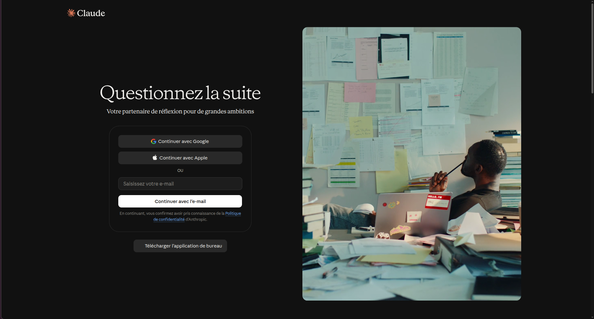

*Figure 1. La page d'accueil de claude.ai et ses trois façons de se connecter.*

### 3.2 Les abonnements et leurs prix

Un compte gratuit existe, mais un **abonnement payant** est nécessaire pour un vrai projet : il donne beaucoup plus d'usage, et il est **indispensable pour utiliser Claude Code** (avec, à défaut, un compte de développeur « Console » facturé à l'usage).

Prix relevés sur les pages officielles le 19 septembre 2026 (en dollars américains, hors taxes) :

| Abonnement | Pour qui | Prix |
|---|---|---|
| **Gratuit** | Découvrir | 0 $, usage limité |
| **Pro** | **Usage personnel** (étudiant, indépendant) : le plus courant | **20 $ par mois** (un tarif annuel, plus avantageux, existe) |
| **Max** | Usage personnel intensif, notamment beaucoup de Claude Code | **100 $ par mois** (« 5x » : cinq fois l'usage de Pro) ou **200 $ par mois** (« 20x » : vingt fois) |
| **Team** | Une **équipe** ou une petite entreprise (au moins 2 membres) | Siège standard : **25 $ par membre et par mois** (20 $ si facturé à l'année) ; siège premium : **125 $** (100 $ à l'année) |
| **Enterprise** | Une **grande organisation** : sécurité et administration renforcées (connexion unique, journaux d'audit, etc.) | Non publics : le siège donne accès à la plateforme, et l'usage est facturé à part, aux tarifs de l'API. Achat en libre-service à partir de 20 sièges, avec un commercial à partir de 50. |

**Lequel choisir ?**

- **Pour ce projet, un compte Pro suffit** pour commencer. Si vous utilisez beaucoup Claude Code, vous atteindrez plus vite les limites et Max peut devenir utile.
- **Team** et **Enterprise** sont pensés pour le travail en entreprise : partage de projets entre collègues, administration centralisée.

**Où voir cette page depuis votre compte ?** Cliquez sur votre profil, en bas à gauche, puis sur **« Mettre le forfait à niveau »**. La page propose deux onglets : **« Particuliers »** (Free, Pro et Max) et **« Team et Enterprise »**.

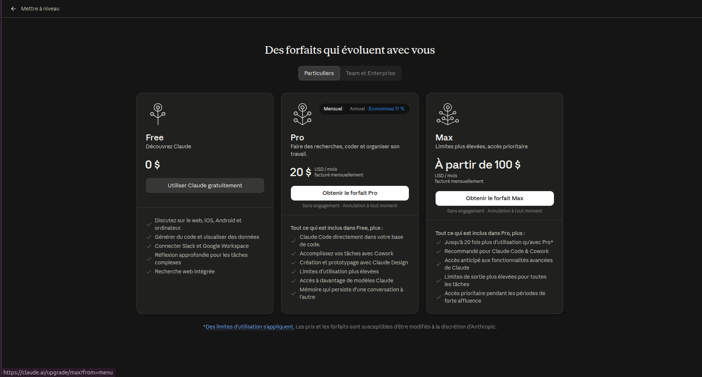

*Figure 2. La page des forfaits, onglet « Particuliers » (prix à vérifier au moment de l'achat).*

---

## 4. Comprendre les limites et les sessions

C'est le point que les débutants comprennent le moins, et celui qui « bloque » le plus souvent. Il faut distinguer **deux limites** et **deux sens du mot « session »**.

### 4.1 Les deux limites

| Limite | Ce qu'elle mesure | Ce qui se passe quand on l'atteint |
|---|---|---|
| **Limite d'usage** | Le « budget de conversation » sur une période : combien vous avez interagi avec Claude (sur claude.ai, dans Claude Code, dans l'application de bureau) | Il faut attendre la remise à zéro |
| **Limite de longueur** | La taille de la « mémoire de travail » de Claude dans **une même conversation** (sa fenêtre de contexte) | Il faut ouvrir une nouvelle conversation, ou laisser Claude résumer les échanges anciens |

### 4.2 La « session d'usage » de 5 heures

Sur les abonnements Pro et Max, l'usage se mesure par **sessions** :

- **toutes les cinq heures**, votre limite de session est **remise à zéro** ;
- en plus, il existe une **limite hebdomadaire**, qui s'applique à l'ensemble des modèles ;
- ce qui compte n'est pas le nombre de messages mais leur « poids » : la longueur du message, les fichiers joints, la complexité de la réponse.

**Ce qui consomme le plus :** les conversations très longues, les nombreuses pièces jointes, la réflexion étendue, l'effort élevé, les connecteurs et la recherche sur le web. Claude Code, qui lit beaucoup de fichiers, consomme aussi vite.

### 4.3 Où surveiller sa consommation

1. Cliquez sur **votre profil, en bas à gauche** de claude.ai : c'est le bouton qui affiche votre prénom et votre forfait (par exemple « Hendrix · Pro »). Un menu s'ouvre.
2. Dans ce menu, cliquez sur **« Paramètres »** (raccourci : `Ctrl` + `Maj` + `,`).
3. Dans la colonne de gauche de la fenêtre qui s'ouvre, cliquez sur **« Utilisation »**.
4. Lisez les trois blocs de la page :
   - **« Session actuelle »** : une barre indique la part déjà utilisée (par exemple « 63 % utilisés ») et le temps avant la remise à zéro (par exemple « Réinitialisation dans 2 h 16 min ») ;
   - **« Limites hebdomadaires »**, ligne **« Tous les modèles »** : la même chose pour la semaine, avec le jour et l'heure de la remise à zéro ;
   - **« Crédits d'utilisation »** : un interrupteur pour continuer à utiliser Claude quand la limite du forfait est atteinte. Des frais peuvent s'appliquer : laissez-le désactivé tant que vous n'avez pas vérifié.
5. La ligne **« Dernière mise à jour »** indique quand ces chiffres ont été rafraîchis ; le petit bouton rond à côté les met à jour.

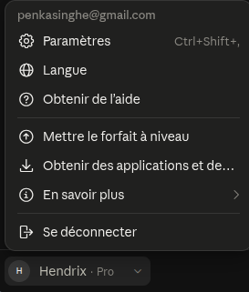

*Figure 3. Le menu du profil : l'entrée « Paramètres » ouvre la fenêtre des réglages.*

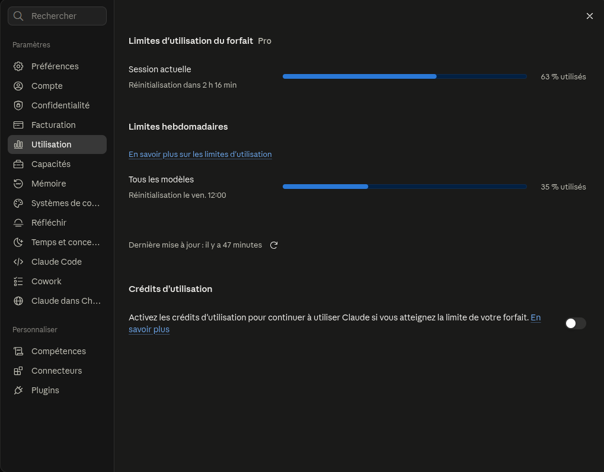

*Figure 4. L'onglet « Utilisation » : session actuelle et limites hebdomadaires.*

### 4.4 Comment consommer moins

- **Une conversation par sujet.** Une conversation qui s'allonge coûte de plus en plus cher : ouvrez-en une nouvelle quand vous changez de sujet.
- **Utilisez le mode Projet** (section 6) : les documents y sont chargés une fois, sans les rejoindre à chaque message.
- **Retirez les fichiers inutiles** d'un projet.
- **Coupez les options non nécessaires** : réflexion étendue, recherche web, connecteurs.
- **Demandez des choses précises** plutôt que de faire refaire plusieurs fois le même travail.

### 4.5 Le deuxième sens de « session » : la session de travail

Au-delà de la limite technique, on parle de **session de travail** : un moment de travail suivi (une demi-journée, par exemple) sur un objectif. C'est une notion de **méthode**, expliquée dans le guide 2 :

> **Les produits d'une session sont les entrées de la session suivante.** À la fin d'une session, on demande à Claude de produire un document de reprise (ce qui a été fait, décidé, ce qui reste). Ce document est déposé dans le projet et sert de point de départ à la session suivante.

---

## 5. Utiliser Claude dans le navigateur (claude.ai)

### 5.1 Une première conversation

1. Sur claude.ai, cliquez sur le bouton **« + Nouveau »**, en haut de la colonne de gauche.
2. Cliquez dans la zone de saisie (« Comment puis-je vous aider aujourd'hui ? » sur l'écran d'accueil, « Écrivez un message… » dans une conversation) et tapez votre demande.
3. Appuyez sur `Entrée` pour l'envoyer. `Maj` + `Entrée` passe à la ligne sans envoyer.
4. Pour **joindre un fichier** : cliquez sur le bouton **« + »** à gauche de la zone de saisie, puis sur **« Ajouter des fichiers ou des photos »** (raccourci `Ctrl` + `U`), et choisissez le fichier (PDF, texte, image, tableau) dans la fenêtre qui s'ouvre.

Sur l'écran d'accueil, deux repères utiles : le sélecteur **« Chat / Cowork »** sous la zone de saisie (restez sur **« Chat »**) et, plus bas, la liste de vos conversations passées : **« Épinglés »** puis **« Récents »**. À droite de la zone de saisie, le nom du modèle est suivi d'un niveau (par exemple « Sonnet 5 Élevé »).


*Figure 5. Le bouton « + Nouveau » ouvre une nouvelle conversation.*

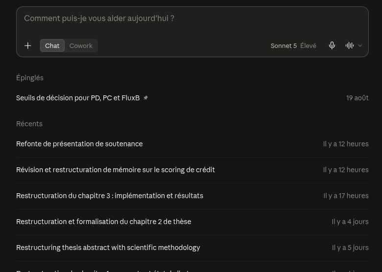

*Figure 6. L'écran d'accueil : zone de saisie, sélecteur « Chat / Cowork », modèle utilisé et conversations récentes.*

**Exemples de demandes utiles :**

```text
Explique-moi en termes simples la différence entre un score de crédit
et une probabilité de défaut.
```

```text
Voici un article scientifique en PDF. Résume-le en dix lignes et dis-moi
en quoi il concerne le choix d'une méthode de sélection de variables.
```

### 5.2 Les outils de recherche et de réflexion

1. Cliquez sur le bouton **« + »** à gauche de la zone de saisie. Un menu s'ouvre, avec notamment : « Ajouter des fichiers ou des photos », « Prendre une capture d'écran », « Ajouter au projet », « Compétences », « Connecteurs », « Système de design », « Ajouter des plugins », **« Recherche »** et **« Recherche web »**.
2. Cliquez sur **« Recherche web »** pour l'activer ou la désactiver : une **coche bleue** apparaît en face quand elle est active.
3. Cliquez sur **« Recherche »** pour demander une recherche approfondie (selon votre abonnement et votre pays, cette option peut varier : vérifiez dans votre menu).
4. Pour la réflexion, regardez à droite de la zone de saisie : le nom du modèle est suivi d'un niveau (par exemple « Sonnet 5 Élevé »). Ce niveau règle l'effort de réflexion : plus il est haut, plus Claude réfléchit longtemps, et plus la réponse consomme.

| Outil | Quand l'utiliser | En bref |
|---|---|---|
| **Recherche web** | Une question factuelle, une information récente | Claude fait une ou deux recherches et répond |
| **Réflexion étendue** (niveau de réflexion du modèle) | Un raisonnement difficile, sans besoin d'Internet : mathématiques, déboguer du code, comparer des choix | Claude réfléchit plus longtemps avant de répondre |
| **Recherche approfondie** (*Research*, entrée « Recherche » du menu) | Un vrai travail de recherche : état de l'art, comparaison de méthodes | Claude enchaîne au moins cinq recherches pendant une à trois minutes et rédige un **rapport avec des citations** vers ses sources |

La recherche approfondie est **très utile pour la partie « littérature »** d'un projet (guide 2).

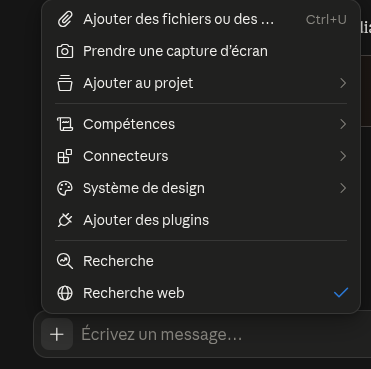

*Figure 7. Le menu « + » : joindre des fichiers, ajouter au projet, « Recherche » et « Recherche web » (coche bleue quand elle est active).*

> **Toujours vérifier les sources.** Même avec des citations, ouvrez les références importantes et vérifiez qu'elles disent bien ce que Claude rapporte. C'est une règle de rigueur pour tout travail académique.

---

## 6. Le mode Projet, indispensable pour un travail long

### 6.1 Chat ou Projet ?

Un **nouveau chat** est une conversation isolée : Claude ne connaît que ce qui s'y dit. Un **Projet** est un **espace de travail** qui regroupe plusieurs conversations et des documents partagés.

| | Nouveau chat | Projet |
|---|---|---|
| Documents | À rejoindre à chaque conversation | **Chargés une fois** dans la « base de connaissances » du projet, disponibles dans toutes ses conversations |
| Consignes | À répéter | **Instructions du projet**, appliquées automatiquement à chaque conversation |
| Mémoire entre conversations | Aucune | Les conversations partagent le même contexte documentaire |
| Volume de documents | Limité à la conversation | Plus grand : sur les abonnements payants, quand le contenu s'approche de la limite, Claude passe en mode de recherche (RAG) et **peut multiplier par 10 la capacité** |
| Travail d'équipe | Non | Partage possible (Team et Enterprise) : « Peut voir » ou « Peut modifier » |
| Adapté à | Une question rapide | **Un projet qui dure plusieurs jours ou semaines** |

Les projets sont disponibles pour tous les comptes, y compris gratuits (dans la limite de cinq projets).

### 6.2 Créer un projet, pas à pas

1. Dans la colonne de gauche de claude.ai, cliquez sur **« Projets »**. La page **« Projets »** s'ouvre : chaque projet y est une carte avec son nom et la date de sa dernière activité.
2. Cliquez sur le bouton **« Nouveau projet »**, en haut à droite de la page.
3. La fenêtre **« Créer un projet »** s'ouvre :
   - dans le champ **« Sur quoi travaillez-vous ? »** (« Nommez votre projet »), tapez le nom, par exemple `CREDIX` ;
   - dans le champ **« Qu'essayez-vous de faire ? »**, décrivez le projet, ses objectifs, son sujet.
4. Cliquez sur **« Créer un projet »** (ou sur « Annuler » pour abandonner).
5. La page du projet s'ouvre avec trois zones : **« Instructions »**, **« Contexte »** et **« Programmé »**. Les deux premières servent aux sections 6.3 et 6.4 ; « Programmé » (tâches récurrentes) ne sert pas ici.
6. Démarrez ensuite une conversation **à l'intérieur** du projet, avec la zone de saisie du projet.

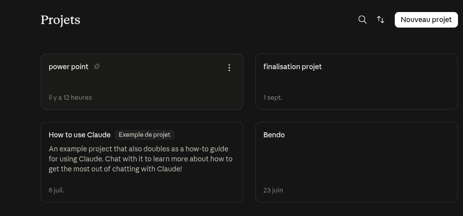

*Figure 8. La page « Projets » et son bouton « Nouveau projet ».*

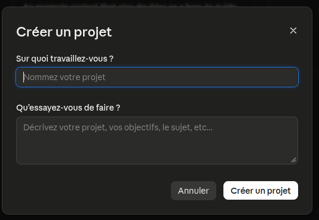

*Figure 9. La fenêtre « Créer un projet » : le nom, puis la description.*

### 6.3 Bien écrire les instructions du projet

Les instructions décrivent **qui est Claude dans ce projet et comment il doit travailler**. Exemple utilisé pour CREDIX, à adapter :

```text
Tu es mon assistant de conception pour un mémoire d'ingénieur sur un système
de scoring de crédit.

Règles de travail :
1. Tu proposes, je décide. Avant toute décision importante, tu présentes les
   options, leurs avantages et leurs limites, puis tu attends mon accord.
2. Aucun chiffre inventé : tout chiffre vient d'un document du projet ou d'un
   calcul que je t'ai transmis. Sinon, tu dis que tu ne sais pas.
3. Tu cites tes sources (auteur, année) et tu signales quand une référence
   reste à vérifier.
4. Tu réponds en français, en termes simples, en structurant avec des titres
   et des listes.
5. À la fin de chaque session, tu produis un document de reprise en Markdown :
   ce qui a été fait, ce qui a été décidé, ce qui reste à faire.
```

**Où saisir ces instructions ?** Dans la page du projet, cliquez sur le bouton **« + »** à droite de **« Instructions »** (le texte grisé indique « Ajoutez des instructions pour personnaliser les réponses de Claude »). Collez le texte, puis validez.

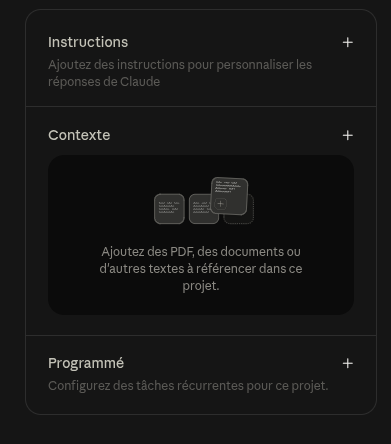

*Figure 10. Le panneau d'un projet neuf : « Instructions », « Contexte » et « Programmé ».*

### 6.4 Que mettre dans la base de connaissances (le « Contexte ») ?

- le **cahier des charges** et les documents de conception déjà produits ;
- les **articles scientifiques** (PDF) sur lesquels s'appuient les choix ;
- les **résultats** d'expériences (exports, rapports) ;
- les **documents de reprise** de chaque session précédente ;
- le **journal de bord** et le **registre des décisions** (voir guide 2).

Pour CREDIX, la première séance de travail a justement consisté à **faire l'inventaire des ressources du projet** et à rédiger les instructions du projet, avant de poser la moindre question de fond.

**Comment ajouter des fichiers ?** Dans la page du projet, cliquez sur le bouton **« + »** à droite de **« Contexte »** (le texte indique « Ajoutez des PDF, des documents ou d'autres textes à référencer dans ce projet »), puis choisissez vos fichiers sur l'ordinateur. Chaque fichier apparaît sous la forme d'une carte avec son nom, sa taille et son type (TXT, MD, PDF…). Une **barre de capacité** indique la part déjà utilisée (par exemple « 58 % de la capacité du projet utilisée ») ; quand le contenu devient volumineux, le **« Mode de recherche »** s'active : Claude cherche alors les passages utiles au lieu de tout relire.

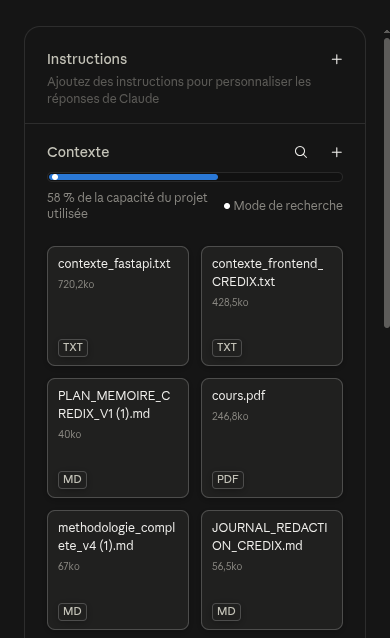

*Figure 11. Le « Contexte » d'un projet : les fichiers ajoutés, la barre de capacité et le mode de recherche.*

---

## 7. Claude Code : installer et utiliser l'assistant dans VS Code

### 7.1 Ce que fait Claude Code

Claude Code est l'assistant qui **travaille dans votre projet** : il lit les fichiers, comprend l'organisation du code, propose et effectue des modifications, lance des commandes (tests, installation) et sait utiliser Git. Vous lui parlez en français, comme dans claude.ai, mais **il agit sur vos fichiers**.

### 7.2 Ce qu'il faut avant d'installer

- **VS Code, version 1.94 ou plus** (menu *Aide*, puis *À propos*, pour voir votre version) ;
- un **abonnement Claude payant** (Pro, Max, Team ou Enterprise), ou un compte développeur « Console » : aucune clé d'API n'est nécessaire avec un abonnement.

### 7.3 Installer l'extension dans VS Code

1. Ouvrez **VS Code**.
2. Ouvrez la vue des **extensions** : cliquez sur l'icône des extensions dans la barre verticale de gauche (quatre carrés, dont un détaché), ou tapez `Ctrl` + `Maj` + `X` (sur Mac : `Cmd` + `Maj` + `X`). Le panneau **« EXTENSIONS: MARKETPLACE »** s'ouvre.
3. Cliquez dans la barre de recherche du panneau et tapez **claude code**.
4. Dans la liste des résultats, repérez l'extension **« Claude Code for VS Code »**. Son éditeur est **Anthropic**, avec un **badge bleu de vérification** à côté du nom. Attention : la liste contient aussi des extensions d'autres éditeurs, au nom presque identique (par exemple « Chat for Claude Code » ou « Claude Code Assistant for VSCode »). **Ne choisissez pas celles-là.**
5. Cliquez sur l'extension officielle pour ouvrir sa page, puis sur le bouton bleu **« Install »** (« Installer »).
6. Attendez la fin de l'installation. Si le message **« Restart Required »** (redémarrage requis) s'affiche à côté du nom de l'extension, redémarrez VS Code : fermez-le puis rouvrez-le.
7. Pour vérifier : l'extension figure dans la liste des extensions installées, et une **icône d'étincelle** apparaît dans VS Code (section 7.4).

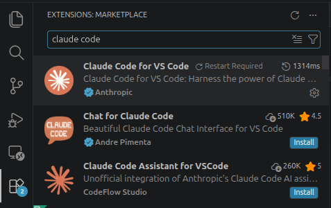

*Figure 12. Recherche « claude code » : l'extension officielle a pour éditeur Anthropic et un badge bleu ; les autres viennent d'autres éditeurs.*

### 7.4 Ouvrir Claude Code et se connecter

**Ouvrir le panneau.** Trois façons, au choix :

1. **Depuis l'éditeur.** Ouvrez d'abord un fichier de votre projet (l'icône n'apparaît que lorsqu'un fichier est ouvert), puis cliquez sur l'**icône d'étincelle**, en haut à droite de l'éditeur.
2. **Depuis la barre d'activité** (la barre verticale de gauche) : cliquez sur l'icône d'étincelle, qui ouvre la liste de vos sessions.
3. **Depuis la palette de commandes** : tapez `Ctrl` + `Maj` + `P`, écrivez « Claude Code » et choisissez **« Open in New Tab »** (raccourci : `Ctrl` + `Maj` + `Échap`).

Le panneau **« Claude Code »** s'ouvre dans un onglet de l'éditeur.

**Se connecter (au premier lancement seulement).**

1. Le panneau vous demande de vous connecter : cliquez sur le bouton de connexion proposé.
2. Votre **navigateur** s'ouvre sur une page de claude.ai. Vérifiez que c'est bien le compte qui possède l'abonnement payant, puis autorisez l'accès avec le bouton de la page.
3. Revenez dans **VS Code** : le panneau affiche maintenant la zone de saisie. Vous êtes connecté.

**Lire le panneau.** L'extension s'affiche **en anglais**. De haut en bas : le titre « Claude Code » ; au milieu, parfois un petit guide « Learn Claude Code » (une liste d'étapes) et des messages d'information, par exemple « Auto mode is enabled », que l'on ferme avec la croix ; en bas, la **zone de saisie**. Sous elle se trouvent, de gauche à droite : le bouton **« + »** (joindre un élément), le bouton **« / »** (commandes), le **nom du modèle** avec son niveau d'effort (par exemple « Sonnet 5 Extra high »), puis, à droite, le **mode en cours** (par exemple « Auto ») et le **bouton d'envoi** (une flèche).


*Figure 13. L'icône d'étincelle, à l'extrémité de la barre d'outils de l'éditeur.*

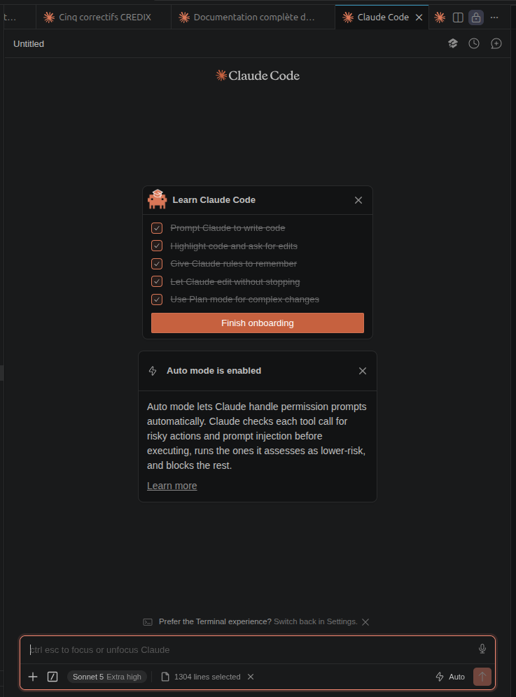

*Figure 14. Le panneau Claude Code : messages d'accueil, puis zone de saisie et réglages en bas.*

> **Alternative en ligne de commande.** Claude Code s'installe aussi dans un terminal. Sous Linux, macOS ou WSL : `curl -fsSL https://claude.ai/install.sh | bash`. Puis `claude --version` vérifie l'installation, et la commande `claude`, tapée dans le dossier d'un projet, démarre l'assistant (connexion au premier lancement).

### 7.5 Première utilisation

1. **Ouvrez le dossier de votre projet** : menu **« Fichier »** (*File*), puis **« Ouvrir le dossier… »** (*Open Folder…*) ; choisissez le dossier et validez. Son contenu apparaît dans la colonne de gauche de VS Code.
2. **Ouvrez le panneau Claude Code** en cliquant sur l'icône d'étincelle (section 7.4).
3. **Cliquez dans la zone de saisie**, en bas du panneau, et tapez une première question :

```text
Que fait ce projet ? Explique-moi son organisation en quelques lignes.
```

4. **Envoyez** avec la touche `Entrée`, ou avec le bouton en forme de flèche à droite de la zone de saisie.
5. **Suivez le travail de Claude** : le panneau affiche ce qu'il fait au fur et à mesure (par exemple la lecture de fichiers), puis sa réponse rédigée. Selon le mode choisi (section 8), il peut vous demander une autorisation avant une action : lisez la demande, puis acceptez ou refusez.
6. **Continuez la conversation** en écrivant dans la même zone de saisie.

Claude lit les fichiers dont il a besoin : vous n'avez pas à les lui fournir un par un. Pour lui désigner un fichier précis, tapez le symbole `@` suivi du début du nom du fichier, puis choisissez-le dans la liste qui s'affiche.

**Quelques commandes utiles**, à taper dans la zone de saisie :

| Commande | Effet |
|---|---|
| `/help` | Affiche l'aide et les commandes disponibles |
| `/clear` | Efface la conversation courante (repartir d'un contexte propre) |
| `/resume` | Reprend une conversation précédente |
| `/plan` devant une demande | Fait d'abord un plan, sans rien modifier (section 8) |
| `/init` | Crée automatiquement un fichier `CLAUDE.md` décrivant le projet (voir ci-dessous) |

### 7.6 Le fichier `CLAUDE.md` : la mémoire du projet

Chaque nouvelle conversation de Claude Code démarre « à blanc ». Pour qu'il connaisse les règles de **votre** projet, on les écrit dans un fichier **`CLAUDE.md`**, placé à la racine du dossier : Claude le lit au début de chaque conversation.

On y met, par exemple : les commandes pour lancer et tester le projet, les conventions de code, les décisions d'architecture, les interdits (« ne jamais modifier tel dossier »). La commande `/init` en produit une première version automatiquement, que l'on complète ensuite.

---

## 8. Les modes de Claude Code, dont le mode Plan

### 8.1 Les modes de permission

Claude Code peut lire, modifier des fichiers et lancer des commandes. Le **mode de permission** règle ce qu'il peut faire **sans vous demander**. Pour le changer :

1. repérez le **nom du mode en cours**, en bas à droite de la zone de saisie (par exemple « Auto ») ;
2. cliquez dessus : la liste **« Modes »** s'ouvre, avec pour chaque mode une courte description ;
3. cliquez sur le mode voulu. Sous la liste, un curseur **« Effort »** règle l'effort de réflexion de Claude.

Raccourci : `Maj` + `Tab` passe au mode suivant (dans le terminal aussi). Dans l'extension, les modes s'affichent **en anglais** : *Manual*, *Edit automatically*, *Plan* et *Auto*.

| Mode | Ce qui s'exécute sans demander | Quand l'utiliser |
|---|---|---|
| **Manuel** (*default*) | La lecture seulement : tout le reste demande votre accord | Travail sensible, on veut tout relire |
| **Modifier automatiquement** (*acceptEdits*) | Lecture, modification de fichiers et commandes simples (créer un dossier, copier…) | On relit le code au fur et à mesure |
| **Plan** (*plan*) | Lecture seulement : Claude **explore et propose un plan, sans rien modifier** | **Avant de changer quoi que ce soit** |
| **Auto** (*auto*) | Presque tout, avec des vérifications de sécurité en arrière-plan | Longues tâches, moins d'interruptions |
| **Contournement** (*bypassPermissions*) | Tout, sans aucune vérification | **À éviter** (réservé à des machines isolées) |

Sur les abonnements Pro, Max et Team, le mode de départ est **Auto**. Les libellés peuvent légèrement varier selon la version de l'extension.

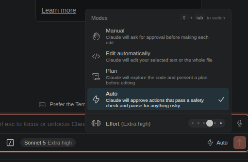

*Figure 15. La liste « Modes » : Manual, Edit automatically, Plan, Auto, et le curseur « Effort ».*

### 8.2 Le mode Plan : réfléchir avant d'agir

En **mode Plan**, Claude Code **explore le projet et rédige un plan d'action, mais ne modifie rien**. C'est le mode à utiliser :

- **au début d'un travail** : à partir d'un document de conception, il produit la **liste des tâches à réaliser** (la « TODO ») ;
- **avant chaque ajout ou modification** d'un module : on relit ce que Claude compte faire, on corrige, puis on valide.

**Pas à pas :**

1. **Passez en mode Plan.** Cliquez sur le nom du mode en cours (en bas à droite de la zone de saisie), puis sur **« Plan »** dans la liste. Autres façons : taper `/plan` au début de votre demande, ou appuyer sur `Maj` + `Tab` jusqu'à ce que « Plan » s'affiche. Vérifiez que le nom du mode indiqué est bien **« Plan »**.
2. **Écrivez votre demande** dans la zone de saisie, par exemple : « Lis le document docs/guides/03_conception_MVP.md et propose un plan de réalisation, module par module. » Envoyez avec `Entrée`.
3. **Attendez.** Claude lit les fichiers et réfléchit. À ce stade, **aucun fichier n'est créé ni modifié**.
4. **Lisez le plan.** Il s'ouvre comme un **document Markdown** dans VS Code : un titre, des parties, une liste d'étapes. Lisez-le en entier, comme vous relirez un document de conception.
5. **Faites corriger si besoin.** Vous pouvez ajouter des commentaires dans le plan, à côté des passages à corriger, comme dans une relecture. Sinon, écrivez vos remarques dans la zone de saisie : Claude révise le plan.
6. **Approuvez quand le plan vous convient.** Trois réponses sont proposées :
   - **Oui, en mode Auto** : Claude passe à la réalisation avec un minimum d'interruptions ;
   - **Oui, en approuvant chaque modification à la main** (recommandé au début) : Claude demande votre accord avant chaque changement ;
   - **Non, continuer à planifier** : on reste en mode Plan et on précise ce qu'il faut changer.
7. **Gardez le plan.** Une fois validé, il sert de **liste des tâches (TODO)** du projet : copiez-le dans un fichier du dossier du projet (guide 2, section 11.1).

> **Règle pratique.** Un travail qui touche plusieurs fichiers commence **toujours** par un plan. C'est moins cher (pas de fausses pistes) et plus sûr (vous validez avant que le code change).

---

## 9. Bonnes pratiques et précautions

### 9.1 Bien demander

- **Soyez précis.** Au lieu de « corrige le bug », écrivez : « corrige le bug où l'écran reste blanc après une erreur de mot de passe ».
- **Procédez par étapes.** Découpez un gros travail : une base de données, puis les routes, puis l'écran.
- **Faites explorer d'abord.** « Analyse la structure de la base de données » avant « ajoute un tableau de bord ».
- **Parlez comme à un collègue** : décrivez l'objectif, pas seulement la tâche.

### 9.2 Précautions

- **Ne collez jamais de secrets** (mots de passe, clés d'API, contenu d'un fichier `.env`) dans une conversation.
- **Relisez les modifications** avant de les accepter (VS Code montre les différences ligne par ligne).
- **Travaillez sous Git** : chaque étape validée est enregistrée, on peut revenir en arrière.
- **Vérifiez ce qui compte** : chiffres, références, résultats de tests. Claude peut se tromper, y compris avec assurance.
- **Données réelles de clients** : ne les confiez pas à un outil externe sans autorisation. CREDIX a été conçu sur un jeu de données public pour cette raison.

---

## 10. Glossaire et sources officielles

### 10.1 Glossaire

| Terme | Explication simple |
|---|---|
| **Anthropic** | L'entreprise qui développe Claude |
| **Abonnement** | Formule payante (Pro, Max, Team, Enterprise) qui donne accès à plus d'usage |
| **Session (d'usage)** | Période de 5 heures au bout de laquelle la limite de session est remise à zéro |
| **Session (de travail)** | Moment de travail suivi sur un objectif, qui se conclut par un document de reprise |
| **Contexte** | Ce que Claude « a en mémoire » dans une conversation |
| **Projet** | Espace de travail regroupant conversations, instructions et documents |
| **Base de connaissances** | Les documents chargés dans un projet |
| **RAG** | Technique où Claude cherche les passages utiles dans une grande masse de documents, au lieu de tout lire |
| **Claude Code** | L'assistant de programmation qui travaille dans vos dossiers |
| **Mode Plan** | Mode où Claude propose un plan sans rien modifier |
| **CLAUDE.md** | Fichier de consignes permanentes d'un projet, lu à chaque conversation |
| **Markdown (.md)** | Format de texte simple avec titres et listes ; c'est le format « naturel » de Claude |

### 10.2 Sources officielles (consultées le 19 septembre 2026)

- Abonnement Pro : <https://support.claude.com/en/articles/8325606-what-is-the-pro-plan>
- Abonnement Max : <https://support.claude.com/en/articles/11049741-what-is-the-max-plan>
- Abonnement Team : <https://support.claude.com/en/articles/9266767-what-is-the-team-plan>
- Abonnement Enterprise : <https://support.claude.com/en/articles/9797531-what-is-the-enterprise-plan>
- Limites d'usage et de longueur : <https://support.claude.com/en/articles/11647753-how-do-usage-and-length-limits-work>
- Projets : <https://support.claude.com/en/articles/9517075-what-are-projects>
- Recherche web, réflexion étendue et recherche approfondie : <https://support.claude.com/en/articles/11095361-when-should-i-use-web-search-extended-thinking-and-research>
- Claude Code dans VS Code : <https://code.claude.com/docs/en/vs-code>
- Claude Code, démarrage rapide : <https://code.claude.com/docs/en/quickstart>
- Modes de permission (dont le mode Plan) : <https://code.claude.com/docs/en/permission-modes>
- Mémoire du projet (`CLAUDE.md`) : <https://code.claude.com/docs/en/memory>
