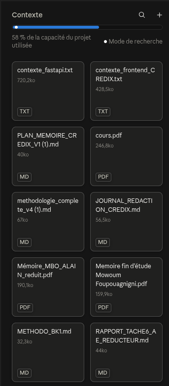

# Guide 2 : la méthode de travail avec Claude, de A à Z

**Comment conduire un projet d'application avec Claude, du besoin à l'application lancée. Illustrée par la conception réelle de CREDIX.**

<!-- toc -->

## Sommaire

1. [Le principe en une page](#1-le-principe-en-une-page)
2. [Vue d'ensemble : trois niveaux et neuf étapes](#2-vue-densemble--trois-niveaux-et-neuf-étapes)
3. [Le cycle de session : ouvrir, travailler, fermer](#3-le-cycle-de-session--ouvrir-travailler-fermer)
4. [Les documents qui font tenir le projet](#4-les-documents-qui-font-tenir-le-projet)
5. [Étape 0 : préparer l'espace de travail](#5-étape-0--préparer-lespace-de-travail)
6. [Étape 1 : du besoin au cahier des charges](#6-étape-1--du-besoin-au-cahier-des-charges)
7. [Étape 2 : la recherche dans la littérature](#7-étape-2--la-recherche-dans-la-littérature)
8. [Étape 3 : les choix méthodologiques, exemple du WoE](#8-étape-3--les-choix-méthodologiques-exemple-du-woe)
9. [Étape 4 : choisir les langages et les technologies](#9-étape-4--choisir-les-langages-et-les-technologies)
10. [Étape 5 : le document de conception](#10-étape-5--le-document-de-conception)
11. [Étapes 6 et 7 : Claude Code, du plan au prototype testé](#11-étapes-6-et-7--claude-code-du-plan-au-prototype-testé)
12. [Étape 8 : livrer, lancer, tester à la main](#12-étape-8--livrer-lancer-tester-à-la-main)
13. [Étape 9 : modifier, documenter, transmettre](#13-étape-9--modifier-documenter-transmettre)
14. [Les erreurs et les pièges réels](#14-les-erreurs-et-les-pièges-réels)
15. [Bibliothèque de prompts](#15-bibliothèque-de-prompts)
16. [Modèles de documents](#16-modèles-de-documents)
17. [Rejouer la méthode : le mini-exercice](#17-rejouer-la-méthode--le-mini-exercice)

<!-- /toc -->

> **Comment lire ce guide.** Les blocs intitulés **« Prompt »** sont à copier dans Claude, après avoir remplacé ce qui est entre crochets `[...]`. Les encadrés **« Dans CREDIX »** montrent ce qui a été réellement fait, d'après les documents du projet (instructions du projet, journaux de sessions et de rédaction, rapports, documents de passation). Les prompts marqués **« extrait réel »** sont tirés de ces fichiers ; les autres sont des prompts types, construits sur le même modèle.
>
> Ce guide suppose que vous avez lu le **guide 1** (abonnement, mode Projet, Claude Code).

---

## 1. Le principe en une page

Concevoir une application avec Claude ne consiste pas à lui dire « fais-moi une application de crédit ». Cela donne un résultat fragile, sans traçabilité. La méthode qui a servi pour CREDIX repose sur **six principes**.

| Principe | Ce que cela veut dire concrètement |
|---|---|
| **1. On conçoit avant de coder** | Un cahier des charges, puis une conception écrite, **avant** la première ligne de code. Règle du projet professionnel : *« ne jamais coder avant d'avoir clarifié la conception »* |
| **2. Claude propose, l'humain décide** | Claude explique ce qu'il va produire **avant** de le produire. Aucun livrable final sans **accord explicite** |
| **3. Une seule tâche à la fois** | Le travail est découpé ; chaque tâche suit les mêmes étapes |
| **4. Chaque décision est écrite** | Un registre consigne le choix, les alternatives écartées, la justification et le **niveau de preuve** |
| **5. Tout passe par des fichiers Markdown** | Le travail d'une session devient un document, qui **alimente la session suivante** |
| **6. On vérifie par l'exécution** | Chaque module est testé ; les commandes de lancement sont rejouées sur une machine neuve |

> **Pourquoi le Markdown (`.md`) ?** Claude écrit naturellement en Markdown : du texte simple, avec titres, listes et tableaux. Il est lisible par une personne **et** par un assistant comme Claude Code, comparable ligne à ligne dans Git, et convertible ensuite en PDF, en Word ou en présentation. **On garde toujours le `.md` comme source**, même si le livrable final est un PDF (les documents de ce dossier sont produits ainsi, avec LaTeX : voir le guide 4).

**Le fil rouge de CREDIX, écrit dans le mémoire :** *« chaque bloc du pipeline sert un objectif précis, et on le prouve. »* La même exigence vaut pour la méthode : *chaque étape produit un document vérifiable.*

---

## 2. Vue d'ensemble : trois niveaux et neuf étapes

### 2.1 Les trois niveaux de la méthode

| Niveau | Ce que c'est | Où en parle-t-on |
|---|---|---|
| **A. Les outils** | Un **Projet** claude.ai (instructions et base de connaissances), **Claude Code** dans VS Code, des **fichiers Markdown** | Guide 1 |
| **B. Le cycle de session** | Une façon **d'ouvrir, de conduire et de fermer** chaque séance de travail, pour ne jamais perdre le fil | Section 3 |
| **C. Les documents du projet** | Instructions, journal, registre de décisions, pièges, TODO, documents de passation : la **mémoire** du projet | Section 4 |

### 2.2 Les neuf étapes d'un projet

| Étape | Ce qu'on fait | Où | Livrable |
|---|---|---|---|
| **0** | Préparer l'espace : Projet Claude, instructions, journal | claude.ai | Projet configuré, journal |
| **1** | Passer du besoin au **cahier des charges** | claude.ai (Projet) | `cahier_des_charges.md` |
| **2** | Chercher dans la **littérature** | claude.ai (recherche approfondie) + articles PDF | Fiches de lecture, références |
| **3** | Faire les **choix méthodologiques** et les consigner | claude.ai (Projet) | **Registre des décisions** |
| **4** | Choisir les **langages et technologies** | claude.ai (Projet) | Section « choix techniques » |
| **5** | Rédiger le **document de conception** (UML, flux, données) | claude.ai (Projet) | `conception.md` |
| **6** | Passer à **Claude Code** : mode **Plan**, TODO | VS Code | Plan validé |
| **7** | **Prototyper module par module**, avec tests | VS Code | Modules testés |
| **8** | **Livrer** : README de lancement, tests à la main | VS Code + terminal | Projet lançable |
| **9** | **Modifier**, documenter, transmettre | VS Code (mode Plan) | Documents de reprise |

Chaque étape est conduite **à l'intérieur d'une session**, selon le cycle de la section suivante.

---

## 3. Le cycle de session : ouvrir, travailler, fermer

Un projet long se déroule sur **de nombreuses sessions**. Claude ne se souvient pas d'une session à l'autre : c'est **vous** qui organisez la continuité, avec des documents. Toutes les sessions de CREDIX suivent le même cycle.

### 3.1 Ouvrir la session : le prompt de démarrage

**Principe.** On ne pose pas de question tout de suite. Le premier message impose **ce que Claude doit lire, dans quel ordre**, et lui interdit de commencer avant votre accord.

**Prompt de démarrage (extrait réel, phase de rédaction du chapitre 2 de CREDIX)**

```text
Voici la suite du travail sur le mémoire CREDIX, chapitre 2. Avant de répondre
quoi que ce soit, lis dans cet ordre, entièrement :

1. HANDOVER_SESSION_SUIVANTE.md : à jour, fin de la session précédente.
2. JOURNAL_REDACTION_CREDIX_CH2_A_JOUR.md : lis en entier la section « Pièges
   méthodologiques déjà identifiés » avant toute chose : ce ne sont pas des
   recommandations générales, ce sont des erreurs déjà commises dans ce projet.
3. chap02_en_cours.tex : le chapitre en cours.
4. TODO_CHAPITRE2_CREDIX_MAJ.md : le plan détaillé à jour. Le journal fait foi
   en cas de désaccord entre les deux fichiers.
5. Dans le project knowledge : [les rapports à lire en entier avant d'écrire].
6. Le notebook joint : nécessaire pour vérifier tout chiffre cité.

Avant d'ouvrir la section suivante, j'ai des remarques groupées sur ma relecture :
je te les donne d'abord, on les traite, puis on passe à la suite. Ne commence pas
la rédaction avant que je te dise que c'est bon.
```

**Ce que ce prompt impose, et pourquoi :**

| Élément | Effet |
|---|---|
| **Ordre de lecture explicite** | Claude part du même état que vous, sans oublier les documents essentiels |
| **Le journal « fait foi »** en cas de désaccord | Il y a **une** source de vérité |
| **Lire d'abord les pièges** | On évite de **refaire** des erreurs déjà commises |
| **« Ne commence pas avant que je te dise que c'est bon »** | Vous gardez la main : Claude propose, vous décidez |

**Variante pour un projet de programmation (extrait réel, projet professionnel)**

```text
Tu es mon pair-programmer principal. Règles absolues : tu travailles une seule
tâche à la fois ; tu respectes l'architecture existante et les conventions ;
tu ne codes jamais avant d'avoir clarifié la conception.
Méthode obligatoire en 5 étapes : 1) analyse de l'existant, 2) conception
fonctionnelle, 3) conception technique, 4) mise en place, 5) tests.
Je vais te fournir le contexte (fichiers, TODO, éventuellement un rapport de
passation). Attends mes instructions.
```

Et le message de démarrage de ce même kit : *« Ta première mission AVANT toute action : 1. lire CONTEXT.md pour comprendre la stack et les fichiers clés ; 2. lire TODO.md et identifier les tâches non cochées ; 3. me dire quelle est la prochaine tâche logique ; 4. attendre ma validation avant de commencer. **Ne propose aucun code pour l'instant.** »*

### 3.2 Conduire la session : une tâche à la fois, en cinq étapes

Pendant la session, on respecte les règles inscrites dans les instructions du projet (voir section 4.1) :

- **Claude explique chaque initiative avant de produire quoi que ce soit.**
- **On travaille sur une seule tâche**, définie au début de la session, et on ne touche pas au reste. Exemple réel : *« Cette session a un seul objectif : exécuter le bloc A de la TODO. Ne pas toucher au backend. Ne pas travailler sur le mémoire. Uniquement le notebook. »*
- Pour une tâche technique, on suit les **cinq étapes** : **analyse de l'existant → conception fonctionnelle → conception technique → mise en place → tests**.
- Pour une tâche de rédaction, on procède **sous-section par sous-section** : décider ce qui entre, ce qui sort, ce qui part dans un autre chapitre ; proposer un sous-plan ; discuter le contenu ; rédiger ; faire une vérification technique courte ; réserver l'**audit critique complet** aux sous-sections à risque, identifiées ensemble.
- **Claude signale quand le contexte devient chargé** et propose de changer de session. Si vous acceptez, il prépare la documentation de clôture.

### 3.3 Fermer la session : le rapport de passation

**Prompt de fin de session (extrait réel, projet professionnel)**

```text
Nous allons bientôt changer de session. Génère-moi un « Handoff Report »
(résumé de passation) très concis. Il doit contenir :
1. Ce qui a été complété avec succès aujourd'hui.
2. Ce qui est actuellement en cours (avec le fichier exact et la ligne si possible).
3. La prochaine étape immédiate selon notre méthode en 5 étapes.
4. Les éventuels points d'attention ou bugs laissés en suspens.
Ne génère pas de code, juste ce rapport en markdown.
```

**La règle de clôture des instructions du projet de CREDIX :** *les livrables de clôture ne sont produits qu'après l'accord explicite de l'auteur, et Claude explique ce qu'il va produire avant de le produire.* Ce sont :

1. les **instructions du projet** mises à jour, si elles ont changé ;
2. une **nouvelle entrée du journal de bord**, datée, en **ajout seulement** (on ne réécrit jamais le passé) ;
3. le **plan** et la **TODO** mis à jour ;
4. le **document de passation**, qui devient l'entrée de la session suivante.

Ces documents sont ensuite **déposés dans le projet Claude** (ou dans le dossier du projet de code) : c'est ce qui rend la session suivante possible.

> **Dans CREDIX.** Le résultat est visible dans le dépôt : des documents de passation (`HANDOVER_...`), un journal de bord, des rapports de session par sujet (par exemple le rapport de la séance sur le flux de contrôle des profils atypiques), une « copie miroir » des notes que Claude conserve d'une session à l'autre, et des prompts de démarrage propres à chaque type de séance (notebook, rédaction du mémoire, codage).

---

## 4. Les documents qui font tenir le projet

### 4.1 Les instructions du projet (six sections)

C'est le document le plus important : il est chargé **une fois** dans le Projet Claude et s'applique à **toutes** les conversations. Voici la structure réelle de celui de CREDIX.

| Section | Contenu | Pourquoi |
|---|---|---|
| **1. Contexte** | Qui, quoi, pour qui, dates clés, encadrants, sujet, état d'avancement | Claude sait dans quel cadre il travaille |
| **2. Ressources permanentes** | La liste **classée** des documents du projet, avec pour chacun **« consulter pour… »** : modèles de référence, documents techniques, normes de rédaction, norme bibliographique, modèle LaTeX, version courante du mémoire | Claude sait **où chercher** selon la tâche |
| **3. Décisions techniques figées** | Treize décisions prises, à ne remettre en question que sur contradiction logique majeure (modèle final, ordre des étapes du pipeline, traitement des manquants, découpage des données, métriques principales, pile technique…) | Évite de rediscuter sans cesse les mêmes choix |
| **4. Consignes permanentes** | Langue, niveau attendu, style, règles anti-plagiat, outil pour les diagrammes, cohérence code/rapport ; **« à faire systématiquement »** et **« ce que Claude ne doit pas faire »** | Uniformise toutes les réponses |
| **5. Workflow de collaboration** | Ce qui se passe **au début, pendant et à la fin** de chaque session (voir section 3) | Le cycle de session est écrit noir sur blanc |
| **6. État courant** | Où en est le projet, mis à jour à chaque session | Claude connaît la situation |

**Extrait réel de la section 4 (consignes permanentes) :**

```text
À faire systématiquement :
- Lire le journal de bord en début de chaque session
- Consulter [le document de méthodologie] avant tout chapitre technique
- Consulter [le rapport de pipeline] pour tous les résultats numériques
- Signaler immédiatement tout doublon détecté dans la base de connaissances
- Demander l'OK explicite de l'auteur avant de produire les livrables finaux

Ce que Claude ne doit pas faire :
- Rédiger sans avoir consulté les ressources pertinentes
- Produire des livrables sans OK explicite de l'auteur
```

**Extrait réel de la section 5 (workflow) :**

```text
En début de session : Claude lit le journal ; propose un objectif de session ;
l'auteur confirme ou ajuste.
Pendant la session : on itère ; Claude explique chaque initiative avant de produire.
En fin de session : Claude produit les livrables de clôture UNIQUEMENT après OK
explicite : instructions à jour, journal (nouvelle entrée datée, ajout seulement),
plans à jour.
Règle fondamentale : aucun livrable final n'est produit sans OK explicite.
```

### 4.2 Les autres documents, en un tableau

| Document | Rôle | Règle d'or | Exemple dans CREDIX |
|---|---|---|---|
| **Journal de bord** | Une entrée par session : *réalisé, décisions prises, en attente* | **Ajout seulement**, jamais de réécriture du passé | `journal_sessions_memoire_hendrix.txt` |
| **Journal de rédaction** | État consolidé d'un chapitre : plan, **règles de rédaction actées**, **décisions verrouillées**, **pièges**, points ouverts | **Fait foi** en cas de désaccord avec la TODO | `JOURNAL_REDACTION_CREDIX_CH2_A_JOUR.md` |
| **Registre des décisions** | Chaque choix : options, justification, niveau de preuve | Toute décision importante y figure | `RAPPORT_DECISIONS_METHODOLOGIQUES_CREDIX.md` |
| **Rapport de résultats** | Résultats validés, consolidés | **Aucun chiffre inventé** : il vient d'un calcul | `RAPPORT_RESULTATS_CONCLUSIONS_CREDIX.md` |
| **Pièges méthodologiques** | La liste des **erreurs déjà commises** | À relire **avant** de reprendre le travail | Section 4bis du journal de rédaction |
| **TODO** | Le plan détaillé, tâche par tâche | Une tâche = une case à cocher | `TODO_...md` |
| **Document de passation** | Ce qui est fait, en cours, à faire, règles absolues | Écrit à la fin de **chaque** session ou phase | `HANDOVER_...md` |
| **État miroir** | Copie des notes que Claude garde d'une session à l'autre | Doit rester identique à la mémoire interne | `ETAT_MEMOIRE_CLAUDE_CREDIX.md` |
| **Instantané de contexte** | Un fichier qui résume **tout le code** d'un projet, fabriqué par un script | À régénérer avant d'en parler à Claude | `scanner.sh` produit `contexte_fastapi.txt` |

### 4.3 Deux exemples réels qui montrent la valeur de ces documents

**Des règles de rédaction « actées »** (extraits du journal de rédaction, sur trente-huit règles) :

- *« Un paragraphe = une fonction argumentative. »*
- *« Aucun composant sans fonction énonçable en une phrase. »*
- *« Séparation stricte conception / résultats : jamais "meilleure" avant les résultats. »*
- *« **Grille des quatre questions pour chaque bloc technique** : ① le problème ② la solution ③ pourquoi celle-là ④ comment elle est validée. »*
- *« Terminologie : un seul terme, "dispositif de décision". Jamais "dispositif de contrôle". »*

**Des pièges consignés, avec leur histoire** (extraits de la section « Pièges méthodologiques ») :

- **Vérifier tout chiffre reçu d'une source externe, même quand le raisonnement est juste.** Deux documents externes utilisaient une variable comme exemple, avec un indicateur d'une valeur de 0,13. Vérifié contre l'exécution réelle : la valeur réelle était de **0,0199**, dans une autre catégorie. Le raisonnement général restait correct et a été conservé ; **seul le chiffre était faux**.
- **Ne jamais présenter le système autrement qu'il n'est**, « même sur un détail », pour paraître plus conforme à la littérature.
- **Ne jamais dire « on a gardé le moins bon »** : une décision se justifie par des critères, pas par un aveu.

### 4.4 Comment les créer avec Claude

**Prompt : rédiger le journal ou le document de passation**

```text
Fais le document de reprise de cette session en Markdown : 1) l'objectif de la
session, 2) ce qui a été fait, 3) les décisions prises et leur justification,
4) ce qui a été écarté et pourquoi, 5) les fichiers créés ou modifiés,
6) ce qui reste à faire dans l'ordre, 7) les pièges à éviter. Sois factuel :
aucun chiffre que nous n'avons pas obtenu.
```

Les modèles prêts à remplir sont en section 16.

---

## 5. Étape 0 : préparer l'espace de travail

### 5.1 Ce qu'il faut mettre en place

1. **Un Projet Claude** (guide 1, section 6), avec ses **instructions en six sections** (section 4.1 de ce guide).
2. **Un journal de bord**, en ajout seulement.
3. **Un dossier de projet** sur l'ordinateur, sous **Git**, dès le début.

### 5.2 La toute première session

> **Dans CREDIX (27 mai 2026).** La première session a servi à **initialiser le projet Claude** : inventaire des ressources de la base de connaissances (cahier des charges v2.0, conception v2.1, méthodologie complète v2, rapport de pipeline, modèles de mémoire de référence), **diagnostic** de l'existant (pipeline documenté à environ 75 %, backend à 0 %, frontend à environ 15 %), rédaction des instructions du projet, d'un plan du mémoire, d'un **plan de travail daté** et du **journal de bord**.

**Prompt 0 : faire l'inventaire du projet**

```text
Fais l'inventaire de tous les documents de la base de connaissances de ce projet.
Pour chacun : son titre, son rôle, sa date, et s'il est à jour ou périmé.
Puis fais un diagnostic honnête : ce qui est prêt, ce qui manque, ce qui se
contredit. Termine par les trois prochaines actions que tu recommandes.
```

**Pas à pas :**

1. Ouvrez votre Projet (colonne de gauche de claude.ai, **« Projets »**, puis le nom du projet).
2. Dans la zone **« Contexte »**, cliquez sur **« + »** et ajoutez vos documents (guide 1, section 6.4).
3. Ouvrez une **nouvelle conversation dans le projet** et collez le prompt 0 ci-dessus.
4. **Lisez l'inventaire** : vérifiez que chaque document est bien décrit, et corrigez ce qui est faux.
5. Demandez ensuite la rédaction des **instructions du projet** (section 4.1) et du **journal de bord** (section 16.2).



*Figure 1. Le « Contexte » du projet : les documents chargés (cahier des charges, méthodologie, journaux), la barre de capacité et le mode de recherche.*

---

## 6. Étape 1 : du besoin au cahier des charges

### 6.1 Laisser Claude vous interroger

Le piège du débutant est de rédiger seul un long descriptif. Il vaut mieux **demander à Claude de vous poser des questions**, une à la fois.

**Prompt 1 : cadrer le besoin par des questions**

```text
Je veux concevoir [décrire l'application en une phrase], pour [qui].
Avant de rédiger quoi que ce soit, pose-moi une question à la fois pour
clarifier : le problème à résoudre, les utilisateurs, ce que l'application
doit faire, ce qu'elle ne doit pas faire, les contraintes (temps, budget,
données, règles légales). Attends ma réponse avant la question suivante.
Quand tu estimes avoir assez d'éléments, dis-le-moi.
```

### 6.2 Rédiger et faire critiquer le cahier des charges

**Prompt 2 : rédiger le cahier des charges**

```text
À partir de notre échange, rédige le cahier des charges en Markdown avec :
1. Contexte et objectifs
2. Acteurs et leurs rôles
3. Périmètre (inclus) et hors périmètre (exclu)
4. Exigences fonctionnelles, numérotées EF-1, EF-2...
5. Exigences non fonctionnelles (performance, sécurité, traçabilité...), ENF-1...
6. Contraintes et hypothèses
7. Critères d'acceptation : pour chaque exigence, comment vérifier qu'elle est atteinte
Exigences courtes, vérifiables, sans ambiguïté.
```

**Prompt 3 : faire critiquer le cahier des charges**

```text
Relis ce cahier des charges comme un examinateur sévère. Liste : les ambiguïtés,
les contradictions, les exigences impossibles à vérifier, ce qui manque.
Classe tes remarques par gravité. Ne corrige rien : propose seulement.
```

> **Dans CREDIX.** Les exigences du mémoire sont numérotées (EM-1 à EM-9). Un cahier des charges séparé a été produit pour le frontend (`cdc_credix.md` : produit, trois rôles, lexique métier, plan de navigation de 36 routes) avant de dessiner les écrans.

---

## 7. Étape 2 : la recherche dans la littérature

Un choix technique important s'appuie sur la **littérature**. Claude peut faire une grande partie de ce travail, à condition de **ne rien croire sans vérifier**. On combine trois outils :

1. la **recherche approfondie** de claude.ai (guide 1, section 5.2), qui produit un rapport **avec citations** ;
2. les **articles PDF** chargés dans le Projet : Claude répond **à partir d'eux** ;
3. **votre vérification** : ouvrir les références clés.

**Prompt 4 : balayer la littérature**

```text
Fais une recherche approfondie sur : [question précise, par exemple
« méthodes de sélection de variables pour un scoring de crédit explicable »].
Je veux : les approches principales, leurs avantages et limites, les références
les plus citées (auteur, année, titre). Cite tes sources. Indique ce qui est un
consensus et ce qui est discuté. Termine par les références dont tu n'es pas
sûr, marquées [à vérifier].
```

**Prompt 5 : interroger un article chargé dans le Projet**

```text
Dans l'article [titre ou auteur] chargé dans ce projet :
1. Quelle est la méthode proposée, en termes simples ?
2. Sur quelles données est-elle évaluée, et avec quels résultats ?
3. Quelles sont ses limites, d'après les auteurs et d'après toi ?
4. Que peut-on en retenir pour mon choix de [sujet] ?
Cite les passages sur lesquels tu t'appuies.
```

**Les garde-fous :** vérifier chaque référence importante ; faire marquer les références incertaines par `[à vérifier]` ; **distinguer** ce que dit la littérature, ce qu'ont montré vos essais et ce qui est un choix assumé (échelle de preuve, section 8).

> **Dans CREDIX.** Une session de recherche approfondie a été conservée sous forme de PDF. Pour le seuil de 50 % de valeurs manquantes, la recherche a établi qu'**il n'existe pas de règle universelle** : le package de référence `scorecard` (langage R) fixe 95 % par défaut, et la littérature utilise des seuils très variables. Conclusion consignée : *ne pas attribuer ce seuil à un auteur* ; le présenter comme un **choix assumé**. Des références comme Chow (1970) ou El-Yaniv et Wiener (2010) sont restées marquées « à vérifier » tant qu'elles n'étaient pas contrôlées.

**Pas à pas : lancer une recherche approfondie et l'exploiter.**

1. Ouvrez une **nouvelle conversation** dans votre Projet (guide 1, section 6).
2. Cliquez sur le bouton **« + »** à gauche de la zone de saisie, puis sur **« Recherche »** (guide 1, section 5.2).
3. Collez le **prompt 4** ci-dessus, remplacez les crochets par votre question précise, puis envoyez avec `Entrée`.
4. **Attendez** la fin du travail : Claude enchaîne plusieurs recherches, en général pendant une à trois minutes.
5. **Lisez le rapport** : il est organisé en parties et contient des **citations**, c'est-à-dire des renvois vers les sources.
6. **Vérifiez** : ouvrez les sources des affirmations importantes et contrôlez qu'elles disent bien ce que le rapport prétend. Marquez `[à vérifier]` tout ce que vous n'avez pas pu contrôler.
7. **Conservez le rapport** : enregistrez-le dans un fichier (dans CREDIX, sous forme de PDF) et ajoutez-le au « Contexte » du projet, pour que les sessions suivantes s'appuient dessus.

---

## 8. Étape 3 : les choix méthodologiques, exemple du WoE

C'est le cœur de la méthode. Chaque choix suit la même séquence : **question, options, critères, décision, preuve, consignation.**

### 8.1 L'échelle de preuve à trois niveaux

| Niveau | Signification | Exemple |
|---|---|---|
| **I : démontré** | Établi par une expérience sur nos données (mesure, ablation, partition) | « L'AUC augmente quand la couverture ρc augmente » |
| **II : ancré dans la littérature** | Fait connu, cité, non refait | « Le WoE est standard en scoring de crédit (Siddiqi) » |
| **III : hypothèse assumée** | Choix de conception justifié comme tel | « Seuil de refus à 30 % de probabilité de défaut » |

Et la **grille des quatre questions** pour chaque bloc technique : **① le problème, ② la solution, ③ pourquoi celle-là, ④ comment elle est validée.**

### 8.2 L'exemple complet : pourquoi le WoE ?

La séquence ci-dessous est **reconstituée à partir des décisions réellement consignées** dans les documents du projet.

**A. Poser la question, avec les contraintes.**

```text
Mon pipeline de scoring doit rester explicable variable par variable (contrainte
réglementaire) et gérer des valeurs manquantes nombreuses. Comment encoder mes
variables numériques et catégorielles avant le modèle ? Compare au moins :
standardisation + encodage one-hot, encodage par la cible, et le WoE.
Critères : explicabilité, traitement des manquants, stabilité, risque de fuite
de données. Termine par une recommandation et ses risques.
```

**B. Claude compare.** Le WoE (*Weight of Evidence*) découpe chaque variable en tranches et remplace chaque valeur par le logarithme du rapport entre bons et mauvais payeurs de sa tranche.

| Critère | WoE | One-hot + standardisation | Encodage par la cible |
|---|---|---|---|
| Explicabilité | **Très bonne** : chaque tranche a un poids lisible | Moyenne | Faible |
| Valeurs manquantes | **Tranche « Manquant » dédiée** | Imputation arbitraire | À gérer à part |
| Stabilité (tranches monotones) | **Contrainte possible** | Non | Non |
| Risque de fuite | Réel : à apprendre **sur le train seul** | Faible | Élevé |

**C. L'avocat du diable.**

```text
Donne-moi les cinq meilleures objections à ce choix. Pour chacune, dis si elle
est décisive ou si on peut la traiter.
```

**D. La décision, écrite dans le registre** (faits tirés du récapitulatif de méthodologie du projet) :

| Champ | Contenu |
|---|---|
| **Décision** | Encodage **WoE** réalisé par la bibliothèque `optbinning` (classe `OptimalBinning`) |
| **Pourquoi** | Explicabilité par variable exigée par la réglementation ; gestion native des manquants ; tranches monotones |
| **Mécanisme** | Pré-découpage fin par arbre de décision, puis un solveur de programmation par contraintes fusionne les tranches voisines pour maximiser l'IV, sous contraintes de taille minimale, de nombre maximal de tranches et de **monotonie du WoE** |
| **Valeurs manquantes** | Jamais imputées : regroupées dans une tranche **« Manquant »** dont le WoE est calculé sur la vraie proportion de bons et de mauvais payeurs |
| **Garde-fou anti-fuite** | Découpage appris **sur le jeu d'entraînement uniquement**, puis appliqué à la validation et au test |
| **Filtre associé** | Variables retenues si **IV ≥ 0,02** (seuil classique) |
| **Choix assumé** | Une variable avec **plus de 50 % de manquants** est exclue, sauf si son IV atteint **0,10** : plus conservateur que le défaut de certains outils (95 %) |
| **Niveau de preuve** | **II** pour le WoE et le seuil d'IV ; **III** pour le seuil de 50 % (à présenter comme tel) |
| **Alternatives écartées** | Standardisation + one-hot ; encodage par la cible |
| **Risques restants** | Perte d'information par découpage en tranches |

**E. Vérifier par une expérience quand c'est possible.** Un contrôle cellule par cellule du notebook a révélé un **défaut réel** : pour recalculer l'IV des colonnes exclues, le code associait la valeur d'une colonne (ordre brut du fichier) à la cible du découpage temporel (ordre trié). Les deux ordres différaient : l'IV de ces colonnes ne mesurait rien de fiable (valeurs quasi nulles pour une quarantaine de colonnes). La correction (fusion sur l'identifiant client) a fait passer 20 colonnes dans la catégorie « couverture faible », **prévue mais jamais déclenchée**. Sans cette vérification, un résultat faux serait entré dans le mémoire.

### 8.3 Les mêmes réflexes pour tout autre choix

La même séquence a servi pour : LightGBM contre XGBoost, l'autoencodeur pour le contrôle des profils atypiques, la calibration isotonique, les seuils de décision, l'indice de couverture ρc.

**Prompt 6 : produire une fiche de décision**

```text
Nous venons de discuter du choix de [sujet]. Rédige la fiche de décision en
Markdown : contexte, options comparées, critères, décision retenue, alternatives
écartées avec leur raison, niveau de preuve (I, II ou III), références (marque
[à vérifier] si nécessaire), risques restants. N'invente aucune référence
ni aucun chiffre.
```

**Pas à pas : tenir le registre des décisions.**

1. Après chaque choix important, envoyez le **prompt 6** à Claude, dans la conversation où le choix a été discuté.
2. **Relisez** la fiche obtenue : les options comparées, la décision, le niveau de preuve, les références.
3. **Faites corriger** avec Claude ce qui est faux ou incertain, et marquer `[à vérifier]` les références non contrôlées.
4. **Copiez** la fiche à la suite des précédentes dans un fichier du dossier du projet (par exemple `registre_des_decisions.md`). On **ajoute**, on n'efface jamais : une décision abandonnée reste écrite, avec la raison de l'abandon.
5. **Ajoutez** ce fichier au « Contexte » du Projet Claude, pour qu'il serve de référence aux sessions suivantes.

Un exemple complet de fiche remplie se trouve en section 8.2 ; le modèle vierge est en section 16.1.

---

## 9. Étape 4 : choisir les langages et les technologies

**À faire avant tout prototype.** Un mauvais choix technique se paie à chaque étape suivante.

**Prompt 7 : proposer une pile technologique justifiée**

```text
À partir des exigences du cahier des charges (EF et ENF), propose une pile
technologique : langage(s), cadre de développement, base de données, outils
de test, moyen de lancement. Pour chaque choix : l'exigence qu'il sert,
deux alternatives écartées et pourquoi, les risques. Contraintes : je débute
sur [technologie], je dois pouvoir tout lancer en local en quelques commandes.
```

**Règle utilisée pour CREDIX :** *chaque technologie répond à une exigence formulée plus haut.* Exemples du mémoire : **Python** pour l'apprentissage **et** l'exploitation, afin d'éviter tout écart silencieux entre le modèle entraîné et le modèle exécuté ; **FastAPI** pour la vérification déclarative des requêtes et le contrôle centralisé des droits ; **Next.js** avec **TypeScript**, dont le typage fait apparaître les écarts de format avant l'exécution ; **MongoDB** pour conserver des demandes de structures variables sans migration ; un **service PDF séparé** pour les comptes rendus.

> **Dans CREDIX (séance du 30 mai).** Les décisions d'architecture ont été prises point par point : quatre conteneurs Docker (API, base de données, suivi des modèles, service PDF), huit collections de données, des seuils de décision configurables depuis l'interface plutôt qu'écrits en dur, une promotion de modèle soumise à validation humaine.

---

## 10. Étape 5 : le document de conception

### 10.1 Ce que contient le document

1. **Contexte, objectifs, périmètre** ;
2. **Acteurs** et **cas d'utilisation** (diagramme et descriptions) ;
3. **Modèle du domaine** : classes, associations, multiplicités ;
4. **Scénarios principaux** : diagrammes de séquence ;
5. **Architecture** : couches, composants, déploiement ;
6. **Données** : tables ou collections ;
7. **Interfaces** : routes de l'API, avec exemples de requêtes et de réponses ;
8. **Critères d'acceptation** et **plan de tests** ;
9. **Glossaire**.

Pour que Claude Code puisse **lire** les diagrammes, on les écrit en **texte** avec **Mermaid**, qui s'affiche automatiquement sur GitHub. Un exemple complet est fourni dans le **guide 3** (le MVP).

**Prompt 8 : rédiger la conception**

```text
À partir du cahier des charges et des décisions du projet, rédige le document
de conception en Markdown avec les neuf sections suivantes : [copier la liste
du paragraphe 10.1]. Diagrammes en Mermaid. Règles UML : pas d'attribut dont
le type est une autre classe du diagramme (utiliser une association, avec
multiplicités aux deux extrémités) ; les types énumérés portent le stéréotype
<<enumeration>>. Chaque diagramme est précédé d'une phrase d'introduction et
suivi d'une légende. Ne rien inventer qui ne découle pas des documents du projet.
```

**Prompt 9 : vérifier la cohérence entre documents**

```text
Compare le cahier des charges et le document de conception. Liste : les
exigences non couvertes par la conception, les éléments de conception sans
exigence, les noms qui diffèrent d'un document à l'autre, les contradictions.
```

> **Dans CREDIX.** La conception suit les règles du cours de génie logiciel (UML : classes, séquences, cas d'utilisation, composants, déploiement), puis a été dessinée en schémas (`docs/diagrammes/`).

---

## 11. Étapes 6 et 7 : Claude Code, du plan au prototype testé

### 11.1 Étape 6 : le mode Plan et la TODO

On ouvre le projet dans VS Code, on **dépose le document de conception** dans le dossier, et on passe Claude Code en **mode Plan** (guide 1, section 8).

**Prompt 10 : produire le plan de réalisation**

```text
/plan Lis docs/conception.md et docs/cahier_des_charges.md.
Propose un plan de réalisation en modules ordonnés (du plus indépendant au plus
dépendant). Pour chaque module : son objectif, les fichiers à créer, les tests
à écrire, le critère qui dit qu'il est terminé, et les dépendances. Ne crée
aucun fichier pour l'instant. Signale les points du document de conception
qui te paraissent ambigus.
```

Vous **relisez le plan**, l'annotez dans VS Code, le faites corriger, puis vous l'**approuvez**. Ce plan devient la **TODO** du projet.

**Pas à pas dans VS Code** (le détail de chaque bouton est dans le guide 1, sections 7 et 8) :

1. **Ouvrez le dossier du projet** (menu **Fichier**, puis **Ouvrir le dossier…**). Il doit contenir le document de conception, par exemple `docs/conception.md`.
2. **Ouvrez le panneau Claude Code** (icône d'étincelle) et **passez en mode Plan** : cliquez sur le nom du mode en bas à droite de la zone de saisie, puis sur **« Plan »**.
3. **Collez le prompt 10** dans la zone de saisie et envoyez avec `Entrée`.
4. **Attendez** le plan : il s'ouvre comme un document Markdown. Aucun fichier du projet n'a été créé ni modifié à ce stade.
5. **Relisez-le avec une grille simple** : chaque module a-t-il un objectif, des fichiers, des tests et un critère de fin ? Les modules sont-ils dans le bon ordre, du plus indépendant au plus dépendant ? Les ambiguïtés du document de conception sont-elles signalées ?
6. **Faites corriger** : ajoutez vos commentaires dans le plan, ou écrivez-les dans la zone de saisie.
7. **Approuvez** le plan. Au début, choisissez la réponse « Oui, en approuvant chaque modification à la main ».
8. **Enregistrez le plan** dans un fichier du dossier du projet (par exemple `TODO.md`) : c'est la liste des tâches que vous cocherez module après module.

### 11.2 Étape 7 : un module à la fois, avec des tests

**Prompt 11 : réaliser un module**

```text
Réalise le module [M2] du plan. Écris d'abord les tests, puis le code.
Lance les tests et montre-moi le résultat. Ne touche à aucun autre module.
Si tu dois modifier un fichier existant, dis-le avant.
```

**Prompt 12 : quand un test échoue**

```text
Le test [nom] échoue avec ce message : [coller le message]. Avant de modifier
quoi que ce soit, explique la cause probable et propose la correction la plus
petite possible.
```

Chaque module est **validé avant de passer au suivant**.

### 11.3 Confier une mission à Claude Code : un exemple réel

Le prompt fixe **la mission, les règles et les livrables**. Voici sa structure, dans le prompt réellement utilisé pour la phase 2 de CREDIX.

**Prompt (extrait réel)**

```text
Tu travailles sur mon mémoire CREDIX (scoring de crédit). Le notebook est dans
le workspace. Lis d'abord EN ENTIER le fichier HANDOVER_CLAUDE_CODE_PHASE2.md
(contexte, règles absolues, variables disponibles) avant de coder.

Ta mission : écrire les cellules de la Section 12.3+ qui démontrent [...].
Ce n'est pas un concours d'outils.

RÈGLES
- On étend, on ne supprime pas. Nouvelles cellules en Section 12.3+ UNIQUEMENT.
- Tu n'exécutes pas le notebook. Tu testes ta logique en local sur données
  factices, puis tu livres le code prêt à coller.
- Anti-fuite : tout ce qui s'apprend s'apprend sur le TRAIN.
```

Les **règles absolues** du document de passation associé : *« On étend, on ne supprime pas »* ; *« Aucun chiffre inventé : le code produit les chiffres ; on ne les anticipe jamais dans les commentaires ou les rapports »* ; et la **division du travail** : **Claude Code écrit et teste sur des données factices ; l'auteur exécute sur les vraies données et renvoie les sorties.**

---

## 12. Étape 8 : livrer, lancer, tester à la main

**Prompt 13 : préparer la livraison et le README**

```text
Prépare la livraison du projet. 1) Vérifie que tous les tests passent.
2) Rédige le README de lancement pour un débutant : prérequis, commandes
exactes dans l'ordre, ce qu'on doit voir après chaque commande, et que faire
en cas d'erreur. 3) Génère une archive ZIP du projet, sans les fichiers
secrets ni les dossiers volumineux.
```

Puis, **vous** : dézippez dans un **dossier vide**, suivez le README **à la lettre**, notez **tout ce qui ne marche pas**, et renvoyez ces constats à Claude.

> **Dans CREDIX (séance du 30 mai).** Le backend a été livré sous forme d'une archive de 51 fichiers, avec l'**ordre de lancement exact** : copier le fichier de configuration, copier les fichiers du modèle, lancer les conteneurs, créer l'administrateur, générer les phrases d'explication, enregistrer le modèle, charger les clients de démonstration, vérifier le point de santé.
>
> **Pour ce dossier de remise**, le test du README sur une copie neuve a révélé que la **compilation de production du frontend n'avait jamais abouti** : quatre erreurs de types que le mode développement ne signalait pas. **Ce qui n'a jamais été testé de bout en bout n'est pas testé.**

---

## 13. Étape 9 : modifier, documenter, transmettre

**Prompt 14 : ajouter une fonction (toujours en mode Plan)**

```text
/plan Je veux ajouter [fonction]. Analyse l'impact : quels fichiers sont
concernés, quels tests existants risquent de casser, quelles nouvelles
données sont nécessaires. Propose les étapes et les tests. Ne modifie rien
avant mon accord.
```

Puis on boucle sur le cycle de session (section 3) : le travail est consigné, la passation écrite.

> **Dans CREDIX.** Le frontend d'origine avait été généré à partir de maquettes. Il a été reconstruit (`credix-v2`) avec Claude Code : cahier des charges de l'interface, système de design, puis réalisation **par phases** (fondations, espace Agent, espace Superviseur, espace Administrateur), **chaque phase vérifiée avant la suivante**.

---

## 14. Les erreurs et les pièges réels

**Claude se trompe, comme un humain.** La méthode ne l'empêche pas : elle **permet de le voir**. Voici des erreurs réelles de CREDIX, et la règle qui en est sortie.

| Ce qui s'est passé | Comment c'est apparu | Règle qui en découle |
|---|---|---|
| Un seuil de détection d'anomalie allait être calculé sur « les bons payeurs », c'est-à-dire avec la variable cible, dans un mécanisme **non supervisé** (fuite d'information) | L'auteur a relevé l'erreur ; les seuils ont été **chargés depuis les fichiers du modèle**, non recalculés | **Relire** chaque proposition avec ses contraintes de rigueur en tête |
| Un argument disait que LightGBM « gagnait nettement sur le rappel » | Une comparaison mesurée a montré des écarts non significatifs entre LightGBM et XGBoost ; **l'argument a été rejeté**, LightGBM gardé sur d'autres critères | Une décision « définitive » peut être révisée si un chiffre la contredit : **le registre garde la trace** |
| Des documents externes donnaient un indicateur de 0,13 pour une variable | Vérifié contre l'exécution réelle : **0,0199** | **Vérifier tout chiffre reçu d'une source externe**, même si le raisonnement est juste |
| Un défaut d'alignement dans le calcul de l'IV (section 8) | Contrôle cellule par cellule | **Vérifier les résultats étonnants**, y compris les résultats « trop faibles » |
| Un test comparait « défaut des accordés avec anomalie » et « accordés sains » : hors sujet, car une anomalie n'est pas un défaut | Recentrage acté avec l'auteur | Demander : *« ce test répond-il vraiment à mon objectif ? »* |
| Un environnement installait une version trop ancienne d'une bibliothèque | Message d'erreur explicite | **Figer les versions** des bibliothèques |
| La compilation de production du frontend n'avait jamais été lancée | Test sur copie neuve (ce dossier) | **Tester comme le fera l'utilisateur final** |

**Les réflexes qui en découlent :** relire ; mesurer ; garder la trace ; refuser les chiffres non sourcés ; ne jamais présenter le système autrement qu'il n'est ; tester sur une machine neuve.

---

## 15. Bibliothèque de prompts

| N° | Moment | Objet |
|---|---|---|
| **S** | Début de session | Prompt de démarrage : ordre de lecture, attendre le feu vert (section 3.1) |
| **F** | Fin de session | Rapport de passation (section 3.3) |
| **0** | Étape 0 | Faire l'inventaire du projet |
| **1** | Étape 1 | Cadrer le besoin en se faisant interroger |
| **2** | Étape 1 | Rédiger le cahier des charges |
| **3** | Étape 1 | Faire critiquer le cahier des charges |
| **4** | Étape 2 | Balayer la littérature (recherche approfondie) |
| **5** | Étape 2 | Interroger un article chargé |
| **6** | Étape 3 | Produire une fiche de décision |
| **7** | Étape 4 | Proposer une pile technologique |
| **8** | Étape 5 | Rédiger le document de conception |
| **9** | Étape 5 | Vérifier la cohérence entre documents |
| **10** | Étape 6 | Produire le plan de réalisation (mode Plan) |
| **11** | Étape 7 | Réaliser un module avec tests |
| **12** | Étape 7 | Traiter un test qui échoue |
| **13** | Étape 8 | Préparer la livraison et le README |
| **14** | Étape 9 | Ajouter ou modifier une fonction (mode Plan) |

Deux prompts utiles à toutes les étapes :

**Prompt 15 : l'avocat du diable**

```text
Donne-moi les cinq meilleures objections à [ce choix, ce plan, ce texte].
Pour chacune : est-elle décisive ? comment la traiter ?
```

**Prompt 16 : la chasse aux chiffres non sourcés**

```text
Relis ce document. Liste chaque chiffre, chaque affirmation factuelle et chaque
référence. Pour chacun : d'où vient-il (document du projet, calcul, littérature,
ou nulle part) ? Signale tout ce qui n'a pas de source.
```

---

## 16. Modèles de documents

### 16.1 Fiche de décision

```markdown
## Décision D-[n] : [titre]
- **Date :** [jj/mm/aaaa]
- **Contexte :** [le problème, les contraintes]
- **Options comparées :** [A], [B], [C]
- **Critères :** [explicabilité, coût, stabilité, ...]
- **Décision :** [option retenue]
- **Pourquoi :** [justification en quelques lignes]
- **Alternatives écartées :** [option : raison]
- **Niveau de preuve :** [I démontré / II littérature / III hypothèse assumée]
- **Références :** [auteur, année] [à vérifier si besoin]
- **Risques restants :** [...]
- **Validée par :** [nom] le [date]
```

### 16.2 Entrée du journal de bord (ajout seulement)

```markdown
## Session [n] : [date]
**Objectif :** [...]
**Réalisé :** [liste]
**Décisions prises :** [liste, avec renvoi vers le registre]
**En attente / à faire à la prochaine session :** [liste ordonnée]
```

### 16.3 Instructions du projet (six sections)

```markdown
# Instructions du projet Claude : [titre du projet]
## Section 1 : Contexte
## Section 2 : Ressources permanentes (liste classée, avec « consulter pour... »)
## Section 3 : Décisions techniques figées
## Section 4 : Consignes permanentes (langue, niveau, style, à faire, à ne pas faire)
## Section 5 : Workflow de collaboration (début / pendant / fin de session)
## Section 6 : État courant (mis à jour à chaque session)
```

### 16.4 Document de passation

```markdown
# Passation : [projet], [phase]
## 1. Contexte minimal
## 2. Règles absolues (non négociables)
## 3. Où en est le projet (ce qui est fait : ne pas refaire)
## 4. Ce qui reste (le travail demandé)
## 5. Fichiers, variables, commandes disponibles
```

### 16.5 Liste de pièges

```markdown
## Pièges déjà identifiés : à ne jamais reproduire
- **[Sujet].** [Ce qui s'est passé] → [ce qu'il faut faire à la place].
```

---

## 17. Rejouer la méthode : le mini-exercice

Pour vérifier que la méthode fonctionne **sans connaître CREDIX**, le **guide 3** fournit un document de conception réduit (MVP) d'un mini-système de scoring de crédit. Le protocole de test devant l'encadrant est dans la **fiche de démonstration**. En résumé :

1. Ouvrir un dossier vide dans VS Code et y déposer `03_conception_MVP.md`.
2. Ouvrir Claude Code, passer en **mode Plan**, et donner le **prompt 10**.
3. **Relire le plan** : est-il fidèle au document ? Les modules sont-ils dans le bon ordre ?
4. Approuver, réaliser **un module** avec le **prompt 11**, et vérifier que ses tests passent.

Si le plan est cohérent et que le premier module passe ses tests, **la méthode est validée**.
