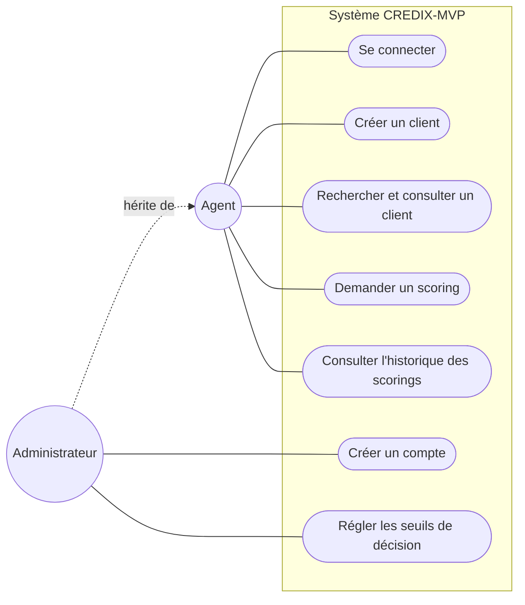
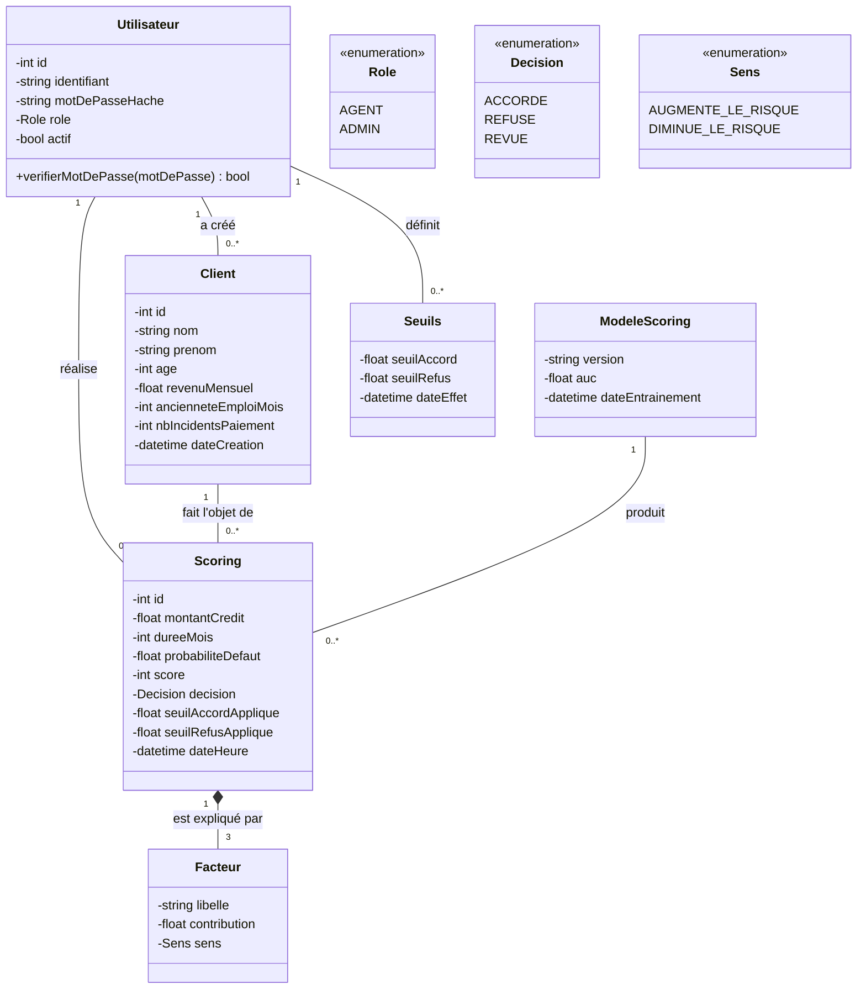
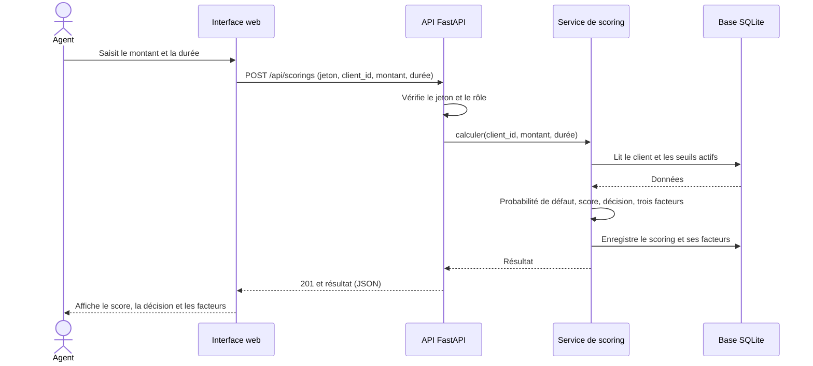
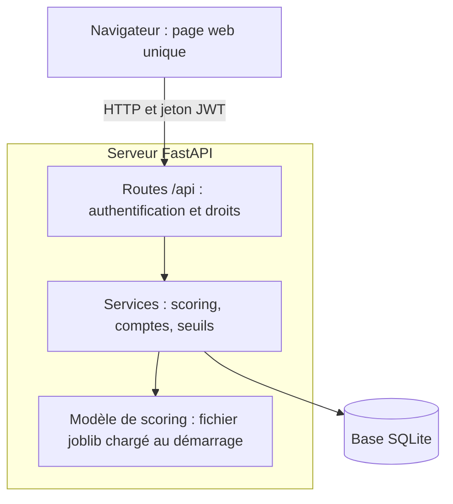

# CREDIX-MVP : document de conception

**Un mini-système de scoring de crédit, conçu pour être construit avec Claude Code en suivant la méthode du guide 2.**

<!-- toc -->

## Sommaire

1. [Introduction](#1-introduction)
2. [Exigences](#2-exigences)
3. [Acteurs et cas d'utilisation](#3-acteurs-et-cas-dutilisation)
4. [Modèle du domaine](#4-modèle-du-domaine)
5. [Scénario principal : demander un scoring](#5-scénario-principal--demander-un-scoring)
6. [Architecture et technologies](#6-architecture-et-technologies)
7. [Modèle de données](#7-modèle-de-données)
8. [Le modèle de scoring](#8-le-modèle-de-scoring)
9. [Interface de programmation (API)](#9-interface-de-programmation-api)
10. [Interface utilisateur](#10-interface-utilisateur)
11. [Plan de réalisation par modules](#11-plan-de-réalisation-par-modules)
12. [Plan de tests et recette](#12-plan-de-tests-et-recette)
13. [Limites et évolution vers CREDIX](#13-limites-et-évolution-vers-credix)
14. [Glossaire](#14-glossaire)
15. [Annexes](#15-annexes)

<!-- /toc -->

---

## 1. Introduction

### 1.1 Contexte

**CREDIX** est un système complet de scoring de crédit (voir le README du dépôt). Il compte plusieurs dizaines de routes, deux modèles complémentaires, une base documentaire, un service de rapports PDF et trois espaces utilisateurs. Il est **trop grand** pour servir d'exercice à une démonstration.

**CREDIX-MVP** en est une version **réduite** : le plus petit système qui garde l'idée essentielle. *Un agent saisit une demande de crédit ; le système calcule une probabilité de défaut, la convertit en score, propose une décision et explique les trois facteurs qui pèsent le plus.*

Ce document est écrit pour être donné à **Claude Code** en mode Plan (guide 1, section 8) : il contient tout ce qu'il faut pour produire un plan de réalisation, puis un système qui tourne.

### 1.2 Objectifs

| N° | Objectif |
|---|---|
| **O1** | Disposer d'un système de scoring **de bout en bout** (données, modèle, API, interface, tests) réalisable en quelques modules |
| **O2** | **Valider la méthode** du guide 2 : à partir de ce seul document, Claude Code doit produire un plan cohérent, puis un premier module qui passe ses tests |
| **O3** | Garder les **principes de CREDIX** : score de 300 à 850, décision à trois issues, explication des facteurs, traçabilité, seuils réglables |

### 1.3 Périmètre

| Inclus dans le MVP | Exclu (voir la section 13) |
|---|---|
| Deux rôles : **Agent** et **Administrateur** | Rôle **Superviseur** et file de revue manuelle |
| Un modèle **statistique simple** (régression logistique) | Deux flux, autoencodeur, calibration isotonique, WoE |
| Six variables explicatives | Vingt-sept variables et indice de couverture ρc |
| Base **SQLite**, aucun Docker | MongoDB, conteneurs, service PDF |
| Une page web unique | Trois espaces, thème sombre, graphiques |
| Données **synthétiques** générées par un script | Jeu de données réel |

### 1.4 Comment utiliser ce document avec Claude Code

1. Créez un dossier vide et ouvrez-le dans **VS Code**.
2. Copiez-y ce fichier sous `docs/conception_mvp.md`.
3. Ouvrez Claude Code et passez en **mode Plan**.
4. Donnez le prompt de l'**annexe B**.

Le déroulé complet de la démonstration est dans la fiche de démonstration.

---

## 2. Exigences

### 2.1 Exigences fonctionnelles

| N° | Exigence | Critère d'acceptation |
|---|---|---|
| **EF-1** | Un utilisateur se **connecte** avec un identifiant et un mot de passe et reçoit un **jeton** valable 8 heures | Bons identifiants : jeton reçu ; mauvais identifiants : refus (401) |
| **EF-2** | L'accès aux routes dépend du **rôle** (Agent, Administrateur) | Un Agent qui appelle une route d'administration reçoit 403 |
| **EF-3** | Un agent **crée un client** (nom, prénom, âge, revenu mensuel, ancienneté d'emploi, nombre d'incidents de paiement) | Le client créé est retrouvable ; une valeur invalide (âge négatif) est refusée (422) |
| **EF-4** | Un agent **recherche** un client par nom ou prénom et **consulte** sa fiche | La recherche « ndi » retrouve « Ndiaye » |
| **EF-5** | Un agent **demande un scoring** pour un client, avec un montant et une durée de crédit | Le résultat contient une probabilité de défaut, un **score entre 300 et 850** et une **décision** |
| **EF-6** | Le résultat contient **trois facteurs** qui expliquent le score (libellé, contribution, sens) | Trois facteurs, triés par importance décroissante |
| **EF-7** | Un agent consulte l'**historique des scorings** d'un client | Les scorings sont listés du plus récent au plus ancien |
| **EF-8** | Un administrateur **crée un compte** (agent ou administrateur) | Le nouveau compte peut se connecter |
| **EF-9** | Un administrateur **règle les deux seuils** de décision | Un seuil incohérent (accord supérieur au refus) est refusé (422) |
| **EF-10** | Un script **génère les données** et **entraîne le modèle**, puis affiche ses performances | Le script écrit le modèle et affiche une AUC d'au moins 0,70 |

### 2.2 Exigences non fonctionnelles

| N° | Exigence | Critère d'acceptation |
|---|---|---|
| **ENF-1** | **Traçabilité** : chaque scoring garde la version du modèle, les seuils appliqués, l'utilisateur et la date | Ces quatre informations figurent dans l'historique |
| **ENF-2** | **Sécurité** : mots de passe hachés, jamais en clair ; secret du jeton dans une variable d'environnement | Aucun mot de passe lisible dans la base ni dans le code |
| **ENF-3** | **Reproductibilité** : deux exécutions du script avec la même graine donnent le même modèle | Mêmes coefficients à la troisième décimale |
| **ENF-4** | **Lancement simple** : installation et démarrage en six commandes, sans Docker | Le README est suivi à la lettre sur une machine neuve |
| **ENF-5** | **Réactivité** : le modèle est chargé une seule fois au démarrage | Un scoring répond en moins de 500 ms en local |
| **ENF-6** | **Testabilité** : une commande unique lance tous les tests | `pytest` passe, avec au moins un test par exigence fonctionnelle |

---

## 3. Acteurs et cas d'utilisation

Le système a **deux acteurs**. L'**Administrateur** peut faire tout ce que fait l'Agent, et en plus gérer les comptes et les seuils : il **hérite** du rôle Agent.

La figure 1 présente les cas d'utilisation de chaque acteur.



*Figure 1. Cas d'utilisation de CREDIX-MVP. Les ovales sont les cas d'utilisation, les cercles les acteurs. La flèche en pointillés indique que l'Administrateur hérite de tout ce que fait l'Agent.*

### 3.1 Spécification du cas « Demander un scoring »

| Élément | Contenu |
|---|---|
| **Acteur** | Agent (ou Administrateur) |
| **Objectif** | Obtenir une décision expliquée pour une demande de crédit |
| **Préconditions** | L'agent est connecté ; le client existe |
| **Scénario nominal** | 1. L'agent ouvre la fiche du client. 2. Il saisit le **montant** et la **durée** du crédit. 3. Il valide. 4. Le système calcule la probabilité de défaut, le score et la décision, et sélectionne les trois facteurs principaux. 5. Le système enregistre le scoring. 6. Il affiche le résultat. |
| **Alternatives** | **3a.** Montant ou durée invalides : le système refuse (422) et l'indique. **4a.** Le modèle n'est pas disponible : erreur 503 avec un message clair. |
| **Postcondition** | Un scoring est enregistré avec sa version de modèle, ses seuils, son auteur et sa date |

### 3.2 Spécification du cas « Créer un compte »

| Élément | Contenu |
|---|---|
| **Acteur** | Administrateur |
| **Préconditions** | L'administrateur est connecté |
| **Scénario nominal** | 1. L'administrateur saisit un identifiant, un mot de passe (8 caractères minimum) et un rôle. 2. Le système vérifie que l'identifiant est libre. 3. Il enregistre le compte, mot de passe **haché**. |
| **Alternatives** | **2a.** Identifiant déjà pris : refus (409). **1a.** Mot de passe trop court : refus (422). |

### 3.3 Spécification du cas « Régler les seuils de décision »

| Élément | Contenu |
|---|---|
| **Acteur** | Administrateur |
| **Scénario nominal** | 1. L'administrateur saisit un **seuil d'accord** et un **seuil de refus** (probabilités de défaut). 2. Le système vérifie que 0 < accord < refus < 1. 3. Il enregistre une **nouvelle version** des seuils (l'historique est conservé). |
| **Règle métier** | Probabilité de défaut **inférieure au seuil d'accord** : décision ACCORDÉ. **Supérieure au seuil de refus** : REFUSÉ. **Entre les deux** : REVUE (un humain doit trancher). Valeurs initiales : 0,10 et 0,30 (les mêmes que CREDIX). |

---

## 4. Modèle du domaine

Le domaine compte cinq classes principales, trois types énumérés, et les associations qui les relient. La figure 2 présente le diagramme de classes.



*Figure 2. Diagramme de classes du domaine. Les losanges pleins indiquent une composition : un Facteur n'existe que dans le Scoring qu'il explique. Les types énumérés portent le stéréotype « enumeration ». Les attributs sont privés (signe moins), les opérations publiques (signe plus).*

**Règles de lecture et de conception :**

- Aucun attribut n'a pour type une autre classe du diagramme : les liens entre classes sont des **associations**, avec leurs multiplicités aux deux extrémités.
- Un **Scoring** garde les seuils **appliqués** (`seuilAccordApplique`, `seuilRefusApplique`) : ils ne changent pas si les seuils sont modifiés plus tard (traçabilité, ENF-1).
- Un **Scoring** est toujours produit par **un** modèle, **un** utilisateur, pour **un** client.

---

## 5. Scénario principal : demander un scoring

La figure 3 montre les échanges entre l'agent et les composants du système lors d'un scoring.



*Figure 3. Diagramme de séquence du cas « Demander un scoring ». Les flèches pleines sont des appels, les flèches pointillées des retours.*

---

## 6. Architecture et technologies

### 6.1 Vue d'ensemble

La figure 4 présente les composants et leurs liens.



*Figure 4. Architecture de CREDIX-MVP. Le navigateur ne parle qu'aux routes ; les services portent la logique ; le modèle est chargé une seule fois en mémoire.*

### 6.2 Choix technologiques

Chaque choix répond à une exigence.

| Choix | Sert l'exigence | Alternative écartée |
|---|---|---|
| **Python 3.12** | EF-10, ENF-3 : un seul langage pour l'entraînement et l'exploitation, pas d'écart entre les deux | Java : deux langages à faire dialoguer |
| **FastAPI** | EF-2, EF-3, ENF-5 : validation automatique des données, droits centralisés, rapidité | Flask : validation à écrire à la main |
| **SQLite** (via SQLAlchemy) | ENF-4 : aucune installation, un fichier | PostgreSQL, MongoDB : trop lourds pour ce MVP |
| **scikit-learn** (régression logistique) | EF-6, ENF-3 : modèle **explicable** (contribution = coefficient × valeur standardisée), reproductible | LightGBM : explications plus complexes (voir CREDIX) |
| **PyJWT** et `hashlib` (PBKDF2) | EF-1, ENF-2 : jeton signé, mots de passe hachés, sans dépendance lourde | bcrypt : dépendance native inutile ici |
| **Page HTML et JavaScript** servie par FastAPI | ENF-4 : aucun outil de compilation | React, Next.js : chaîne de compilation en plus |
| **pytest** et **httpx** | ENF-6 | — |

### 6.3 Organisation des dossiers

```text
credix-mvp/
|-- README.md
|-- requirements.txt
|-- .env.example              (SECRET_JWT)
|-- app/
|   |-- main.py               création de l'application, chargement du modèle
|   |-- config.py
|   |-- database.py           connexion SQLite, création des tables
|   |-- models.py             tables (Utilisateur, Client, Scoring, ...)
|   |-- schemas.py            formats des requêtes et des réponses
|   |-- security.py           hachage, jeton, contrôle des rôles
|   |-- routers/              auth.py, clients.py, scorings.py, admin.py
|   `-- services/             scoring.py, comptes.py, seuils.py
|-- scripts/
|   |-- generer_donnees.py    données synthétiques (annexe A)
|   |-- entrainer_modele.py   entraînement et sauvegarde du modèle
|   `-- creer_admin.py        premier compte administrateur
|-- modele/                   modele.joblib et meta.json (générés)
|-- frontend/                 index.html, app.js, style.css
`-- tests/                    un fichier de tests par module
```

---

## 7. Modèle de données

Base SQLite, une table par classe (les facteurs sont stockés avec leur scoring).

| Table | Colonnes | Contraintes |
|---|---|---|
| **utilisateur** | `id` (clé), `identifiant`, `mot_de_passe_hache`, `role`, `actif` | `identifiant` unique ; `role` parmi AGENT, ADMIN |
| **client** | `id` (clé), `nom`, `prenom`, `age`, `revenu_mensuel`, `anciennete_emploi_mois`, `nb_incidents_paiement`, `date_creation`, `cree_par` (vers utilisateur) | `age` entre 18 et 80 ; `revenu_mensuel` > 0 ; ancienneté et incidents ≥ 0 |
| **modele_scoring** | `id` (clé), `version`, `auc`, `date_entrainement` | `version` unique |
| **seuils** | `id` (clé), `seuil_accord`, `seuil_refus`, `date_effet`, `defini_par` (vers utilisateur) | 0 < accord < refus < 1 |
| **scoring** | `id` (clé), `client_id`, `utilisateur_id`, `modele_id`, `montant_credit`, `duree_mois`, `probabilite_defaut`, `score`, `decision`, `seuil_accord_applique`, `seuil_refus_applique`, `date_heure` | `montant_credit` > 0 ; `duree_mois` entre 6 et 60 |
| **facteur** | `id` (clé), `scoring_id`, `libelle`, `contribution`, `sens` | trois lignes par scoring |

---

## 8. Le modèle de scoring

### 8.1 Variables du modèle

Six variables explicatives, dont deux **calculées** à partir des données saisies :

| Variable | Origine | Libellé affiché |
|---|---|---|
| `age` | Fiche du client | « Âge » |
| `log_revenu` | Logarithme népérien du revenu mensuel | « Revenu mensuel » |
| `anciennete_emploi_mois` | Fiche du client | « Ancienneté dans l'emploi » |
| `taux_effort` | (montant du crédit ÷ durée) ÷ revenu mensuel : **part du revenu mensuel consacrée au remboursement** | « Taux d'effort » |
| `duree_mois` | Saisie de la demande | « Durée du crédit » |
| `nb_incidents_paiement` | Fiche du client | « Incidents de paiement passés » |

### 8.2 Entraînement

1. Le script `generer_donnees.py` produit 3 000 clients synthétiques (annexe A), avec une variable cible `defaut` (0 ou 1).
2. `entrainer_modele.py` sépare les données (80 % entraînement, 20 % test, **graine 42**, découpage stratifié).
3. Les six variables sont **standardisées** (moyenne 0, écart-type 1), en apprenant les moyennes et écarts-types **sur l'entraînement seulement**.
4. Une **régression logistique** est entraînée.
5. Le script affiche l'**AUC sur le jeu de test** et sauvegarde le modèle, les moyennes, les écarts-types, les coefficients et l'AUC dans `modele/`.

### 8.3 Calcul d'un scoring

| Étape | Formule |
|---|---|
| **Probabilité de défaut** | Sortie de la régression logistique sur les variables standardisées |
| **Score** | `score = 515,06 − 28,85 × ln( PD ÷ (1 − PD) )`, borné entre 300 et 850, arrondi à l'entier (les constantes de CREDIX) |
| **Décision** | PD < seuil d'accord : **ACCORDÉ** ; PD > seuil de refus : **REFUSÉ** ; sinon **REVUE** |
| **Contribution d'une variable** | `coefficient × valeur standardisée` |
| **Trois facteurs** | Les trois variables dont la contribution est la plus grande **en valeur absolue** ; le sens est AUGMENTE_LE_RISQUE si la contribution est positive, DIMINUE_LE_RISQUE sinon |

### 8.4 Valeurs de référence

Avec le jeu de données de l'annexe A (graine 42), un premier essai a donné une **AUC de test d'environ 0,75**, un taux de défaut d'environ 8 % et, sur les 3 000 clients, environ 78 % d'accords, 17 % de revues et 5 % de refus. Les valeurs exactes dépendent de l'implémentation ; **les critères de recette de la section 12 sont donc écrits avec des marges.**

Trois profils d'exemple, avec le résultat **indicatif** obtenu :

| Profil | Âge | Revenu | Ancienneté | Montant | Durée | Incidents | PD | Score | Décision |
|---|---|---|---|---|---|---|---|---|---|
| **A** solide | 42 | 450 000 | 120 mois | 1 500 000 | 24 mois | 0 | 0,5 % | 667 | ACCORDÉ |
| **B** intermédiaire | 33 | 220 000 | 36 mois | 2 600 000 | 24 mois | 2 | 24,5 % | 548 | REVUE |
| **C** fragile | 24 | 120 000 | 6 mois | 1 800 000 | 12 mois | 3 | 95 % | 429 | REFUSÉ |

---

## 9. Interface de programmation (API)

Format des échanges : **JSON**, avec des noms en `snake_case`. Toutes les routes, sauf `/health` et `/api/auth/login`, exigent l'en-tête `Authorization: Bearer <jeton>`.

| Méthode et route | Rôle requis | Description | Codes |
|---|---|---|---|
| `GET /health` | aucun | État du système et du modèle | 200 |
| `POST /api/auth/login` | aucun | Connexion | 200, 401 |
| `POST /api/clients` | Agent, Admin | Créer un client | 201, 422 |
| `GET /api/clients?recherche=` | Agent, Admin | Rechercher (nom ou prénom) | 200 |
| `GET /api/clients/{id}` | Agent, Admin | Fiche d'un client | 200, 404 |
| `POST /api/scorings` | Agent, Admin | Demander un scoring | 201, 404, 422, 503 |
| `GET /api/scorings?client_id=` | Agent, Admin | Historique d'un client | 200 |
| `POST /api/admin/utilisateurs` | Admin | Créer un compte | 201, 403, 409, 422 |
| `GET /api/admin/seuils` | Admin | Seuils actifs | 200, 403 |
| `PUT /api/admin/seuils` | Admin | Nouvelle version des seuils | 200, 403, 422 |

Sans jeton ou avec un jeton invalide : **401**. Avec un rôle insuffisant : **403**.

**Exemple : connexion**

```json
POST /api/auth/login
{ "identifiant": "agent1", "mot_de_passe": "MotDePasse2026" }

200 OK
{ "jeton": "eyJhbGciOi...", "role": "AGENT", "expire_a": "2026-09-20T09:00:00Z" }
```

**Exemple : demande de scoring**

```json
POST /api/scorings
{ "client_id": 12, "montant_credit": 2600000, "duree_mois": 24 }

201 Created
{
  "id": 57,
  "client_id": 12,
  "probabilite_defaut": 0.245,
  "score": 548,
  "decision": "REVUE",
  "facteurs": [
    { "libelle": "Incidents de paiement passés", "contribution": 0.931, "sens": "AUGMENTE_LE_RISQUE" },
    { "libelle": "Taux d'effort", "contribution": 0.408, "sens": "AUGMENTE_LE_RISQUE" },
    { "libelle": "Âge", "contribution": 0.256, "sens": "AUGMENTE_LE_RISQUE" }
  ],
  "modele_version": "1.0",
  "seuil_accord": 0.10,
  "seuil_refus": 0.30,
  "date_heure": "2026-09-19T14:03:11Z"
}
```

---

## 10. Interface utilisateur

Une **page web unique**, sans compilation, servie à la racine `/`. Trois zones, affichées selon le rôle.

| Zone | Contenu |
|---|---|
| **Connexion** | Identifiant, mot de passe, bouton « Se connecter » ; message clair en cas d'échec |
| **Clients et scoring** (Agent et Admin) | Barre de recherche ; formulaire « Nouveau client » ; fiche d'un client avec le formulaire de scoring (montant, durée) ; **résultat** : score, décision (colorée : vert, orange, rouge), probabilité de défaut, trois facteurs avec leur sens ; **historique** du client |
| **Administration** (Admin seulement) | Création d'un compte ; réglage des deux seuils, avec le rappel de la règle « accord < refus » |

Un bouton « Se déconnecter » efface le jeton.

---

## 11. Plan de réalisation par modules

L'ordre va du plus indépendant au plus dépendant. Chaque module se termine quand ses tests passent.

| Module | Objectif | Fichiers principaux | Terminé quand |
|---|---|---|---|
| **M1 Socle** | Structure du projet, configuration, base et tables | `app/config.py`, `database.py`, `models.py`, `requirements.txt` | Les tables sont créées ; test de connexion à la base |
| **M2 Données et modèle** | Générer les données, entraîner et sauvegarder le modèle (**EF-10**, ENF-3) | `scripts/generer_donnees.py`, `scripts/entrainer_modele.py` | AUC de test au moins égale à 0,70 ; deux exécutions donnent les mêmes coefficients |
| **M3 Service de scoring** | PD, score, décision, trois facteurs (**EF-5, EF-6**) | `app/services/scoring.py` | Les profils A et C donnent ACCORDÉ et REFUSÉ ; plus d'incidents implique une PD plus élevée |
| **M4 Sécurité et comptes** | Hachage, jeton, rôles (**EF-1, EF-2, EF-8**) | `app/security.py`, `routers/auth.py`, `routers/admin.py`, `scripts/creer_admin.py` | Connexion réussie ou refusée ; 403 pour un Agent sur une route d'administration |
| **M5 API métier** | Clients, scorings, historique, seuils (**EF-3, EF-4, EF-7, EF-9**, ENF-1) | `routers/clients.py`, `routers/scorings.py`, `services/seuils.py` | Tous les tests d'API passent |
| **M6 Interface et livraison** | Page web, README de lancement (ENF-4) | `frontend/*`, `README.md` | Le README est suivi à la lettre sur une machine neuve |

**Dépendances :** M1 avant tout ; M2 avant M3 ; M4 avant M5 ; M3 et M5 avant M6.

**Règles de conduite pour Claude Code :** un seul module à la fois ; les tests d'abord ; ne jamais modifier un module déjà validé sans le dire ; ne jamais écrire de mot de passe ni de secret dans le code.

---

## 12. Plan de tests et recette

### 12.1 Tests automatiques

Une commande, `pytest`, lance tous les tests. Il y a **au moins un test par exigence fonctionnelle**, plus :

- **monotonie** : à profil identique, la PD **augmente** avec le nombre d'incidents (0, 1, 2, 3) ;
- **bornes** : le score est toujours entre 300 et 850 ;
- **traçabilité** : un scoring enregistré contient la version du modèle et les seuils appliqués ;
- **sécurité** : le hachage du mot de passe est différent du mot de passe, et la vérification réussit.

### 12.2 Scénario de recette (à la main)

| N° | Action | Résultat attendu |
|---|---|---|
| 1 | Lancer les commandes du README | L'application répond sur `http://localhost:8000` ; `/health` indique « ok » |
| 2 | Se connecter avec le compte administrateur | Accès à l'écran d'administration |
| 3 | Créer un compte « agent1 » | Le compte apparaît ; il peut se connecter |
| 4 | Se connecter en agent1 | Pas d'accès à l'administration |
| 5 | Créer le client du profil **A** | Le client est retrouvable par recherche |
| 6 | Demander un scoring (1 500 000 sur 24 mois) | Décision **ACCORDÉ**, score élevé, trois facteurs |
| 7 | Créer le client du profil **C** et demander un scoring (1 800 000 sur 12 mois) | Décision **REFUSÉ** |
| 8 | Consulter l'historique du client **A** | Le scoring figure, avec version du modèle et seuils |
| 9 | En administrateur, passer le seuil de refus de 0,30 à 0,20, puis rejouer le scoring du profil **B** (probabilité de défaut d'environ 24,5 %) | La décision passe de **REVUE à REFUSÉ** ; l'ancien scoring **garde** ses seuils d'origine (0,30) |
| 10 | Essayer un seuil d'accord de 0,40 avec un seuil de refus de 0,20 | Le système refuse (422) et explique que l'accord doit être inférieur au refus |

### 12.3 Critères de succès de la démonstration

| Résultat | Signification |
|---|---|
| Le **plan** produit par Claude Code couvre tous les modules M1 à M6, dans un ordre cohérent | Le document de conception est **exploitable** |
| Le module **M2** livre une AUC d'au moins 0,70 | Le premier module tient ses promesses |
| Les tests du module **M3** passent | La logique métier est correcte |

---

## 13. Limites et évolution vers CREDIX

| Ce que fait CREDIX | Le MVP | Comment y arriver |
|---|---|---|
| Deux flux : score et détection des profils atypiques (autoencodeur) | Un seul flux | Ajouter un second modèle non supervisé qui peut **durcir** une décision |
| WoE, sélection de variables, LightGBM | Régression logistique sur six variables | Remplacer le modèle derrière la même interface de scoring |
| Calibration isotonique des probabilités | Aucune | Ajouter une étape entre le modèle et le score |
| Indice de couverture ρc et clients à dossier incomplet | Aucun | Calculer la part d'information disponible par client |
| Explications par SHAP, phrases en langage naturel | Contributions du modèle linéaire | Remplacer par SHAP et un gabarit de phrases |
| Rôle **Superviseur** et file de revue | La décision REVUE n'a pas de suite | Ajouter le rôle, la file, la décision justifiée |
| MongoDB, Docker, service PDF, journal d'audit | SQLite, aucun conteneur | Voir l'architecture de CREDIX |

Le MVP n'a **aucune valeur prédictive réelle** : ses données sont synthétiques. Il sert à **valider la méthode**, pas à évaluer un risque.

---

## 14. Glossaire

| Terme | Définition |
|---|---|
| **Probabilité de défaut (PD)** | Chance estimée qu'un client ne rembourse pas son crédit |
| **Score** | La PD convertie en un nombre de 300 à 850 : plus il est haut, plus le risque est faible |
| **Décision** | ACCORDÉ, REFUSÉ ou REVUE (à trancher par un humain) |
| **Seuils** | Les deux probabilités qui séparent les trois décisions |
| **Taux d'effort** | Part du revenu mensuel consacrée au remboursement du crédit |
| **AUC** | Mesure de la capacité d'un modèle à séparer bons et mauvais payeurs (0,5 : aucun pouvoir ; 1 : parfait) |
| **Régression logistique** | Modèle statistique simple qui calcule une probabilité à partir d'une somme pondérée de variables |
| **Variable standardisée** | Variable ramenée à une moyenne de 0 et un écart-type de 1 |
| **JWT (jeton)** | Justificatif temporaire délivré après connexion |
| **PBKDF2** | Méthode de hachage de mot de passe |
| **Recette** | Vérification finale, à la main, que le système répond au besoin |

---

## 15. Annexes

### Annexe A : générateur de données synthétiques (référence)

Ce script définit le « monde » du MVP. Le donner tel quel à Claude Code garantit des données **identiques d'une exécution à l'autre** (graine 42).

```python
import numpy as np
import pandas as pd

rng = np.random.default_rng(42)
n = 3000
age = np.clip(rng.normal(38, 10, n), 21, 65).round().astype(int)
revenu = np.clip(np.exp(rng.normal(np.log(250000), 0.5, n)), 80000, 2000000).round(-3)
anciennete = np.clip(rng.exponential(60, n), 0, 360).round().astype(int)
duree = rng.choice([6, 12, 18, 24, 36, 48], n, p=[.10, .25, .20, .25, .15, .05])
montant = (revenu * rng.uniform(1, 10, n)).round(-4)
incidents = np.clip(rng.poisson(0.6, n), 0, 8)
taux_effort = (montant / duree) / revenu

logit = (-4.4 - 0.035 * (age - 38) - 1.1 * (np.log(revenu) - np.log(250000))
         - 0.004 * (anciennete - 60) + 3.0 * taux_effort
         + 0.02 * (duree - 18) + 0.55 * incidents)
probabilite = 1 / (1 + np.exp(-logit))
defaut = rng.binomial(1, probabilite)

donnees = pd.DataFrame({
    "age": age, "revenu_mensuel": revenu, "anciennete_emploi_mois": anciennete,
    "montant_credit": montant, "duree_mois": duree,
    "nb_incidents_paiement": incidents, "defaut": defaut,
})
donnees.to_csv("clients_synthetiques.csv", index=False)
```

### Annexe B : prompt de démonstration

À donner à Claude Code, en **mode Plan**, dans un dossier contenant ce document sous `docs/conception_mvp.md`.

```text
/plan Lis docs/conception_mvp.md en entier. Propose un plan de réalisation par
modules (M1 à M6 ou mieux, si tu vois une meilleure découpe). Pour chaque
module : l'objectif, les fichiers à créer, les tests à écrire, le critère qui
dit qu'il est terminé, les dépendances. Signale les points du document qui te
paraissent ambigus ou contradictoires. Ne crée aucun fichier pour l'instant.
```

Puis, après relecture et approbation du plan :

```text
Réalise le module M2 du plan. Écris d'abord les tests, puis le code. Lance les
tests et montre-moi le résultat, dont l'AUC de test. Ne touche à aucun autre module.
```

### Annexe C : commandes de lancement attendues à la fin

```bash
python3 -m venv .venv && source .venv/bin/activate
pip install -r requirements.txt
cp .env.example .env
python scripts/generer_donnees.py && python scripts/entrainer_modele.py
python scripts/creer_admin.py
uvicorn app.main:app --port 8000
```

### Annexe D : ce que ce document ne dit pas volontairement

Le **code** des modules M3 à M6, la structure exacte des tests et l'aspect visuel de la page. C'est le travail de Claude Code, et c'est ce que la démonstration cherche à observer.
