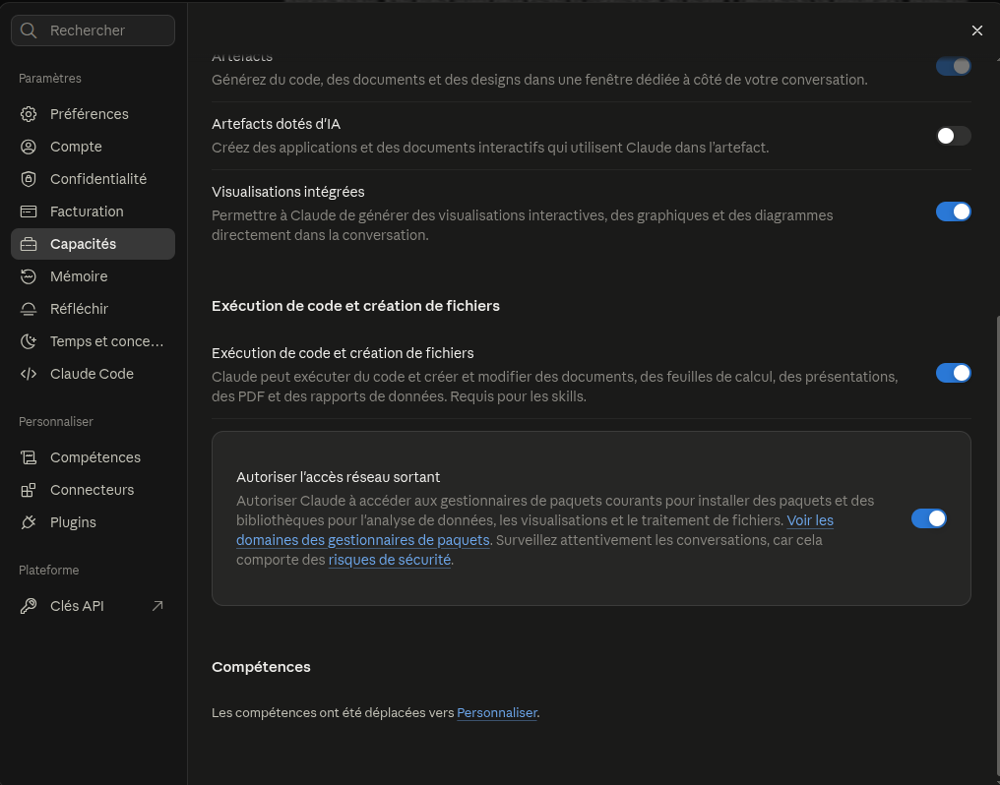
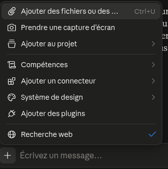
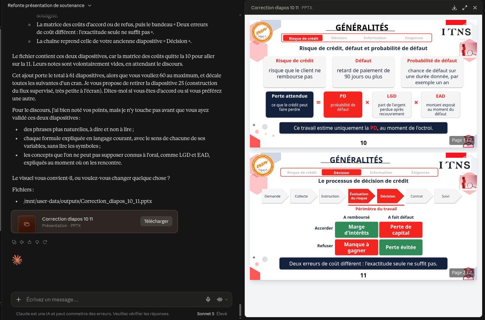

# Guide 4 : les autres fonctions de Claude

**Créer des fichiers Excel, Word, PowerPoint et PDF, transformer un PDF en présentation, utiliser les Skills, les artefacts et les connecteurs, et fabriquer soi-même les PDF de ce dossier.**

<!-- toc -->

## Sommaire

1. [À quoi sert ce guide](#1-à-quoi-sert-ce-guide)
2. [Créer des fichiers avec Claude](#2-créer-des-fichiers-avec-claude)
3. [Recette : transformer un PDF en présentation PowerPoint](#3-recette--transformer-un-pdf-en-présentation-powerpoint)
4. [D'autres recettes du même genre](#4-dautres-recettes-du-même-genre)
5. [Les Skills : apprendre à Claude votre façon de travailler](#5-les-skills--apprendre-à-claude-votre-façon-de-travailler)
6. [Les artefacts et les connecteurs](#6-les-artefacts-et-les-connecteurs)
7. [Claude Code : au-delà de l'écriture de code](#7-claude-code--au-delà-de-lécriture-de-code)
8. [Fabriquer soi-même des PDF, Word et PowerPoint à partir de Markdown](#8-fabriquer-soi-même-des-pdf-word-et-powerpoint-à-partir-de-markdown)
9. [Quel outil pour quel besoin ?](#9-quel-outil-pour-quel-besoin-)
10. [Précautions](#10-précautions)
11. [Sources officielles](#11-sources-officielles)

<!-- /toc -->

> **À propos des captures d'écran.** Ce guide contient des cadres « CAPTURE À INSÉRER », numérotés de 04-01 à 04-06. Chaque cadre indique ce qu'il faut montrer et le nom du fichier attendu, dans `docs/images/guides/`. La liste complète est dans `docs/guides/CAPTURES_A_PRENDRE.md`.
>
> **À propos des menus.** Les noms de menus de Claude changent avec le temps, et leur libellé français peut différer de l'anglais. Ceux de ce guide ont été **vérifiés sur les pages officielles le 19 septembre 2026** (sources en section 11).
>
> **Ce qui est vérifié, et ce qui ne l'est pas.** Les fonctions décrites (formats, limites, menus) viennent de la documentation officielle. Les **recettes** (sections 3 et 4) sont des façons de les utiliser : **essayez-les une fois avant de les présenter**, et relisez toujours le résultat.

---

## 1. À quoi sert ce guide

Les guides 1 à 3 montrent comment concevoir une application avec Claude. Ce guide, **à part**, répond à une autre question : **que sait faire Claude en dehors de la conception ?**

Vous y trouverez :

- la création de **fichiers** (Excel, Word, PowerPoint, PDF) directement dans une conversation ;
- une recette complète pour **transformer un PDF en présentation PowerPoint**, par exemple un mémoire en diaporama de soutenance ;
- les **Skills**, qui apprennent à Claude vos consignes de travail une fois pour toutes ;
- les **artefacts** et les **connecteurs** (Google Drive, GitHub, etc.) ;
- ce que **Claude Code** sait faire en plus d'écrire du code ;
- la fabrication **sans intelligence artificielle** de PDF, de documents Word et de présentations à partir de fichiers Markdown, comme pour ce dossier.

---

## 2. Créer des fichiers avec Claude

### 2.1 Ce que Claude peut produire

Claude peut **créer et modifier des fichiers** directement dans une conversation. Vous les téléchargez ensuite, ou vous les enregistrez dans Google Drive.

| Type de fichier | Extension | Exemples d'usage |
|---|---|---|
| **Tableur Excel** | `.xlsx` | Un tableau de données trié, un budget, une analyse de résultats |
| **Présentation PowerPoint** | `.pptx` | Un diaporama de soutenance, un support de formation |
| **Document Word** | `.docx` | Un rapport, une lettre, un compte rendu |
| **PDF** | `.pdf` | Un document figé prêt à envoyer |
| **Image de graphique** | `.png` | Une courbe, un histogramme tracés à partir de vos données |
| **Script Python** | `.py` | Un programme d'analyse que vous pouvez relancer |

Cette fonction est disponible sur **tous les abonnements** (Gratuit, Pro, Max, Team, Enterprise), sur le site web, l'application de bureau et l'application mobile.

### 2.2 L'activer

1. Cliquez sur votre profil (en bas à gauche), puis **Paramètres** (*Settings*).
2. Ouvrez **Capacités** (*Capabilities*).
3. Activez l'option **« Code execution and file creation »** (exécution de code et création de fichiers).



*Figure 1. L'option « Code execution and file creation ».*

Sur les abonnements d'équipe (Team, Enterprise), l'option est activée par défaut au niveau de l'organisation, et un propriétaire peut la désactiver.

### 2.3 Les limites à connaître

| Limite | Valeur |
|---|---|
| Taille d'un fichier créé ou téléchargé | **30 Mo** au maximum |
| Fichiers envoyés dans une conversation | **20 fichiers** au maximum par conversation |
| Taille d'un fichier envoyé dans une conversation | 500 Mo au maximum ; **30 Mo** dans un projet |
| PDF envoyé | **1 000 pages** au maximum |
| Ce que Claude lit dans un PDF de **100 pages ou moins** | Le **texte et les éléments visuels** (images, graphiques) |
| Ce que Claude lit dans un PDF de **101 à 1 000 pages** | Le **texte seulement** |
| Formats de documents acceptés | PDF, DOCX, CSV, TXT, HTML, ODT, RTF, EPUB, JSON, XLSX |
| Formats d'images acceptés | JPEG, PNG, GIF, WebP |

> **Conséquence pratique.** Un mémoire de plus de 100 pages est lu **sans ses graphiques**. Si les schémas comptent, envoyez les chapitres séparément (moins de 100 pages chacun), ou ajoutez les images vous-même à la fin.

### 2.4 Un point de sécurité

Quand Claude peut créer des fichiers, il exécute du code dans un environnement séparé. Deux précautions vous concernent :

- **Le partage public** d'une conversation qui contient des fichiers créés est **désactivé** sur les abonnements Gratuit, Pro et Max.
- **L'accès à Internet** de cet environnement est réglable. Une page web piégée pourrait, en théorie, pousser Claude à envoyer vos données ailleurs : **n'envoyez pas de documents confidentiels** sans avoir vérifié les réglages réseau.

---

## 3. Recette : transformer un PDF en présentation PowerPoint

**Cas d'usage :** vous avez un rapport ou un mémoire en PDF, et vous voulez un diaporama de présentation. Ici, le mémoire de CREDIX devient le support de soutenance.

### 3.1 Étape par étape

1. **Activez** la création de fichiers (section 2.2).
2. **Ouvrez une nouvelle conversation**, de préférence **dans un Projet** (guide 1, section 6), où vous aurez déposé vos consignes.
3. **Joignez le PDF** avec le bouton de pièce jointe. Vérifiez sa taille (moins de 30 Mo) et son nombre de pages (section 2.3).
4. **Collez le prompt** de la section 3.2 et complétez les crochets.
5. **Attendez le fichier** `.pptx` : Claude l'affiche dans la conversation, avec un bouton pour le télécharger.
6. **Téléchargez-le**, ouvrez-le (PowerPoint ou LibreOffice Impress) et **relisez tout** (section 3.3).
7. **Demandez les corrections** dans la même conversation (section 3.4).



*Figure 2. Le PDF joint à la conversation.*

### 3.2 Le prompt à copier

```text
Voici mon mémoire en PDF. Crée une présentation PowerPoint (.pptx) de
soutenance à partir de ce document.

Contexte :
- Public : [un jury de trois enseignants, non spécialistes du sujet]
- Durée : [20] minutes, soit environ [15] diapositives
- Langue : français

Structure demandée :
1. Titre et présentation
2. Contexte et problème posé
3. Objectifs
4. Méthode
5. Résultats principaux
6. Limites
7. Conclusion et perspectives
8. Questions

Règles à respecter :
- Une idée par diapositive, un titre clair, cinq lignes au plus.
- Aucun chiffre inventé : tout chiffre doit venir du PDF. Pour chacun,
  indique la page du PDF dans les notes de la diapositive.
- Ajoute des notes de présentation (ce que je dirai à l'oral).
- Style sobre : fond clair, une couleur principale, texte lisible de loin.
- À la fin, donne-moi la liste des diapositives avec leur titre, et
  signale tout passage que tu n'as pas pu résumer fidèlement.
```

### 3.3 Ce qu'il faut vérifier

Claude peut se tromper, y compris avec assurance. Avant d'utiliser le diaporama :

| Vérification | Comment |
|---|---|
| **Les chiffres** | Comparez chaque chiffre de chaque diapositive avec le PDF (aide : les numéros de page dans les notes) |
| **Le nombre de diapositives** | Correspond-il à la durée ? Comptez environ une diapositive par minute |
| **Les graphiques et schémas** | Sont-ils repris, et lisibles ? Sinon, insérez vos images vous-même |
| **Les mots** | Les noms de méthodes, de variables, d'auteurs sont-ils correctement écrits ? |
| **La cohérence** | Le diaporama dit-il la même chose que le mémoire ? Rien d'ajouté, rien de déformé ? |



*Figure 3. Le fichier `.pptx` produit, ouvert pour relecture.*

### 3.4 Demander des corrections

Restez dans la **même conversation** : Claude garde le fichier en mémoire et le modifie.

```text
Réduis la présentation à 12 diapositives : fusionne le contexte et
les objectifs, et supprime la diapositive sur les limites de la méthode.
```

```text
La diapositive 6 est trop chargée : sépare-la en deux, avec un
graphique par diapositive.
```

```text
Les notes de la diapositive 4 sont trop longues : garde trois phrases.
```

### 3.5 Une variante sans intelligence artificielle

Si vous avez une version **Markdown** de votre document (comme les guides de ce dossier), la commande `pandoc` fabrique un `.pptx` **sans rien changer au texte** (section 8.4). Le résultat est plus austère, mais **fidèle au mot près**.

---

## 4. D'autres recettes du même genre

| Besoin | Fichier joint | Ce que vous demandez | Résultat |
|---|---|---|---|
| **Mettre des données en tableau** | Un CSV ou un PDF contenant des tableaux | « Extrais les tableaux de ce PDF dans un fichier Excel, un onglet par tableau, et indique les cellules que tu as dû deviner. » | `.xlsx` |
| **Analyser des résultats** | Un CSV de résultats | « Calcule les moyennes par groupe, trace un histogramme, et donne-moi le graphique en image. » | `.png` |
| **Rédiger un compte rendu** | Vos notes de réunion en texte | « Rédige un compte rendu Word : décisions, actions, responsables, échéances. » | `.docx` |
| **Résumer un article scientifique** | L'article en PDF | « Résume en 10 lignes, puis dis en quoi il concerne le choix d'une méthode de sélection de variables. » | Texte dans la conversation |
| **Comparer deux documents** | Deux PDF | « Liste les différences de contenu entre ces deux versions, section par section. » | Tableau dans la conversation, ou `.xlsx` |
| **Corriger un document Word** | Un `.docx` | « Corrige l'orthographe et les tournures, en gardant ma mise en forme. Liste tes modifications. » | `.docx` corrigé |

**Règle commune :** demandez toujours à Claude de **signaler ce qu'il a deviné ou n'a pas pu lire**. C'est là que se cachent les erreurs.

---

## 5. Les Skills : apprendre à Claude votre façon de travailler

### 5.1 Ce que c'est

Un **Skill** (« compétence ») est un **dossier d'instructions**, parfois accompagné de scripts, que Claude charge **uniquement quand la tâche le demande**. Il enseigne à Claude *comment* faire une tâche précise, de façon répétable.

| | Projet | Skill |
|---|---|---|
| **Nature** | Documents et consignes générales | Une **procédure** pour une tâche |
| **Quand c'est utilisé** | Toujours, dans les conversations du projet | **Seulement** si la demande correspond |
| **Exemple** | Le cahier des charges de CREDIX | « Comment rédiger un diagramme UML conforme à nos règles » |

Il en existe de plusieurs sortes :

- les Skills **d'Anthropic** (création de fichiers Excel, Word, PowerPoint, PDF), que Claude utilise **automatiquement** ;
- les Skills **personnels**, que vous écrivez (en Markdown : aucune programmation nécessaire pour un Skill simple) ;
- les Skills **d'organisation**, distribués par les administrateurs d'une équipe ;
- des Skills de **partenaires** (Notion, Figma, Atlassian, etc.).

Les Skills sont disponibles sur tous les abonnements, et demandent que l'option de création de fichiers soit activée (section 2.2).

### 5.2 Où les trouver dans claude.ai

1. Cliquez sur **Personnaliser** (*Customize*) dans votre compte.
2. Ouvrez **Skills**.
3. Cliquez sur **+**, puis **Parcourir les skills** (*Browse skills*) pour ouvrir l'annuaire.


*Figure 4. L'annuaire des Skills.*

### 5.3 Dans Claude Code : écrire son propre Skill

Un Skill est un dossier contenant un fichier **`SKILL.md`**, qui commence par un en-tête (nom et description) puis contient les instructions.

| Portée | Emplacement |
|---|---|
| **Personnel** (tous vos projets) | `~/.claude/skills/<nom-du-skill>/SKILL.md` |
| **Projet** (ce dépôt uniquement) | `.claude/skills/<nom-du-skill>/SKILL.md` |

Exemple minimal, à placer dans `.claude/skills/relecture-conception/SKILL.md` :

```text
---
name: relecture-conception
description: Relit un document de conception et signale les exigences sans critère de test, les ambiguïtés et les incohérences de vocabulaire.
---

Quand on te demande de relire un document de conception :

1. Liste chaque exigence et indique si elle a un critère de test mesurable.
2. Signale les termes utilisés avec deux sens différents.
3. Ne réécris rien : propose des corrections sous forme de liste.
4. Termine par les cinq problèmes les plus importants.
```

Le Skill se déclenche **de deux façons** :

- **automatiquement**, quand votre demande correspond à sa description (d'où l'importance d'une description précise) ;
- **manuellement**, en tapant `/relecture-conception` dans Claude Code.

> **Un exemple concret dans ce projet.** Un Skill « génie logiciel » regroupe les règles de rédaction des diagrammes UML (une association plutôt qu'un attribut, multiplicités aux deux extrémités, etc.). Il a servi à écrire les diagrammes du guide 3, sans qu'on ait à répéter ces règles à chaque conversation.

---

## 6. Les artefacts et les connecteurs

### 6.1 Les artefacts

Un **artefact** est un contenu que Claude produit et qui **s'ouvre à côté de la conversation** : vous pouvez le modifier, y revenir et le partager par un lien.

Il peut s'agir de : un **document** (Markdown ou texte), un **extrait de code**, une **page web** d'une seule page (HTML), une image **SVG**, un **schéma** ou un organigramme, un **composant interactif**.

- Pour modifier un artefact, demandez à Claude, ou, pour un document Markdown, surlignez le passage, cliquez sur **Edit with Claude** et écrivez votre demande.
- En bas à droite de la fenêtre de l'artefact, vous pouvez **voir le code**, **copier** le contenu ou **télécharger** le fichier.
- La fonction **Publier et partager** permet de partager un artefact par un lien.

Les artefacts sont disponibles sur tous les abonnements. Des fonctions de présentation (Claude Slides) et de documents sont proposées, **en version bêta**, sur les abonnements payants.


*Figure 5. Un artefact à côté de la conversation.*

### 6.2 Les connecteurs

Un **connecteur** relie Claude à un **service extérieur** pour qu'il lise ou utilise vos données : Google Workspace (Gmail, Drive, Agenda), GitHub, Microsoft 365, etc. On peut aussi ajouter des connecteurs personnalisés.

**Activation (abonnements Gratuit, Pro et Max) :**

1. Ouvrez **Personnaliser**, puis **Connecteurs** (*Customize > Connectors*).
2. Ajoutez le connecteur voulu et autorisez l'accès quand la page vous le demande.
3. Dans une conversation, cliquez sur le bouton **+**, puis **Connecteurs**, pour l'activer pour cette conversation.

Sur les abonnements Team et Enterprise, un propriétaire ajoute d'abord les connecteurs dans **Paramètres de l'organisation**.


*Figure 6. Le menu des connecteurs.*

> **Prudence.** Ne connectez Claude qu'à des services **de confiance**. Un connecteur peut **lire, créer, modifier ou supprimer** des données. Lisez attentivement les autorisations demandées, et n'acceptez que celles dont vous avez besoin.

---

## 7. Claude Code : au-delà de l'écriture de code

Claude Code (guide 1, sections 7 et 8) sait faire plus que programmer. D'après la documentation officielle :

| Fonction | À quoi elle sert |
|---|---|
| **`CLAUDE.md`** | Fichier lu au début de chaque session : règles du projet, commandes, conventions |
| **Skills** | Procédures réutilisables (`/nom-du-skill`), partageables avec l'équipe (section 5.3) |
| **Hooks** | Commandes lancées automatiquement avant ou après une action de Claude (par exemple : reformater un fichier après chaque modification) |
| **Sous-agents** | Plusieurs agents Claude qui travaillent en parallèle sur des parties différentes d'une tâche |
| **MCP** | Connexion à des outils extérieurs (documents Google Drive, tickets Jira, Slack…) |
| **Git** | Enregistrer des modifications, créer des branches, rédiger les messages, ouvrir des demandes de fusion |
| **Mode non interactif** | Lancer une seule demande depuis le terminal, par exemple `claude -p "ta demande"`, pour l'enchaîner avec d'autres commandes |
| **Tâches planifiées** | Répéter une demande à intervalles réguliers |
| **Autres surfaces** | Terminal, VS Code, JetBrains, application de bureau, navigateur (claude.ai/code) |

**Une idée utile pour ce projet :** vous pouvez demander à Claude Code de **transformer un document** (par exemple, écrire un fichier `.pptx` ou `.docx` à partir d'un `.md`), puis de **relire ce qu'il a produit**. Comme pour tout ce qui précède, **relisez le résultat**.

---

## 8. Fabriquer soi-même des PDF, Word et PowerPoint à partir de Markdown

Tous les PDF de ce dossier sont fabriqués **sans intelligence artificielle**, à partir des fichiers Markdown, avec deux outils libres : **pandoc** (convertisseur de documents) et **LaTeX** (mise en page). Avantage : le texte est identique au mot près, et vous refaites le PDF en une commande dès que le `.md` change.

### 8.1 Installer les outils (Linux)

```bash
sudo apt update
sudo apt install pandoc texlive-latex-recommended texlive-latex-extra \
  texlive-fonts-recommended texlive-lang-french poppler-utils
```

Vérifiez :

```bash
pandoc --version | head -1
pdflatex --version | head -1
```

Chacune doit afficher un numéro de version. Le paquet `poppler-utils` fournit `pdfunite` (assembler des PDF) et `pdfinfo` (compter les pages).

### 8.2 Fabriquer un PDF et son fichier LaTeX

Depuis la racine du dépôt :

```bash
docs/build/build_pdf.sh docs/guides/04_autres_fonctions_claude.md \
  /tmp/exemple.pdf "Guide 4" "Autres fonctions de Claude"
```

Les quatre paramètres sont : le fichier Markdown, le PDF à produire, le titre de la page de garde, son sous-titre. Le script fait deux choses :

1. il convertit le Markdown en un fichier **LaTeX autonome** (`/tmp/exemple.tex`), avec la page de garde, la table des matières et les en-têtes ;
2. il **compile ce fichier** en PDF (`/tmp/exemple.pdf`).

Pour tout le dossier de remise, une seule commande refait les six PDF, leurs fichiers `.tex` (dans `docs/tex/`) et le PDF regroupé :

```bash
docs/build/build_all.sh
```

Pour compter les pages d'un PDF :

```bash
pdfinfo /tmp/exemple.pdf | grep Pages
```

### 8.3 Insérer des images dans le fichier `.tex`

Dans chaque fichier `.tex`, **chaque image est un bloc LaTeX standard** :

```text
% CAPTURE : 01-01_claude_ai_accueil.png : Page d'accueil de claude.ai avant la connexion
\begin{figure}[H]
  \centering
  \includegraphics[width=\linewidth,height=0.75\textheight,keepaspectratio]{../images/guides/01-01_claude_ai_accueil.png}
  \caption{Page d'accueil de claude.ai.}
\end{figure}
```

Pour mettre votre capture, **changez seulement le nom du fichier** entre les accolades de `\includegraphics{...}`. Le chemin est relatif au dossier `docs/tex/` : d'où le `../images/`. Deux façons de faire :

- **Sans toucher au `.tex`.** Déposez votre capture **sous le nom exact** déjà écrit dans le bloc, dans `docs/images/guides/` (ou `docs/images/readme/`).
- **En changeant le nom dans le `.tex`.** Remplacez `01-01_claude_ai_accueil.png` par le nom de votre fichier.

Tant que le fichier est absent, le PDF affiche à sa place un cadre **« CAPTURE À INSÉRER »** et la compilation ne s'arrête pas. Pour trouver un bloc dans le `.tex`, cherchez le nom du fichier ou le mot `CAPTURE :`, écrit en commentaire au-dessus de chaque bloc. Le texte de la légende se change avec `\caption{...}`.

Ensuite, recompilez **deux fois**, depuis `docs/tex/` :

```bash
cd docs/tex
pdflatex 02_Guide1_Outils_Claude.tex
pdflatex 02_Guide1_Outils_Claude.tex
```

La deuxième compilation met à jour la table des matières. Le PDF est créé à côté du `.tex`.

> **Attention.** Le `.tex` est **fabriqué** à partir du Markdown : quand on relance `docs/build/build_all.sh`, il est **réécrit**, et les modifications faites directement dedans sont perdues. Choisissez donc une source : le Markdown (recommandé) ou le `.tex`. Le fichier `docs/tex/LISEZMOI.md` résume la marche à suivre.

### 8.4 Fabriquer un fichier Word ou PowerPoint

Depuis un fichier Markdown, `pandoc` produit directement :

```bash
pandoc -f gfm mon_document.md -o mon_document.docx
pandoc -f gfm mon_document.md -o ma_presentation.pptx
pandoc -f gfm mon_document.md -s -o ma_page.html
```

Vérifié sur un petit document d'essai : les trois commandes réussissent. Pour la présentation, **un titre de niveau 1 (`#`) donne la diapositive de titre, et chaque titre de niveau 2 (`##`) donne une diapositive**, dont le contenu est le texte placé dessous. Structurez donc votre Markdown en conséquence : peu de texte sous chaque titre `##`.

### 8.5 Quand utiliser quoi ?

| Besoin | Outil |
|---|---|
| Un diaporama **rédigé et mis en forme** à partir d'un PDF, avec résumé et notes | **Claude** (section 3) |
| Un diaporama, un Word ou un PDF **exactement fidèle** au texte d'un `.md` | **pandoc** (section 8) |
| Un PDF soigné (page de garde, table des matières), et le fichier LaTeX pour y ajouter des images | **pandoc + LaTeX** (sections 8.2 et 8.3) |

---

## 9. Quel outil pour quel besoin ?

| Je veux… | J'utilise | Où lire |
|---|---|---|
| Réfléchir, cadrer un besoin, chercher dans la littérature | claude.ai, en mode **Projet** | Guide 1, sections 5 et 6 |
| Concevoir une application, de A à Z | La **méthode** (Projet, sessions, documents, décisions) | Guide 2 |
| Écrire, tester et corriger le code | **Claude Code**, en mode **Plan** | Guide 1, section 8 ; guide 3 |
| Créer un Excel, un Word ou un PowerPoint | claude.ai avec **création de fichiers** | Sections 2 à 4 |
| Que Claude applique toujours mes règles pour une tâche | Un **Skill** | Section 5 |
| Que Claude lise mes documents Drive ou mon dépôt GitHub | Un **connecteur** | Section 6.2 |
| Un PDF ou un document fidèle au mot près | **pandoc** | Section 8 |

---

## 10. Précautions

- **Relisez tout.** Un fichier bien présenté n'est pas forcément exact. Chiffres, noms et références se vérifient à la main.
- **Confidentialité.** Ne donnez à Claude ni mot de passe, ni clé d'API, ni donnée personnelle de clients réels. Vérifiez les réglages réseau si des fichiers sont créés (section 2.4).
- **Connecteurs et Skills de tiers.** N'installez que ceux dont la source est fiable : un Skill peut contenir des scripts, un connecteur peut modifier vos données.
- **Gardez la source.** Conservez toujours l'original (le PDF, le Markdown) : le fichier produit par Claude en est une **dérivation**, pas le remplacement.
- **Fonctions en évolution.** Les menus, les limites et les fonctions en version bêta changent : en cas de doute, la page officielle fait foi.

---

## 11. Sources officielles

Pages consultées le 19 septembre 2026 :

- Créer et modifier des fichiers avec Claude : <https://support.claude.com/en/articles/12111783-create-and-edit-files-with-claude>
- Envoyer des fichiers à Claude (limites, PDF) : <https://support.claude.com/en/articles/8241126-upload-files-to-claude>
- Qu'est-ce qu'un Skill : <https://support.claude.com/en/articles/12512176-what-are-skills>
- Skills dans Claude Code : <https://code.claude.com/docs/en/skills>
- Artefacts : <https://support.claude.com/en/articles/9487310-what-are-artifacts-and-how-do-i-use-them>
- Connecteurs personnalisés : <https://support.claude.com/en/articles/11175166-get-started-with-custom-connectors-using-remote-mcp>
- Claude Code, vue d'ensemble : <https://code.claude.com/docs/en/overview>
